# 重庆大学编译原理2022教改项目

## **实验方案**
本次实验将实现一个由 SysY (精简版 C 语言，来自 https://compiler.educg.net/) 翻译至 RISC-V 汇编的编译器，生成的汇编通过 GCC 的汇编器翻译至二进制，最终运行在模拟器 qemu-riscv 上

实验至少包含四个部分: 词法和语法分析、语义分析和中间代码生成、以及目标代码生成，每个部分都依赖前一个部分的结果，逐步构建一个完整编译器

**实验一**：词法分析和语法分析，将读取源文件中代码并进行分析，输出一颗语法树

**实验二**：接受一颗语法树，进行语义分析、中间代码生成，输出中间表示 IR (Intermediate Representation)

**实验三**：根据 IR 翻译成为汇编

**实验四(可选)**：IR 和汇编层面的优化
<br><br><br>

## **实验开始之前**
本次实验将从零开始，写一个完整的编译器，编译 SysY 语言至 risc-v 汇编，并在 qemu-riscv 上跑起来

在开始之前，请不要抱有畏惧心理，我们准备好的了详细的文档、代码框架和构建方案、自动化测试程序

还有几个小建议：
1. 在编写代码时，注意代码规范，避免出现低级但难以排查的错误甚至是奇奇怪怪的链接错误，请阅读 [C++ coding style](https://zh-google-styleguide.readthedocs.io/en/latest/google-cpp-styleguide/headers/) 和助教为你准备的 [如果不遵守可能会出现各种奇奇怪怪问题的编码小技巧](/src/docs/coding_guide.txt)
2. 在遇到 bug 时，请相信计算机一定不会出错，**一定是代码的问题**
3. 在需要查找资料来解决问题时，请至少使用 [Bing](https://cn.bing.com/) 而不是百度，尽量查阅 [Google](https://www.google.com), [wikipedia](http://en.wikipedia.org), [stackoverflow](http://stackoverflow.com) 等网站的资料，因为与编译原理相关的中文资料可能会非常少，英文资料相对丰富（以助教的经验来说 CSDN 不太能解决问题
4. 上网查资料并不能解决所有的问题，他们的回答甚至有可能时错的！正确的做法应当是阅读官方文档，官方手册包含了查找对象的所有信息，关于查找对象的一切问题都可以在官方手册中找到答案。如果你需要了解如何使用 GDB，你应该阅读[Debugging with GDB](https://sourceware.org/gdb/current/onlinedocs/gdb)，或者是你需要了解 riscv 的指令集定义、汇编规则，你应该到 [riscv 官网中的技术手册](https://riscv.org/technical/specifications/) 中寻找答案
5. 在向助教和同学提问之前，请学习 [提问的智慧](https://github.com/ryanhanwu/How-To-Ask-Questions-The-Smart-Way/blob/main/README-zh_CN.md)，以更高效的解决问题

\newpage

#环境配置

## **实验环境介绍**

### **实验工具**
实验至少需要用到以下工具，请同学们自行安装并学习，在下面也有简单的使用说明，这个程度的说明只能保证基础的使用，如果出现不符合预期的情况，**请阅读文档**
1. [Git](https://git-scm.com/doc)
2. [CMake](https://www.bookstack.cn/read/CMake-Cookbook/README.md)   
3. [GNU Makefiles](https://www.gnu.org/software/make/manual/make.html) / [GCC](https://gcc.gnu.org/) / [GDB](https://sourceware.org/gdb/)


### **代码框架介绍**
#### **获取代码**
```
从希冀实验题的附件中下载 
```
可以使用 docker 来避免配置环境的问题，但是仍需从希冀中下载相应实验的框架
```
docker使用

拉取镜像：
docker pull frankd35/demo:v3

挂载目录至 /coursegrader 并使用：
docker run -it -v {你的代码框架目录}:/coursegrader frankd35/demo:v3

在使用 docker 里面的 cmake 时会遇到一个问题，因为安装了交叉编译器以及 cmake 不知道怎么把 riscv 的交叉编译器配置成了默认编译器，所以编出来的可执行文件是 riscv 版的。要解决这个问题需要在 CMakeLists.txt 中指定 x86-linux 的编译器：
    set(CMAKE_C_COMPILER    "/usr/bin/x86_64-linux-gnu-gcc-7")
    set(CMAKE_CXX_COMPILER  "/usr/bin/x86_64-linux-gnu-g++-7")
```


因为我们希望以库的形式提供 IR 测评相关的函数实现，所以请在 /lib 下根据你使用的 linux 或 windows 平台将对应的库文件重命名为 libxx.a 才能通过编译


#### **测评程序**
在测评时 你应该提交一个直接包含至少 /include /src 的压缩包

我们的测评程序会解压你的压缩包，并将 CMakeLists.txt 和 main.cpp 复制到同一目录下（会覆盖你的文件），并链接合适的 libxx.a，使用 /test/test.py [s1/s2/S] 来进行测评, 所以请严格按照实验指导书指定的接口来完成实验（最近简单的方式是不要修改 CMakeLists.txt 和 main.cpp
```
目录结构：
--- dir
    --- {你的压缩包解压出来的文件}
    --- CMakeLists.txt
    --- main.cpp
```

#### **目录结构**
```
/bin		可执行文件 + 库文件

/build		构建项目的文件

/include	头文件

/src		源代码

/src/...	子模块: IR, frontend, backend, opt
            third_party: 第三方库, 目前使用了 jsoncpp 用于生成和读取 json

/lib        我们提供的库文件, 你需要根据你使用的 linux 或 windows 平台将对应的库文件重命名为 libIR.a 才能通过编译


/test       测试框架, 可以用于自测

/CMakeList.txt

/readme.txt	
```

#### **编译**
```
首先进入 /build 若CMakeList修改后应执行 cmake 命令
1. cd /build
2. cmake .. （如果是在 windows 环境下第一次支持 cmake 命令，需要使用 'cmake -G "MinGW Makefiles" ..' 以构建 makefile）
如果一切正常没有报错 执行make命令
3. make
```

#### **执行**
```
1. cd /bin
2. compiler <src_filename> [-step] -o <output_filename> [-O1]
    -step: 支持以下几种输入
        s0: 词法结果 token 串
        s1: 语法分析结果语法树, 以 json 格式输出
        s2: 语义分析结果, 以 IR 程序形式输出
        -S: RISC-v 汇编
```
#### **测试**
```
1. cd /test
2. python [files]:
    build.py:   进入到 build 目录, 执行 cmake .. & make
    run.py: 运行可执行文件 compiler 编译所有测试用例, 打印 compiler 返回值和报错, 输出编译结果至 /test/output
        执行方法: python run.py [s0/s1/s2/S]
    score.py: 将 run.py 生成的编译结果与标准结果进行对比并打分
        执行方法: python score.py [s0/s1/s2/S]

    test.py 编译生成 compiler 可执行文件，执行并生成结果，最后对结果进行判断并打分，结果将出现在标准输出的最后一行
        执行方法: python test.py [s0/s1/s2/S]
```

### **Windows 环境准备**
在 Windows 下至少可以完成实验一和实验二的部分，实验三部分需要在 linux 运行 qemu-riscv 来完成

为了在 windows 下运行 CMake 及 Makefiles，同学们需要安装
> - [CMake](https://cmake.org/)
>  is an open-source, cross-platform family of tools designed to build, test and package software 
> - [Mingw](https://www.mingw-w64.org/)
> A native Windows port of the GNU Compiler Collection (GCC), with freely distributable import libraries and header files for building native Windows applications

在测试中我们还用到了 ```diff``` 工具，Windows 原生是不支持的，这个工具在安装了 Git 之后，在 {ur_path_to_git}/Git/usr/bin 中可以找到 diff.exe，所以我们需要将这个目录添加到 **环境变量 PATH** 下，才能正常使用测评功能
> 完成了以上步骤以后，在 cmd 或 powershell 里敲出 cmake, make, diff 命令时，响应不应该为 **xxx 不是内部或外部命令，也不是可运行的程序
或批处理文件。**

> 如果安装了 Mingw 后仍然不支持 make, 请检查 gcc 命令在 command 里面是否支持，如果支持的话说明你的 Mingw 是安装好了的，那么请你到 {ur_path_to_Mingw}/bin 下面找一下有没有一个叫 mingw64-make.exe 的程序（应该是有的），把他的名字改成 make.exe，重启 command 就可以支持 make 命令了

### **Mac 环境准备**
可以完成实验一和实验二的部分，实验三部分需要使用 qemu-riscv 来完成，建议使用我们提供的 docker
至少需要支持 cmake, git，GNU Makefiles, gcc, diff 等工具


### **Linux 环境准备**
部分 linux 环境不是原生支持 CMake 的，安装 CMake 即可，实验三部分需要使用 qemu-riscv 来完成，建议使用我们提供的 docker


## 实验环境配置

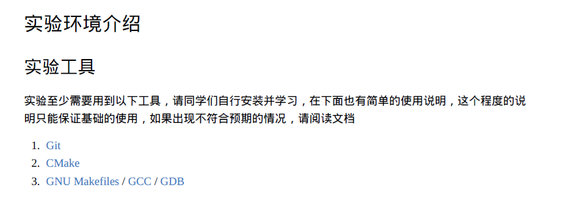

实验指导书中给出了最少的要安装的工具包，但是这些对于一个舒服的开发环境来说，还远远不够！

下面给出我在完成实验时使用到的一些工具

### 1.WSL2

提供Windows操作系统下的Linux环境

### 2.GCC

编译器

### 3.GDB

调试器

### 4.CMake

项目管理工具

### 5.VS Code

编辑器

### 6.VSCode CMake Tools Extension

图形化界面

### 具体步骤

#### 1.安装wsl

以管理员身份打开powershell，执行以下命令：

更新wsl

```powershell
wsl --update --web-download
```

安装Ubuntu发行版

```
wsl --install -d Ubuntu --web-download
```

#### 2.打开vscode搜索安装wsl插件


安装WSL插件

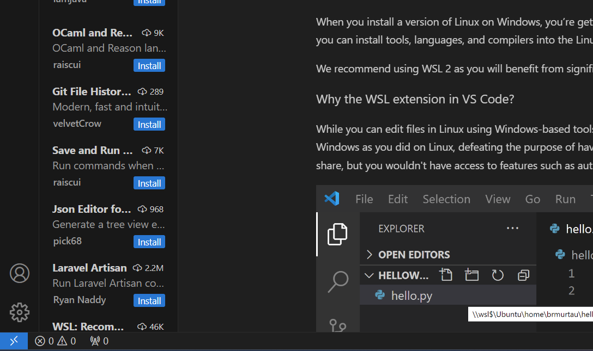

点击最左下角蓝色"><"按钮

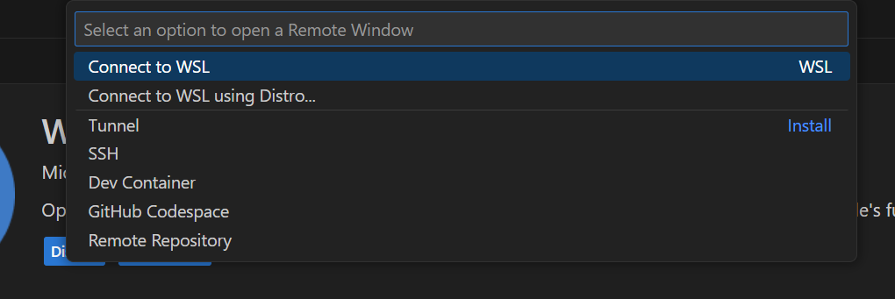

点击“连接到WSL”

#### 3.安装gcc g++ gdb make cmake

ctrl + '~'波浪键打开WSL下Ubuntu发行版的命令窗口

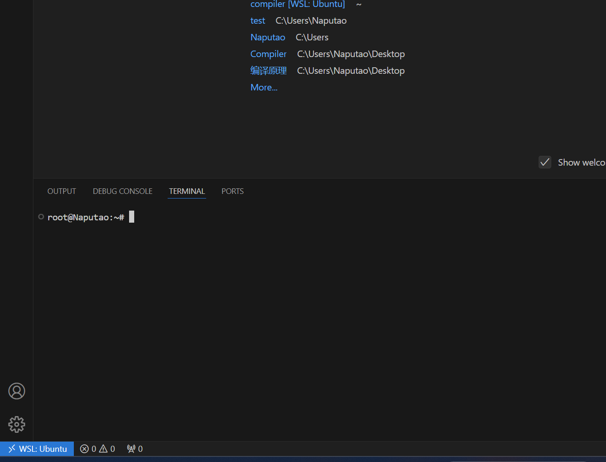

安装gcc g++ gdb make cmake

```bash
apt-get update
apt install gcc
apt install g++
apt install gdb
apt install make
apt install cmake
```

#### 4.安装cmake tools插件


#### 5.编写cmakelists.txt文件

首先创建文件夹

```bash
mkdir compiler
```

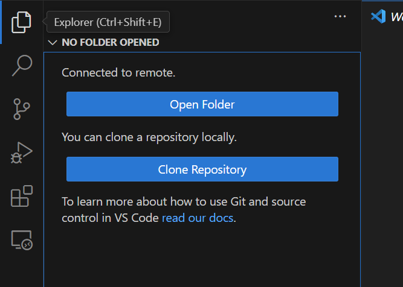

通过vscode打开文件夹，点击"打开文件夹"

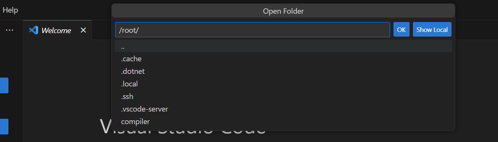

选择compiler目录

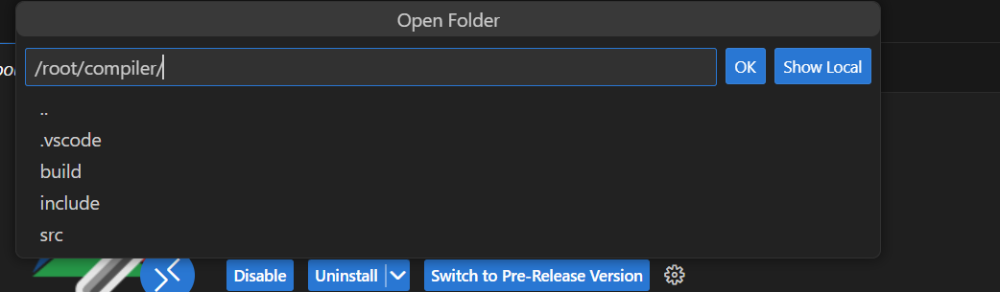

点击OK

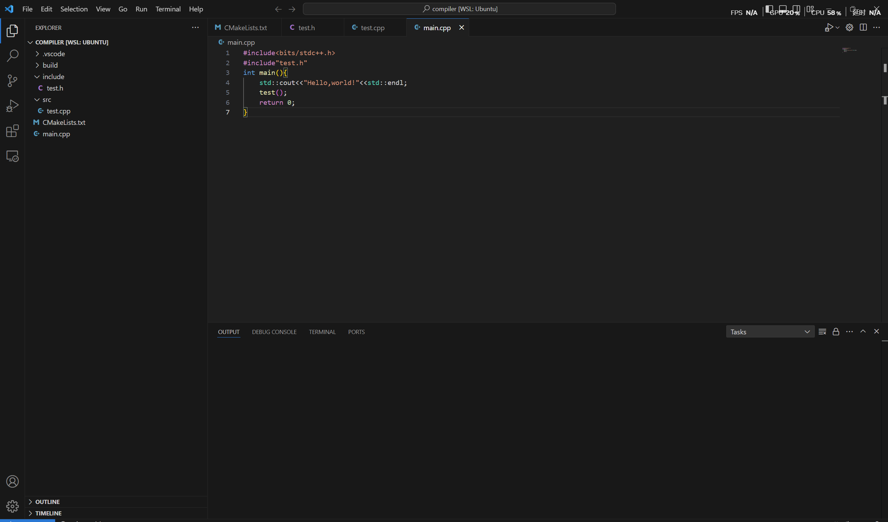

依次创建`src/test.cpp` `include/test.h` `CMakeLists.txt` `main.cpp`四个文件

```c++
//test.h
#ifndef TEST_H
#define TEST_H
#include<unordered_map>
#include<string>
void test();
void f();
#endif
```

```C++
//test.cpp
#include"test.h"
#include<iostream>
#include<vector>
void test(){
    std::cout<<"include ok"<<std::endl;
}
void f(){
    std::vector<int> vec = {1,2,3,4,5,6,7,8};
    for(auto&i:vec){
        std::cout<<i<<std::endl;
    }
    return;
}
```

```C++
//main.cpp
#include<bits/stdc++.h>
#include"test.h"
int main(){
    std::cout<<"Hello,world!"<<std::endl;
    test();
    f();
    return 0;
}
```

```cmake
## CMakeLists.txt
cmake_minimum_required(VERSION 3.11)
project(compiler)
set(CMAKE_CXX_STANDARD 23)
include_directories(${PROJECT_SOURCE_DIR}/include)
add_executable(main main.cpp src/test.cpp)
set(CMAKE_CXX_FLAGS_DEBUG "-g")
```

依次创建`src/test.cpp` `include/test.h` `CMakeLists.txt` `main.cpp`四个文件

#### 6.启动项目

Ctrl + Shift + p 输入查找CMake Select for Kits

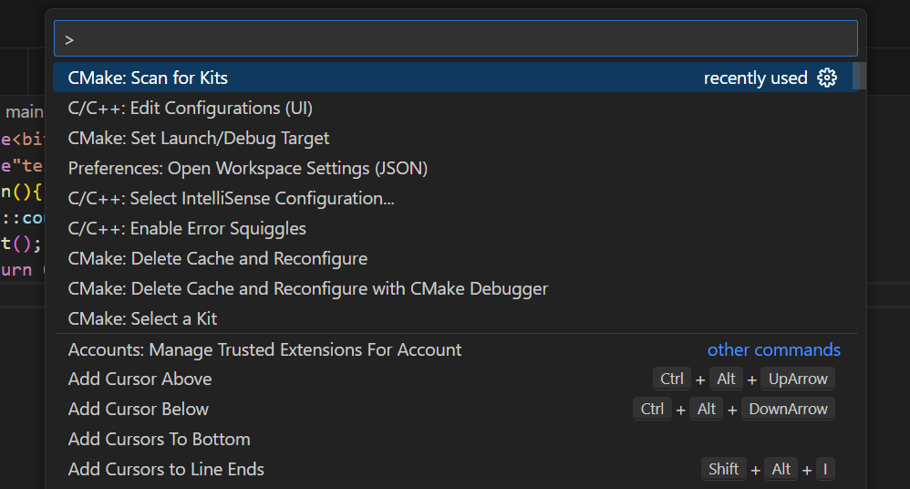

选择GCC

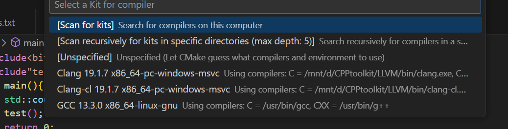

点击左侧小三角

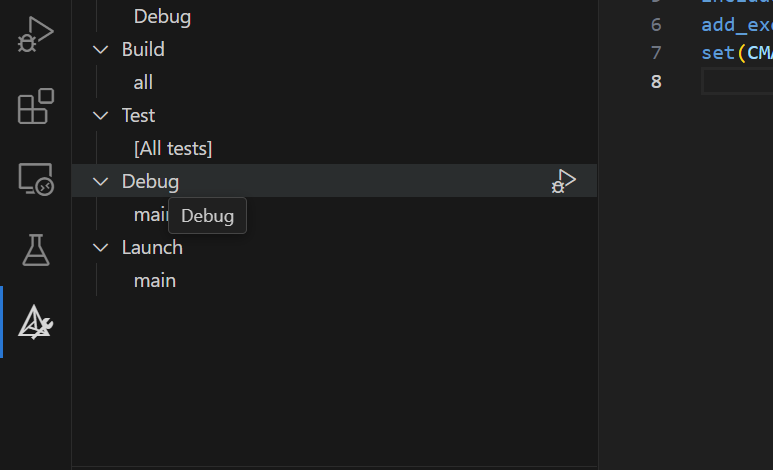

点击launch，即可构建运行main.cpp

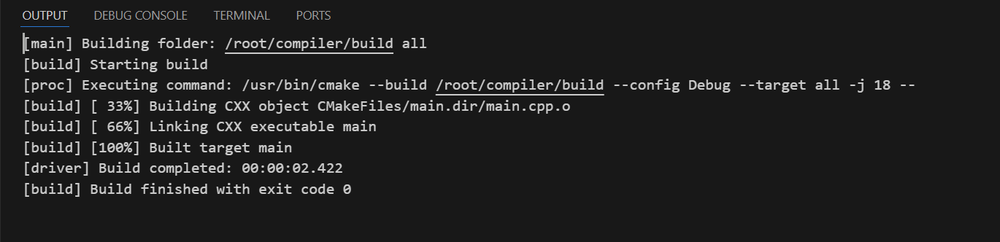

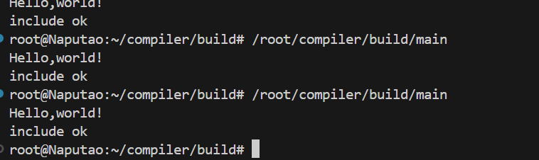

点击文本左侧添加断点

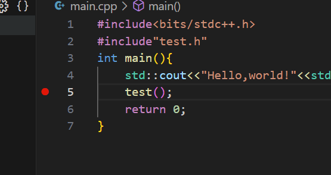

点击debug即可调试


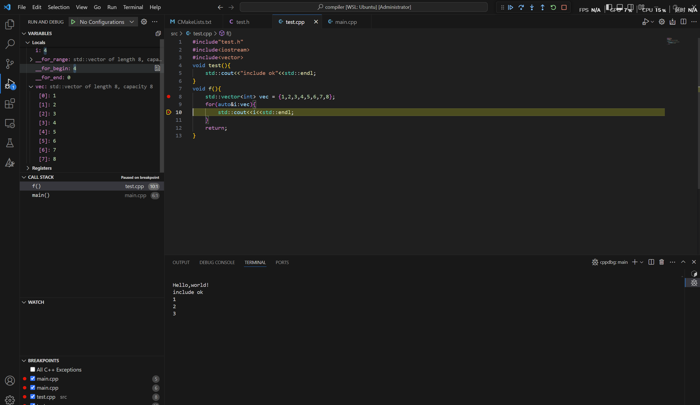

#### 7.以上环境构建就完成了，将实验框架拖入vscode即可开始编写代码

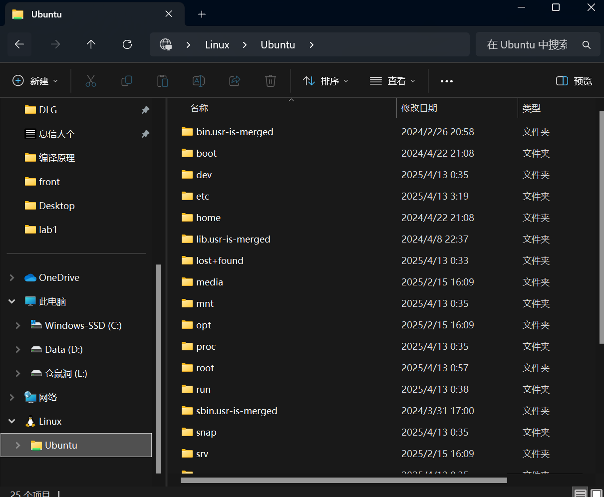

可以使用windows的资源管理器浏览WSL2的文件，以及复制拷贝文件。

将框架代码拖入到home中，在使用vscode打开即可开始快乐的写代码了

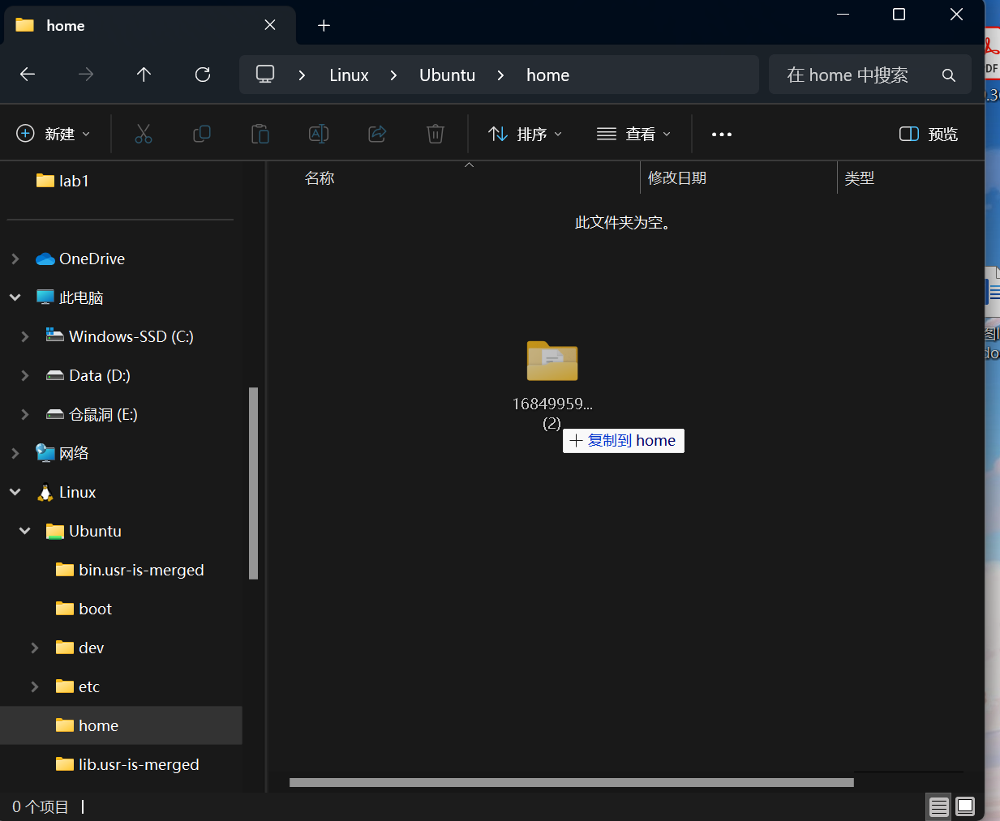

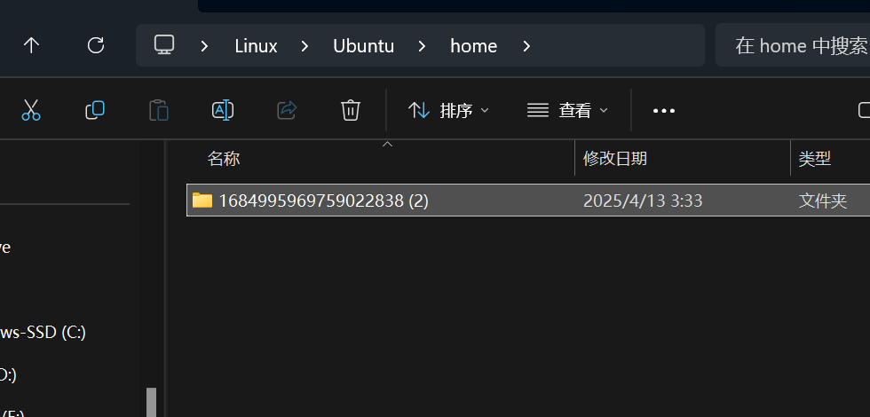

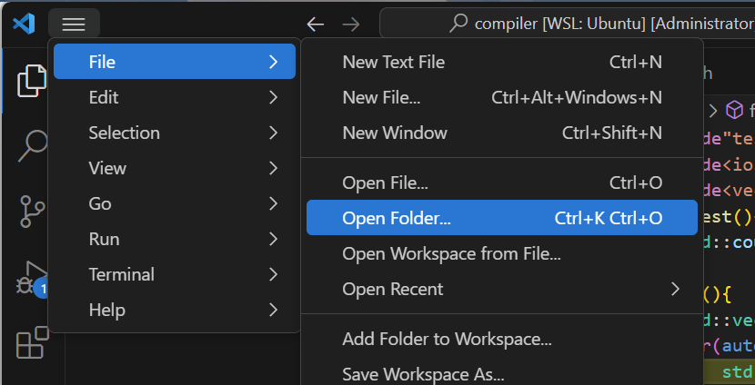

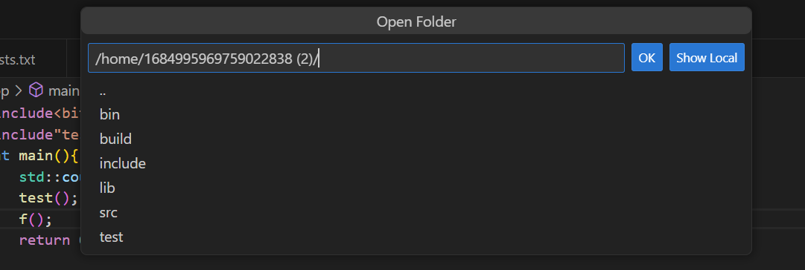

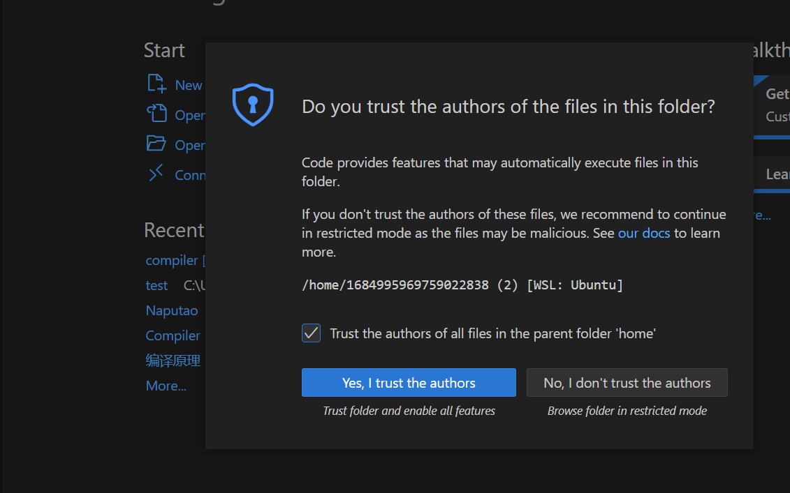

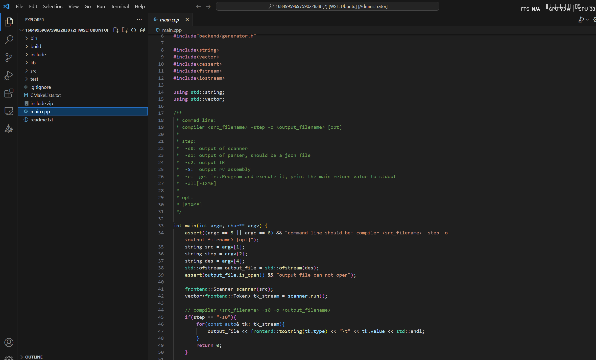

#### 8.也可以直接将文件拖出，提交作业

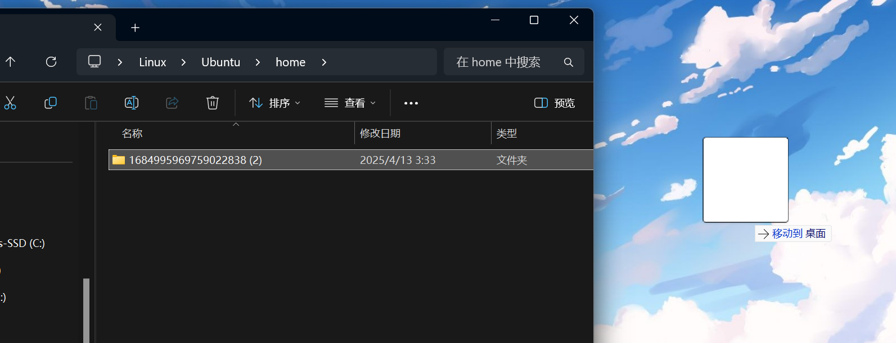

### Q&A

#### 1.使用WSL就可以完成所有的实验步骤吗？需要docker吗？

可以，不需要docker。我们只需要安装好以上的实验工具: gcc g++ gdb make cmake 即可。 实验三需要额外安装qemu来模拟运行riscv指令。只要我们的WSL中包含所有的工具，就可以顺利的完成实验。docker只是将我们的环境一键打包，如果我们自己能够配置环境，就不需要docker。

## CMake

### 🌟 **推荐方式 1：系统包管理器安装**

#### 🐧 Ubuntu / Debian

```bash
sudo apt update
sudo apt install cmake
```

> 默认版本可能稍旧，但对一般项目足够用了。如果你需要最新版，请看后面的「推荐方式 2」。

------

#### 🐧 Arch Linux / Manjaro

```bash
sudo pacman -S cmake
```

------

#### 🐧 Fedora / RHEL / CentOS

```bash
sudo dnf install cmake
```

------

#### 🐧 openSUSE

```bash
sudo zypper install cmake
```

------

### 🌟 **推荐方式 2：手动安装最新版 CMake（跨发行版通用）**

如果你想安装最新版本（比如 3.29.x）：

#### ✅ 步骤如下：

1. 下载最新版：

```bash
wget https://github.com/Kitware/CMake/releases/latest/download/cmake-*-linux-x86_64.tar.gz
```

（可用 `curl -LO` 替代）

1. 解压：

```bash
tar -xzf cmake-*-linux-x86_64.tar.gz
```

1. 进入目录并添加到 PATH：

```bash
cd cmake-*-linux-x86_64
sudo mv cmake-* /opt/cmake
echo 'export PATH=/opt/cmake/bin:$PATH' >> ~/.bashrc
source ~/.bashrc
```

1. 测试版本：

```bash
cmake --version
```

## **CMake**与**make**

一些网络资源

[Makefile基础](https://liaoxuefeng.com/books/makefile/makefile-basic/index.html)

[CMake 构建实例](https://www.runoob.com/cmake/cmake-build-demo.html)

### 🌟 一句话理解

- **make**：负责“执行编译”，是一个老牌的自动化构建工具。
- **Makefile**：是给 `make` 工具读的“说明书”，写清楚怎么编译、哪些文件依赖哪些。
- **CMake**：是一个更现代、更高级的“构建配置工具”，它能生成 `Makefile` 或其他构建系统的配置文件。

------

### 🛠️ make 和 Makefile 简介

#### ✅ 作用：

`make` 会根据你写的 `Makefile`，自动决定哪些源文件需要重新编译，并调用编译器进行编译。

#### 📄 Makefile 示例：

```make
main: main.o utils.o
	g++ -o main main.o utils.o

main.o: main.cpp
	g++ -c main.cpp

utils.o: utils.cpp utils.h
	g++ -c utils.cpp

clean:
	rm -f *.o main
```

#### 🔄 说明：

- `main` 依赖于 `main.o` 和 `utils.o`
- 如果 `main.cpp` 改了，只会重新编译 `main.o`，提高效率
- `clean` 是自定义命令，用于清理中间文件

------

### 🧠 CMake 简介

#### ✅ 作用：

CMake 是一个跨平台的构建系统生成工具。你只需要写一次 `CMakeLists.txt`，CMake 就能根据你的平台生成：

- Linux：`Makefile`
- Windows（MSVC）：Visual Studio 工程
- macOS：Xcode 工程
- 甚至 Ninja、CodeBlocks 工程等

#### 📄 CMakeLists.txt 示例：

```cmake
cmake_minimum_required(VERSION 3.10)
project(MyApp)

set(CMAKE_CXX_STANDARD 17)

add_executable(MyApp main.cpp utils.cpp)
```

#### 🚀 构建流程（Linux / Mac / WSL 中）：

```bash
mkdir build
cd build
cmake ..
make
```

#### Windows 上（使用 Visual Studio）：

```powershell
cmake -G "Visual Studio 16 2019" ..
```

------

### 📌 总结对比：

| 特性     | make + Makefile        | CMake                  |
| -------- | ---------------------- | ---------------------- |
| 易用性   | 手动写依赖，稍麻烦     | 更现代，自动处理依赖   |
| 可移植性 | 不好，只适合 UNIX 系统 | 很好，支持多平台多 IDE |
| 学习曲线 | 简单                   | 稍复杂，但功能强大     |
| 推荐程度 | 🟡 初学者了解           | ✅ 项目开发首选         |


对于本实验给出的 `CMakeLists.txt`

```cmake
cmake_minimum_required(VERSION 3.10)
project(compiler)

## compile flags
set(CMAKE_CXX_STANDARD 14)
set(CMAKE_CXX_FLAGS   "-g")                     # 调试信息
set(CMAKE_CXX_FLAGS   "-Wall")                  # 开启所有警告
## debug flags
## add_definitions(-DDEBUG_DFA)
## add_definitions(-DDEBUG_SCANNER)
## add_definitions(-DDEBUG_PARSER)

## output settings
set(CMAKE_RUNTIME_OUTPUT_DIRECTORY ${PROJECT_SOURCE_DIR}/bin)
set(CMAKE_ARCHIVE_OUTPUT_DIRECTORY ${PROJECT_SOURCE_DIR}/bin)


## include
include_directories(./include)

## third party libs
add_library(jsoncpp ./src/third_party/jsoncpp/jsoncpp.cpp)

## --------------------- from lib ---------------------
## link libxx.a
## u should rename libxx-x86-win.a or libxx-x86-linux.a to libxx.a according to ur own platform
link_directories(./lib)
## --------------------- from lib ---------------------

## build library
## every src file directory should be compile into a lib

aux_source_directory(./src/front FRONT_SRC)
add_library(Front ${FRONT_SRC})
aux_source_directory(./src/backend BACKEND_SRC)
add_library(Backend ${BACKEND_SRC})

## 为了 debug 方便，你可以选择通过源文件来构建 IR 测评机，但是请以链接静态库文件的方式去跑分（为了防止你们修改测评机，在OJ上我们会采取此方式）
## --------------------- from src ---------------------
## aux_source_directory(./src/ir IR_SRC)
## add_library(IR ${IR_SRC})
## aux_source_directory(./src/tools TOOLS_SRC)
## add_library(Tools ${TOOLS_SRC})
## --------------------- from src ---------------------


## executable
add_executable(compiler main.cpp)

## link
## every lib should be linked with [compiler]
target_link_libraries(compiler Backend Tools Front IR jsoncpp)
```

这段 `CMakeLists.txt` 是一个典型的 CMake 项目的构建脚本，用于配置一个名为 **compiler** 的项目。它定义了编译选项、库的包含与链接、输出目录、以及源文件和库的构建方式。下面我逐一解释每个部分：

------

#### 1. **基本设置**

```cmake
cmake_minimum_required(VERSION 3.10)
project(compiler)
```

- `cmake_minimum_required(VERSION 3.10)`：设置该 CMake 脚本需要的最低 CMake 版本为 3.10。这个版本支持现代的 CMake 特性。
- `project(compiler)`：定义项目的名称为 `compiler`。

------

#### 2. **编译选项和调试信息**

```cmake
set(CMAKE_CXX_STANDARD 14)
set(CMAKE_CXX_FLAGS   "-g")                     # 调试信息
set(CMAKE_CXX_FLAGS   "-Wall")                  # 开启所有警告
```

- `set(CMAKE_CXX_STANDARD 14)`：指定 C++ 编译标准为 C++14。
- `set(CMAKE_CXX_FLAGS "-g")`：添加调试信息到编译选项中，生成调试符号。
- `set(CMAKE_CXX_FLAGS "-Wall")`：开启所有编译警告，帮助开发者检查潜在问题。

------

#### 3. **调试选项（注释部分）**

```cmake
## debug flags
## add_definitions(-DDEBUG_DFA)
## add_definitions(-DDEBUG_SCANNER)
## add_definitions(-DDEBUG_PARSER)
```

- 这部分被注释掉了，通常是用于定义调试宏。`add_definitions(-DDEBUG_XXX)` 可以向编译器传递宏定义（如 `-DDEBUG_DFA`），这些宏在源代码中用于调试输出。

------

#### 4. **输出设置**

```cmake
set(CMAKE_RUNTIME_OUTPUT_DIRECTORY ${PROJECT_SOURCE_DIR}/bin)
set(CMAKE_ARCHIVE_OUTPUT_DIRECTORY ${PROJECT_SOURCE_DIR}/bin)
```

- `set(CMAKE_RUNTIME_OUTPUT_DIRECTORY ${PROJECT_SOURCE_DIR}/bin)`：设置运行文件（可执行文件）的输出目录为项目根目录下的 `bin` 文件夹。
- `set(CMAKE_ARCHIVE_OUTPUT_DIRECTORY ${PROJECT_SOURCE_DIR}/bin)`：设置静态库文件的输出目录为 `bin` 文件夹。

------

#### 5. **头文件目录**

```cmake
include_directories(./include)
```

- `include_directories(./include)`：将 `./include` 目录添加到编译时的头文件搜索路径中。这样，在源文件中引用头文件时，CMake 会去 `include` 文件夹寻找相关文件。

------

#### 6. **第三方库**

```cmake
add_library(jsoncpp ./src/third_party/jsoncpp/jsoncpp.cpp)
```

- `add_library(jsoncpp ./src/third_party/jsoncpp/jsoncpp.cpp)`：将 `jsoncpp.cpp` 文件编译成一个名为 `jsoncpp` 的库。这个库来自于 `src/third_party/jsoncpp` 目录，通常是第三方依赖库。

------

#### 7. **库文件链接目录**

```cmake
link_directories(./lib)
```

- `link_directories(./lib)`：指定一个目录（`./lib`）来搜索库文件。这是链接时的搜索路径，通常是一些外部库的 `.a` 或 `.so` 文件。

------

#### 8. **源文件组织和库构建**

```cmake
aux_source_directory(./src/front FRONT_SRC)
add_library(Front ${FRONT_SRC})
aux_source_directory(./src/backend BACKEND_SRC)
add_library(Backend ${BACKEND_SRC})
```

- `aux_source_directory(./src/front FRONT_SRC)`：将 `./src/front` 目录下的所有源文件（`.cpp`）收集到变量 `FRONT_SRC` 中。
- `add_library(Front ${FRONT_SRC})`：将 `FRONT_SRC` 中的源文件编译成一个名为 `Front` 的库。
- 同样，`aux_source_directory(./src/backend BACKEND_SRC)` 和 `add_library(Backend ${BACKEND_SRC})` 会把 `./src/backend` 目录下的源文件编译成 `Backend` 库。

------

#### 9. **静态库构建（注释部分）**

```cmake
## --------------------- from src ---------------------
## aux_source_directory(./src/ir IR_SRC)
## add_library(IR ${IR_SRC})
## aux_source_directory(./src/tools TOOLS_SRC)
## add_library(Tools ${TOOLS_SRC})
## --------------------- from src ---------------------
```

- 这部分被注释掉了，但它展示了如何构建其他库（如 `IR` 和 `Tools`）。如果需要，你可以取消注释并添加源文件来构建更多的库。

------

#### 10. **可执行文件构建**

```cmake
add_executable(compiler main.cpp)
```

- `add_executable(compiler main.cpp)`：将 `main.cpp` 文件编译成一个名为 `compiler` 的可执行文件。

------

#### 11. **库链接**

```cmake
target_link_libraries(compiler Backend Tools Front IR jsoncpp)
```

- `target_link_libraries(compiler Backend Tools Front IR jsoncpp)`：将 `compiler` 可执行文件与多个库进行链接，包括：
  - `Backend`
  - `Tools`（注释掉了）
  - `Front`
  - `IR`（注释掉了）
  - `jsoncpp`

这意味着在编译 `compiler` 时，它会链接这些库文件，确保运行时可以找到它们的符号。

## GCC（GNU 编译器）

### 🐧 1. **Ubuntu / Debian**

#### 🔧 安装命令：

```bash
sudo apt update
sudo apt install build-essential
```

这会安装：

- `gcc`、`g++`
- `make`
- 常见头文件和工具链

#### ✅ 检查版本：

```bash
gcc --version
g++ --version
```

#### 🛠️ 多版本管理（如 gcc-10、gcc-11）：

```bash
sudo apt install gcc-10 g++-10
sudo update-alternatives --install /usr/bin/gcc gcc /usr/bin/gcc-10 100
sudo update-alternatives --config gcc
```

------

### 🐧 2. **Arch Linux / Manjaro**

#### 🔧 安装命令：

```bash
sudo pacman -Syu base-devel
```

这会装上：

- `gcc`、`g++`
- `make`、`binutils`、其他开发工具

可单独装 GCC：

```bash
sudo pacman -S gcc
```

------

### 🐧 3. **Fedora / RHEL / CentOS**

#### 🔧 安装命令：

```bash
sudo dnf groupinstall "Development Tools"
```

或者单独安装：

```bash
sudo dnf install gcc gcc-c++
```

------

### 🐧 4. **openSUSE**

#### 🔧 安装命令：

```bash
sudo zypper install -t pattern devel_C_C++
```

或单独安装：

```bash
sudo zypper install gcc gcc-c++
```

------

### 🐧 5. **Kali Linux（基于 Debian）**

```bash
sudo apt update
sudo apt install build-essential
```

和 Ubuntu 方法一样。

------

### ✅ 共通检查和调试

```bash
which gcc
gcc --version
echo $PATH
```

------

### 🧠 补充：你还可以装 Clang 一起用：

- Ubuntu/Debian: `sudo apt install clang`
- Arch: `sudo pacman -S clang`
- Fedora: `sudo dnf install clang`
- openSUSE: `sudo zypper install clang`

##  GDB（GNU 调试器）

### ✅ GDB 是干嘛的？

`gdb` 是 GNU 的调试器，用于调试 C / C++ 等语言编写的程序，支持：

- 设置断点（`break`）
- 单步执行（`next`, `step`）
- 查看变量、内存、寄存器
- 调试 core dump

------

### 🐧 各发行版 GDB 安装方式

#### 📦 Ubuntu / Debian / Kali / WSL (Ubuntu)

```bash
sudo apt update
sudo apt install gdb
```

------

#### 📦 Arch Linux / Manjaro

```bash
sudo pacman -S gdb
```

------

#### 📦 Fedora / CentOS / RHEL

```bash
sudo dnf install gdb
```

------

#### 📦 openSUSE

```bash
sudo zypper install gdb
```

------

### 🔧 编译支持调试的程序

编译时要加上 `-g` 参数：

```bash
g++ -g main.cpp -o main
```

然后就可以用 gdb 调试了：

```bash
gdb ./main
```

常用命令举例：

| 命令                | 功能                     |
| ------------------- | ------------------------ |
| `break main`        | 在 `main` 函数处设置断点 |
| `run`               | 启动程序                 |
| `next`              | 执行下一行，不进入函数   |
| `step`              | 执行下一行，进入函数     |
| `print x`           | 查看变量 `x` 的值        |
| `backtrace` 或 `bt` | 查看当前调用栈           |
| `quit`              | 退出 GDB                 |

------

### 💡 小贴士：带 TUI 图形界面的 GDB 模式

```bash
gdb -tui ./main
```

按 `Ctrl + X` 然后 `A`，可以切换源码视图，非常方便！

------

### ✅ 检查版本 & 安装成功验证

```bash
gdb --version
```

如果看到类似：

```bash
GNU gdb (Ubuntu 12.1-3ubuntu2) ...
```

说明装好了。

## **CMake Tools extension** 

这个插件专为 **使用 CMake 构建 C++ 项目** 而设计，它让你在 VS Code 里告别命令行、秒变图形化点点点构建大师！

相关Blog [Visual Studio Code系列--CMake Tools使用说明](https://blog.csdn.net/tianizimark/article/details/131512067)

### 📦 插件名称

> 🧩 **CMake Tools**
>  插件 ID：`ms-vscode.cmake-tools`
>  发布者：Microsoft
>  安装方式：在 VS Code 插件市场搜索 `CMake Tools`，点击安装

------

### ✨ 它能做什么？

| 功能                               | 描述                                     |
| ---------------------------------- | ---------------------------------------- |
| 🔍 自动检测 `CMakeLists.txt`        | 打开项目时自动识别并加载配置             |
| ⚙️ 选择构建工具链                   | 支持 GCC、Clang、MSVC、Ninja、Make 等    |
| 🧱 选择构建类型                     | 快速切换 Debug / Release 等              |
| 🧪 一键编译 / 清理                  | 无需命令行，点一下就编译、清理           |
| 🚀 运行与调试目标                   | 直接运行或调试你选的 `executable`        |
| 🗂️ 多目标支持                       | 适合一个项目多个 `add_executable` 的情况 |
| 📄 自动生成 `compile_commands.json` | 给 clangd 和 LSP 补全用，非常实用        |
| 📜 状态栏集成                       | 所有操作都能在底部状态栏完成，非常方便   |

------

### 💡 使用流程（上手超快）

1. 打开带有 `CMakeLists.txt` 的项目文件夹
2. 点击左下角 CMake 状态栏（选择构建目录 / 类型）
3. CMake Tools 自动配置项目（等几秒）
4. 点击 ▶️ “Build” 构建目标
5. 点 🚀 “Run” 或 🐞 “Debug” 开始运行或调试

------

### 📁 自动创建 `.vscode/` 配置（可选）

可以自动生成以下文件：

- `.vscode/settings.json`：设置构建目录、kit 等
- `.vscode/launch.json`：设置调试器（GDB / LLDB / lldb-mi 等）
- `.vscode/tasks.json`：绑定构建快捷方式

------

### 🧠 支持 Kits（构建工具套件）

插件支持检测系统中安装的构建工具，并为你生成 Kits：

- GCC / Clang（Linux / WSL）
- MSVC（Windows）
- Emscripten（WebAssembly）
- 自定义工具链文件（`toolchain.cmake`）

通过命令面板输入：

```plaintext
CMake: Scan for Kits
CMake: Select a Kit
```

可以轻松切换你要用的工具链环境。

------

### 🛠️ 示例：VS Code 中运行一个 CMake 项目

假设你有这个结构：

```
my_project/
├── CMakeLists.txt
└── main.cpp
```

**CMakeLists.txt 内容：**

```cmake
cmake_minimum_required(VERSION 3.10)
project(HelloCMake)
add_executable(hello main.cpp)
```

打开这个文件夹后，CMake Tools 会自动识别构建目标，然后你就能用 VS Code 一键构建和运行了！

### 实际效果

#### 编译程序

```
Ctrl + S 保存cmake配置 
```


```
点击 生成按钮 自动构建文件
```


```
点击 调试按钮自动启动 gdb断点调试
```


```
点击 启动按钮自动运行程序
```


## VS Code for WSL2

### 🧩 前提条件

1. 已安装 WSL2（例如 Ubuntu）
2. 已安装最新版 VS Code（Windows 上）

👉 如果还没装 VS Code，可从这里下载并安装： https://code.visualstudio.com/

------

### 🛠️ 一步到位：安装 WSL 插件

打开 VS Code（Windows 上），然后按下：

```
Ctrl + Shift + X
```

搜索并安装插件：


### 🚀 启动 VS Code in WSL 的两种方式

#### ✅ 方法 1：命令行启动

在你的 WSL2 终端（比如 Ubuntu）中输入：

```bash
code .
```

这会在 Windows 上的 VS Code 中，**以 WSL 模式打开当前 Linux 路径**（不是 Windows 的路径哦）。

如果是第一次运行，它会自动在 Linux 系统里安装 VS Code Server，并连接到 VS Code。

------

#### ✅ 方法 2：从 Windows 启动

- 打开 VS Code
- 点击左下角绿色图标 → `WSL: Ubuntu`（或你的发行版名）
- 就能进入 WSL 模式啦 🎉

------

### 🧪 测试：新建文件、编译运行

在 VS Code 中：

1. 新建 `main.cpp`：

   ```cpp
   #include <iostream>
   int main() {
       std::cout << "Hello from WSL!" << std::endl;
       return 0;
   }
   ```

2. 打开终端（快捷键 `Ctrl + `），确认它在 `bash` 里。

3. 编译运行：

   ```bash
   g++ main.cpp -o hello
   ./hello
   ```

输出：

```
Hello from WSL!
```

成功！

------

### 💡 补充推荐插件（C++开发）

- **C/C++**（微软官方的 `ms-vscode.cpptools`）
- **CMake Tools**（如果你用 CMake 构建项目）
- **CodeLLDB**（调试更强大）
- **Clangd**（代码补全、智能提示）

## WSL2（Windows Subsystem for Linux 2）

### ✅ 安装 WSL2 的完整流程（Windows 10 & 11）

#### 🌟 方法一：一键安装命令（推荐）

打开 **PowerShell（管理员）**，输入以下命令：

```powershell
wsl --install
```

它会自动安装：

- WSL 核心组件
- WSL2 版本
- 默认的 Linux 发行版（通常是 Ubuntu）

#### 安装完成后：

- 重启电脑（有提示就重启）
- 首次启动会让你设置一个 Linux 用户名和密码
- 然后你就可以使用 Linux 环境了！

------

### 🔧 检查系统是否支持 WSL2

可以提前检查：

1. **Windows 版本**：
   - Windows 10 版本 2004 及以上（Build ≥ 19041）
   - 或 Windows 11 ✅
2. 打开 PowerShell，运行：

```powershell
wsl --list --online
```

如果这个命令能运行，就说明你的系统支持。

------

### 💡 想选择不同的 Linux 发行版？

你可以查看并安装其他版本，比如 Debian、Kali、Arch 等：

```powershell
wsl --list --online
```

然后安装，例如：

```powershell
wsl --install -d Debian
```

------

### 🧠 设置默认使用 WSL2（如果你已有 WSL1）

确保 WSL2 是默认版本：

```powershell
wsl --set-default-version 2
```

------

### 🚀 启动方式

安装好之后，可以从 **开始菜单** 找到：

- Ubuntu（或你安装的发行版名）
- 点击打开即可开始使用 WSL Linux 环境

------

### 🛠️ WSL 的一些常用命令

| 命令                         | 说明                                          |
| ---------------------------- | --------------------------------------------- |
| `wsl`                        | 启动默认 Linux                                |
| `wsl --list --verbose`       | 查看当前已安装的发行版及其版本（WSL1 / WSL2） |
| `wsl --set-version <名称> 2` | 将某个发行版切换到 WSL2                       |
| `wsl --shutdown`             | 关闭所有 WSL 实例                             |
| `wsl --unregister <名称>`    | 卸载发行版                                    |

#实验一

## **实验一**

### **实验目标**
实验一将实现编译器前端的词法分析和语法分析部分，目标是分析输入的 **源文件** 得到一颗 **抽象语法树**

### **实验步骤**
从希冀上下载实验框架

    4.29 日对测试用例进行了更新

### **实验一标准输出**
这是一段最简单的 SysY 程序
```C++
int main() {
    return 3;
}
```
实验一将把他解析为一颗语法分析树，我们用 json 来输出语法树，标准如下：
```json
{
   "name" : "CompUnit",
   "subtree" : [
      {
         "name" : "FuncDef",
         "subtree" : [
            {
               "name" : "FuncType",
               "subtree" : [
                  {
                     "name" : "Terminal",
                     "type" : "INTTK",
                     "value" : "int"
                  }
               ]
            },
            {
               "name" : "Terminal",
               "type" : "IDENFR",
               "value" : "main"
            },
            {
               "name" : "Terminal",
               "type" : "LPARENT",
               "value" : "("
            },
            {
               "name" : "Terminal",
               "type" : "RPARENT",
               "value" : ")"
            },
            {
               "name" : "Block",
               "subtree" : [
                  {
                     "name" : "Terminal",
                     "type" : "LBRACE",
                     "value" : "{"
                  },
                  {
                     "name" : "BlockItem",
                     "subtree" : [
                        {
                           "name" : "Stmt",
                           "subtree" : [
                              {
                                 "name" : "Terminal",
                                 "type" : "RETURNTK",
                                 "value" : "return"
                              },
                              {
                                 "name" : "Exp",
                                 "subtree" : [
                                    {
                                       "name" : "AddExp",
                                       "subtree" : [
                                          {
                                             "name" : "MulExp",
                                             "subtree" : [
                                                {
                                                   "name" : "UnaryExp",
                                                   "subtree" : [
                                                      {
                                                         "name" : "PrimaryExp",
                                                         "subtree" : [
                                                            {
                                                               "name" : "Number",
                                                               "subtree" : [
                                                                  {
                                                                     "name" : "Terminal",
                                                                     "type" : "INTLTR",
                                                                     "value" : "3"
                                                                  }
                                                               ]
                                                            }
                                                         ]
                                                      }
                                                   ]
                                                }
                                             ]
                                          }
                                       ]
                                    }
                                 ]
                              },
                              {
                                 "name" : "Terminal",
                                 "type" : "SEMICN",
                                 "value" : ";"
                              }
                           ]
                        }
                     ]
                  },
                  {
                     "name" : "Terminal",
                     "type" : "RBRACE",
                     "value" : "}"
                  }
               ]
            }
         ]
      }
   ]
}

```

本文档为实验指导书的补充说明，请同学们优先仔细阅读实验指导书

## 实验一


实验一大致分为两个步骤，词法分析：先将文本解析成词法单元序列，语法分析：再将词法单元序列解析成抽象语法树。

### 数据结构与算法

#### 词法分析相关数据结构

##### Token(词法单元)


```C++
    // enumerate for Token type
    enum class TokenType
    {
        IDENFR,     // identifier
        INTLTR,     // int literal
        FLOATLTR,   // float literal
        CONSTTK,    // const
        VOIDTK,     // void
        INTTK,      // int
        FLOATTK,    // float
        IFTK,       // if
        ELSETK,     // else
        WHILETK,    // while
        CONTINUETK, // continue
        BREAKTK,    // break
        RETURNTK,   // return
        PLUS,       // +
        MINU,       // -
        MULT,       // *
        DIV,        // /
        MOD,        // %
        LSS,        // <
        GTR,        // >
        COLON,      // :
        ASSIGN,     // =
        SEMICN,     // ;
        COMMA,      // ,
        LPARENT,    // (
        RPARENT,    // )
        LBRACK,     // [
        RBRACK,     // ]
        LBRACE,     // {
        RBRACE,     // }
        NOT,        // !
        LEQ,        // <=
        GEQ,        // >=
        EQL,        // ==
        NEQ,        // !=
        AND,        // &&
        OR,         // ||
    };
    std::string toString(TokenType);

    struct Token
    {
        TokenType type;
        std::string value;
    };
```

`type`词法单元的类型

`value`词法单元的值

##### DFA(确定性有限自动机)


```C++
struct DFA
    {
        /**
         * @brief constructor, set the init state to State::Empty
         */
        DFA();

        /**
         * @brief destructor
         */
        ~DFA();

        // the meaning of copy and assignment for a DFA is not clear, so we do not allow them
        DFA(const DFA &) = delete;            // copy constructor
        DFA &operator=(const DFA &) = delete; // assignment

        /**
         * @brief take a char as input, change state to next state, and output a Token if necessary
         * @param[in] input: the input character
         * @param[out] buf: the output Token buffer
         * @return  return true if a Token is produced, the buf is valid then
         */
        bool next(char input, Token &buf);

        /**
         * @brief reset the DFA state to begin
         */
        void reset();

    private:
        State cur_state;     // record current state of the DFA
        std::string cur_str; // record input characters
    };
```

`next()`当DFA.cur_str满足词法单元序列的匹配规则时，返回true,设置buf, 否则为false

`reset()`重置状态机

##### Scanner(扫描器)


```C++
struct Scanner
    {
        /**
         * @brief constructor
         * @param[in] filename: the input file
         */
        Scanner(std::string filename);

        /**
         * @brief destructor, close the file
         */
        ~Scanner();

        // rejcet copy and assignment
        Scanner(const Scanner &) = delete;
        Scanner &operator=(const Scanner &) = delete;

        /**
         * @brief run the scanner, analysis the input file and result a token stream
         * @return std::vector<Token>: the result token stream
         */
        std::vector<Token> run();

    private:
        std::ifstream fin; // the input file
    };
```

`fin`是C语言程序的文件输入流

`run()`执行后返回词法单元序列`std::vector<Token>`

#### 词法分析相关算法

首先来介绍词法分析中最重要的组成部分DFA

##### 

DFA类中最重要函数是DFA::next(char input, Token &buf)函数

这个函数的作用是：

1. 当DFA.cur_str满足词法单元序列的匹配规则时，返回true，供scanner类处理;

2. 当next函数返回true时，根据cur_str设置Token&buf的参数，scanner类会将buf添加进std::vector\<frontend::Token\> tk_stream;中

上图是一个我当时做实验写的一个简单的状态机实例。

比如对于下面这段文本

#### 示例代码

```C
float a =.2;
int b = 0x2;
int main(){
    if(b==2){
        a = 0.1;
    }
}
```

有如下处理流程

| input                                     | cur_str | cur_state    | return         |
| ----------------------------------------- | ------- | ------------ | -------------- |
| 初始                                      | none    | empty        | none           |
| f                                         | f       | ident        | false          |
| l                                         | fl      | ident        | false          |
| o                                         | flo     | ident        | false          |
| a                                         | floa    | ident        | false          |
| t                                         | float   | ident        | false          |
| 空格                                      | 空格    | empty        | true 处理float |
| a                                         | a       | ident        | false          |
| 空格                                      | 空格    | empty        | true 处理a     |
| =                                         | =       | op           | false          |
| .                                         | .       | floatliteral | true 处理=     |
| 2                                         | .2      | floatliteral | false          |
| ;                                         | ;       | op           | true 处理.2    |
| int b = 0x2;<br/>int main(){<br/>    if(b | ......  | ......       | ......         |
| =                                         | =       | op           | true 处理b     |
| 1                                         | ==      | op           |                |
| 2                                         | 2       | intliteral   | true 处理==    |
| ){<br/>        a = 0.1;<br/>    }<br/>}   | ......  | ......       | ......         |
| 空格(最后一次将cur_str情空)               | 空格    | empty        | true 处理}     |

所以得到的输出结果为

| token.value | token.type |
| ----------- | ---------- |
| float       | FLOATTK    |
| a           | IDENT      |
| =           | ASSIGN     |
| .2          | FLOATLTR   |
| ;           | SEMICN     |
| int         | INTTK      |
| b           | IDENT      |
| =           | ASSIGN     |
| 0x2         | INTLTR     |
| int         | INTTK      |
| main        | IDENT      |
| (           | LPARENT    |
| )           | RPARENT    |
| {           | LBRACE     |
| if          | RBRACK     |
| (           | LPARENT    |
| b           | IDENT      |
| ==          | EQL        |
| 2           | INTLTR     |
| )           | RPARENT    |
| {           | LBRACE     |
| a           | IDENT      |
| =           | ASSIGN     |
| 0.1         | FLOATLTR   |
| ;           | SEMICN     |
| }           | RBRACE     |
| }           | RBRACE     |

##### 🧠补充说明

1.这里没有考虑注释的情况，如果出现`//注释`和`/*多行注释*/`的情况下怎么办？

2.有限自动机也是正则表达式算法的核心实现，这里的程序是否能使用[正则表达式](正则表达式.md)来重构？

#### 语法分析相关数据结构

##### AST(抽象语法树)

```c++
enum class NodeType {
    TERMINAL,  // terminal lexical unit
    COMPUINT,
    DECL,
    FUNCDEF,
    CONSTDECL,
    BTYPE,
    CONSTDEF,
    CONSTINITVAL,
    VARDECL,
    VARDEF,
    INITVAL,
    FUNCTYPE,
    FUNCFPARAM,
    FUNCFPARAMS,
    BLOCK,
    BLOCKITEM,
    STMT,
    EXP,
    COND,
    LVAL,
    NUMBER,
    PRIMARYEXP,
    UNARYEXP,
    UNARYOP,
    FUNCRPARAMS,
    MULEXP,
    ADDEXP,
    RELEXP,
    EQEXP,
    LANDEXP,
    LOREXP,
    CONSTEXP,
};
std::string toString(NodeType);

struct Varient
{
    Type t;
    Operand v_int;
    Operand v_float;
};

// tree node basic class
struct AstNode
{
    NodeType type;              // the node type
    AstNode* parent;            // the parent node
    vector<AstNode*> children;  // children of node

    /**
     * @brief constructor
     */
    AstNode(NodeType t, AstNode* p = nullptr);

    /**
     * @brief destructor
     */
    virtual ~AstNode();

    /**
     * @brief Get the json output object
     * @param root: a Json::Value buffer, should be initialized before calling
     * this function
     */
    void get_json_output(Json::Value& root) const;

    // rejcet copy and assignment
    AstNode(const AstNode&)            = delete;
    AstNode& operator=(const AstNode&) = delete;
};
```

`type`抽象语法树节点类型

`parent`父母节点

`children`子节点

`get_json_output`获取json形式的抽象语法树输出

##### Parser(语法分析器)

```C++
struct Parser
{
    uint32_t                  index;  // current token index
    const std::vector<Token>& token_stream;

    /**
     * @brief constructor
     * @param tokens: the input token_stream
     */
    Parser(const std::vector<Token>& tokens);

    /**
     * @brief destructor
     */
    ~Parser();

    /**
     * @brief creat the abstract syntax tree
     * @return the root of abstract syntax tree
     */
    CompUnit* get_abstract_syntax_tree();
    /**
     * @brief for debug, should be called in the beginning of recursive descent
     * functions
     * @param node: current parsing node
     */
    void log(AstNode* node);

    bool parseTerm(AstNode* root, TokenType expect);
    bool parseCompUnit(AstNode* root);
    bool parseDecl(AstNode* root);
    bool parseFuncDef(AstNode* root);
    bool parseConstDecl(AstNode* root);
    bool parseBType(AstNode* root);
    bool parseConstDef(AstNode* root);
    bool parseConstInitVal(AstNode* root);
    bool parseVarDecl(AstNode* root);
    bool parseVarDef(AstNode* root);
    bool parseInitVal(AstNode* root);
    bool parseFuncType(AstNode* root);
    bool parseFuncFParam(AstNode* root);
    bool parseFuncFParams(AstNode* root);
    bool parseBlock(AstNode* root);
    bool parseBlockItem(AstNode* root);
    bool parseStmt(AstNode* root);
    bool parseExp(AstNode* root);
    bool parseCond(AstNode* root);
    bool parseLVal(AstNode* root);
    bool parseNumber(AstNode* root);
    bool parsePrimaryExp(AstNode* root);
    bool parseUnaryExp(AstNode* root);
    bool parseUnaryOp(AstNode* root);
    bool parseFuncRParams(AstNode* root);
    bool parseMulExp(AstNode* root);
    bool parseAddExp(AstNode* root);
    bool parseRelExp(AstNode* root);
    bool parseEqExp(AstNode* root);
    bool parseLAndExp(AstNode* root);
    bool parseLOrExp(AstNode* root);
    bool parseConstExp(AstNode* root);
};
```

`index`下一个解析的词法单元

`token_stream`词法单元序列

`get_abstract_syntax_tree()`抽象语法树接口

`bool parseXXX(AstNode* root)`解析特定的抽象语法树节点，解析成功则返回true

#### 语法分析相关算法


| 产生式 |
| ---------------------------- |
|CompUnit $\rightarrow$ (Decl \| FuncDef) [CompUnit]|
|Decl $\rightarrow$ ConstDecl \| VarDecl|
|ConstDecl $\rightarrow$ 'const' BType ConstDef { ',' ConstDef } ';'|
|BType $\rightarrow$ 'int' \| 'float'|
|ConstDef $\rightarrow$ Ident { '[' ConstExp ']' } '=' ConstInitVal|
|ConstInitVal $\rightarrow$ ConstExp \| '{' [ ConstInitVal { ',' ConstInitVal } ] '}'|
|VarDecl $\rightarrow$ BType VarDef { ',' VarDef } ';'|
|VarDef $\rightarrow$ Ident { '[' ConstExp ']' } [ '=' InitVal ]|
|InitVal $\rightarrow$ Exp \| '{' [ InitVal { ',' InitVal } ] '}'|
|FuncDef $\rightarrow$ FuncType Ident '(' [FuncFParams] ')' Block|
|FuncType $\rightarrow$ 'void' \| 'int' \| 'float'|
|FuncFParam $\rightarrow$ BType Ident ['[' ']' { '[' Exp ']' }]|
|FuncFParams $\rightarrow$ FuncFParam { ',' FuncFParam }|
|Block $\rightarrow$ '{' { BlockItem } '}'|
|BlockItem $\rightarrow$ Decl \| Stmt|
|Stmt $\rightarrow$ LVal '=' Exp ';' \| Block \| 'if' '(' Cond ')' Stmt [ 'else' Stmt ] \| 'while' '(' Cond ')' Stmt \| 'break' ';' \| 'continue' ';' \| 'return' [Exp] ';' \| [Exp] ';'|
|Exp $\rightarrow$ AddExp|
|Cond $\rightarrow$ LOrExp|
|LVal $\rightarrow$ Ident {'[' Exp ']'}|
|Number $\rightarrow$ IntConst \| floatConst|
|PrimaryExp $\rightarrow$ '(' Exp ')' \| LVal \| Number|
|UnaryExp $\rightarrow$ PrimaryExp \| Ident '(' [FuncRParams] ')' \| UnaryOp UnaryExp|
|UnaryOp $\rightarrow$ '+' \| '-' \| '!'|
|FuncRParams $\rightarrow$ Exp { ',' Exp }|
|MulExp $\rightarrow$ UnaryExp { ('\*' \| '/' \| '%') UnaryExp }|
|AddExp $\rightarrow$ MulExp { ('+' \| '-') MulExp }|
|RelExp $\rightarrow$ AddExp { ('<' \| '>' \| '<=' \| '>=') AddExp }|
|EqExp $\rightarrow$ RelExp { ('==' \| '!=') RelExp }|
|LAndExp $\rightarrow$ EqExp [ '&&' LAndExp ]|
|LOrExp $\rightarrow$ LAndExp [ '\|\|' LOrExp ]|
|ConstExp $\rightarrow$ AddExp|

❗要通过实验一的检测程序**必须**按照上述产生式进行抽象语法树构建

**最终我们要实现syntax.cpp文件下`get_abstract_syntax_tree()`抽象语法树接口。**


⭐这部分的代码主要用到了回溯和递归的思想

`parseXXX()`函数主要做了如下两件事：

1. 当解析XXX类型节点成功时，返回true
2. 设置index在正确的位置(解析成功时为下一个词法单元索引，失败时则为解析前的词法单元索引)

##### 示例1:产生式$A \rightarrow BC$

```
Function ParseA(ASTNode* root)
Begin
	保存index数据
	b = ParseB(第一个子节点)
	如果b为假，恢复index，返回false
	//b为真
	c = ParseC(第一个子节点)
	如果c为假，恢复index，返回false
    创建A节点，将节点的父节点设为root，将自己加入root的子节点
	返回true
End
```

##### 示例2:产生式$A \rightarrow B|C$

```
Function ParseA(ASTNode* root)
Begin
	保存index数据
	b = ParseB(第一个子节点)
	如果b为真，创建A节点，将节点的父节点设为root，将自己加入root的子节点，返回true
	//b为假
	c = ParseC(第一个子节点)
	如果c为真，创建A节点，将节点的父节点设为root，将自己加入root的子节点，返回true
	恢复index
	返回false
End
```

##### 示例3:产生式$A \rightarrow B\ B$ 为终结符

```
Function ParseA(ASTNode* root)
Begin
	保存index数据
	如果index对应词法单元和B不一致，恢复index，返回false
	//尝试成功
	index++
    创建Term点，将节点的父节点设为root，将自己加入root的子节点
    
	返回true
End
```

##### ⭐示例4:优先级问题

对于如下一段特殊代码

```
f();
```

假设目前我们已经分析到了UnaryExp节点，对于上文定义文法如下

UnaryExp $\rightarrow$ PrimaryExp \| Ident '(' [FuncRParams] ')' \| UnaryOp UnaryExp

这里应该采用第二条`Ident '(' [FuncRParams] ')'`产生式。但是如果按照先后顺序分析，我们会先尝试分析`PrimaryExp`，那么它的分析路径如下：

`PrimaryExp`$\rightarrow$`Lval`$\rightarrow$`'f'`

分析成功，返回true，然后`ParseUnaryExp`也返回true，此时index指向的是`(`，然后程序递归到`ParseMulExp`，`ParseMulExp`尝试分析`* / %`失败，......直到所有程序都尝试解析`(`失败，程序报错。

###### 解决方式：将第二条`Ident '(' [FuncRParams] ')'`产生式提前分析。先分析难分析的，再分析简单的，采用`贪婪模式`。

##### ⭐示例5:另一种接口

上面提到的示例接口是

```
bool parseXXXXX(AstNode* root);
```

需要将父节点传入，供子节点使用，其实有另一种更加简便的定义接口的办法。

```
AstNode* parseXXXXX();
```

这里不需要传入父节点，而是将子节点返回给父节点，让父节点成为构建树的负责人，当构建成功时返回子节点，构建失败返回nullptr。

那么对于产生式$A \rightarrow BC$，有伪代码

```
Function ParseA(ASTNode* root)
Begin
	保存index数据
	b = ParseB(第一个子节点)
	如果b为nullptr，恢复index，返回false
	//b为真
	c = ParseC(第一个子节点)
	如果c为nullptr，恢复index，返回false
    创建a = A节点，将b,c加入自己的子节点
	返回a
End
```

### Q&A

#### 1.词法分析中的intliteral有十进制42、八进制052、十六进制0x2a, floatliteral有0.1、1.、1.0等形式


## 文法定义

对于实验一 只需要关注第一行的文法

对于实验二 在文法之外我们还提供了语法树中属性的参考定义, 但这不是强制要求的 ###FIXME 更详细的描述 

### Extended Backus-NaurForm
SysY 语言的文法采用扩展的 Backus 范式（EBNF，Extended Backus-NaurForm）表示，其中：

    符号[...]表示方括号内包含的为可选项；
    
    符号{...}表示花括号内包含的为可重复 0 次或多次的项；
    
    终结符或者是单引号括起的串，或者是 Ident、InstConst、floatConst 这样的记号

### 文法规则

CompUnit -> (Decl | FuncDef) [CompUnit]

Decl -> ConstDecl | VarDecl

ConstDecl -> 'const' BType ConstDef { ',' ConstDef } ';'

    ConstDecl.t

BType -> 'int' | 'float'

    BType.t 

ConstDef -> Ident { '[' ConstExp ']' } '=' ConstInitVal

    ConstDef.arr_name

ConstInitVal -> ConstExp | '{' [ ConstInitVal { ',' ConstInitVal } ] '}'

    ConstInitVal.v
    ConstInitVal.t

VarDecl -> BType VarDef { ',' VarDef } ';'

    VarDecl.t

VarDef -> Ident { '[' ConstExp ']' } [ '=' InitVal ]

    VarDef.arr_name

InitVal -> Exp | '{' [ InitVal { ',' InitVal } ] '}'

    InitVal.is_computable
    InitVal.v
    InitVal.t

FuncDef -> FuncType Ident '(' [FuncFParams] ')' Block

    FuncDef.t 
    FuncDef.n 

FuncType -> 'void' | 'int' | 'float'

FuncFParam -> BType Ident ['[' ']' { '[' Exp ']' }]

FuncFParams -> FuncFParam { ',' FuncFParam }

Block -> '{' { BlockItem } '}'

BlockItem -> Decl | Stmt

Stmt -> LVal '=' Exp ';' 
        | Block
        | 'if' '(' Cond ')' Stmt [ 'else' Stmt ]
        | 'while' '(' Cond ')' Stmt
        | 'break' ';' 
        | 'continue' ';' 
        | 'return' [Exp] ';' 
        | [Exp] ';'

Exp -> AddExp

    Exp.is_computable
    Exp.v
    Exp.t

Cond -> LOrExp

    Cond.is_computable
    Cond.v
    Cond.t

LVal -> Ident {'[' Exp ']'}

    LVal.is_computable
    LVal.v
    LVal.t
    LVal.i

Number -> IntConst | floatConst

PrimaryExp -> '(' Exp ')' | LVal | Number

    PrimaryExp.is_computable
    PrimaryExp.v
    PrimaryExp.t

UnaryExp -> PrimaryExp | Ident '(' [FuncRParams] ')' | UnaryOp UnaryExp

    UnaryExp.is_computable
    UnaryExp.v
    UnaryExp.t

UnaryOp -> '+' | '-' | '!'

FuncRParams -> Exp { ',' Exp }

MulExp -> UnaryExp { ('*' | '/' | '%') UnaryExp }

    MulExp.is_computable
    MulExp.v
    MulExp.t

AddExp -> MulExp { ('+' | '-') MulExp }

    AddExp.is_computable
    AddExp.v
    AddExp.t

RelExp -> AddExp { ('<' | '>' | '<=' | '>=') AddExp }

    RelExp.is_computable
    RelExp.v
    RelExp.t

EqExp -> RelExp { ('==' | '!=') RelExp }

    EqExp.is_computable
    EqExp.v
    EqExp.t

LAndExp -> EqExp [ '&&' LAndExp ]

    LAndExp.is_computable
    LAndExp.v 
    LAndExp.t 

LOrExp -> LAndExp [ '||' LOrExp ]

    LOrExp.is_computable 
    LOrExp.v 
    LOrExp.t

ConstExp -> AddExp

    ConstExp.is_computable: true 
    ConstExp.v
    ConstExp.t


### **词法分析**
词法分析的目的是读入外部的字符流（源程序）对其进行扫描，把它们组成有意义的词素序列，对于每个词素，词法分析器都会产生词法单元(**Token**) 作为输出
#### **1. Token**
Token 的定义在 [token.h](/src/include/front/token.h) 中，同时 Token 类型的枚举类 **TokenType** 也定义在其中  
```C++
struct Token {
    TokenType type;
    string value;
};

enum class TokenType{
    IDENFR,         // identifier	
    INTLTR,		    // int literal
    FLOATLTR,		// float literal
    CONSTTK,		// const
    VOIDTK,		    // void
    ... 
}
```
其中 **string** value 是 Token 所代表的字符串， **TokenType** type 是指 Token 的类型

#### **2. DFA**
在词法分析中，我们使用确定有限状态自动机 (deterministic finite automaton, DFA) 来进行分词，对于一个给定的属于该自动机的状态和一个属于该自动机字母表 Σ 的字符，它都能根据事先给定的 **转移函数** 转移到下一个状态，某些转移函数会进行输出

我们需要为词法分析设计这样一个 DFA：它可以接收输入字符，进行状态改变，并在某些转移过程中输出累计接受到的字符所组成的字符串

该 DFA 中应存在五种状态，我们用枚举类 **State** 来表示
```C++
enum class State {
    Empty,              // space, \n, \r ...
    Ident,              // a keyword or identifier, like 'int' 'a0' 'else' ...
    IntLiteral,         // int literal, like '1' '1900', only in decimal
    FloatLiteral,       // float literal, like '0.1'
    op                  // operators and '{', '[', '(', ',' ...
};
```


我们将 DFA 及其行为的抽象为类和类方法，定义在 [lexical.h](/src/include/front/lexical.h) 中
```C++
struct DFA {
    /**
     * @brief take a char as input, change state to next state, and output a Token if necessary
     * @param[in] input: the input character
     * @param[out] buf: the output Token buffer
     * @return  return true if a Token is produced, the buf is valid then
     */
    bool next(char input, Token& buf);

    /**
     * @brief reset the DFA state to begin
     */
    void reset();

private:
    State cur_state;    // record current state of the DFA
    string cur_str;    // record input characters
};

```
其中 **State** cur_state 记录 DFA 当前的状态，**string** cur_str 记录 DFA 已经接受的字符串

每次字符输入都应调用 ```bool next(char input, Token& buf);``` 该函数是实现 DFA 的核心，即 **转移函数** ，其根据自身当前状态和输入来决定转移后的状态，如果产生 Token 则返回 true


<table><tr><td bgcolor=MistyRose><strong>TODO:<strong> 实现 DFA 中的 bool next(char input, Token& buf) 函数和 void reset(); 函数</td></tr></table>


#### **3. Scanner**
Scanner 是扫描器，其职责是将字符串输入转化为 Token 串，词法分析实际上就是实现一个 Scanner

Scanner 的定义在 [lexical.h](/src/include/front/lexical.h) 中

```C++
struct Scanner {
    /**
     * @brief constructor
     * @param[in] filename: the input file  
     */
    Scanner(std::string filename); 

    /**
     * @brief run the scanner, analysis the input file and result a token stream
     * @return std::vector<Token>: the result token stream
     */
    std::vector<Token> run();

private:
    std::ifstream fin;  // the input file
};

```
其中 **std::ifstream** fin 是源文件打开得到的文件流

```std::vector<Token> run();``` 将执行分析过程，从文件流中读取字符，实例化一个 DFA 对象来获取 Token，但是我们的 DFA 只能识别代码部分，源文件中的注释输入 DFA 后并不能被正确的处理，我们需要在使用 DFA 接受字符串前对字符串进行预处理，所以 run() 的伪代码如下：
```C++
vector<Token> ret;
Token tk;
DFA dfa;
string s = preproccess(fin);    // delete comments
for(auto c: s) {
        if(dfa.next(c, tk)){
            ret.push_back(tk);
        }
}
```
<table><tr><td bgcolor=MistyRose><strong>TODO:<strong> 实现 Scanner 的 std::vector<Token> run() 函数</td></tr></table>

我们用一段最简单的 SysY 程序来展示词法分析的结果
```C++
int main() {
    return 3;
}
```

结果如下

| TokenType      | Value |
| ----------- | ----------- |
| INTTK | int |
|IDENFR	|main |
|LPARENT|	(|
|RPARENT|	)|
|LBRACE|	{|
|RETURNTK	|return|
|INTLTR|	3|
|SEMICN|	;|
|RBRACE|	}|

<table><tr><td bgcolor=yellow><strong> 词法分析部分到此结束 <td></tr></table>


## Regex库

C++ 的 `<regex>` 库是 C++11 引入的，功能强大，用法和 Python、Perl 等语言类似。下面我来系统地讲一讲它的用法，配合示例代码，适合你查阅和参考。

------

### 🔧 头文件 & 命名空间

```cpp
#include <regex>
#include <string>
#include <iostream>
```

### 📌 常用类和函数

| 类/函数              | 说明                             |
| -------------------- | -------------------------------- |
| `std::regex`         | 表示正则表达式                   |
| `std::smatch`        | 用于存储字符串匹配结果（string） |
| `std::cmatch`        | 用于 C 字符串匹配                |
| `std::regex_match`   | 判断整个字符串是否匹配           |
| `std::regex_search`  | 判断字符串中是否存在匹配子串     |
| `std::regex_replace` | 替换匹配部分                     |

------

### ✅ 示例 1：regex_match（完全匹配）

```cpp
string s = "abc123";
regex r("[a-z]+\\d+");

if (regex_match(s, r)) {
    cout << "完全匹配！" << endl;
} else {
    cout << "不匹配" << endl;
}
```

------

### ✅ 示例 2：regex_search（部分匹配）

```cpp
string s = "hello 123 world";
regex r("\\d+");

smatch match;
if (regex_search(s, match, r)) {
    cout << "找到数字: " << match.str() << endl;
}
```

------

### ✅ 示例 3：regex_replace（替换）

```cpp
string s = "ID123 and ID456";
regex r("ID(\\d+)");
string result = regex_replace(s, r, "编号$1");

cout << result << endl;
// 输出：编号123 and 编号456
```

------

### ✅ 示例 4：提取所有匹配项

```cpp
string s = "apple=10, orange=20, banana=30";
regex r("(\\w+)=(\\d+)");
smatch match;

while (regex_search(s, match, r)) {
    cout << "水果: " << match[1] << ", 数量: " << match[2] << endl;
    s = match.suffix().str();  // 继续搜索剩下的字符串
}
```

------

### 📋 正则语法回顾（兼容 ECMAScript）

| 表达式  | 含义             |
| ------- | ---------------- |
| `.`     | 任意字符         |
| `\\d`   | 数字             |
| `\\w`   | 字母/数字/下划线 |
| `*`     | 0 次或多次       |
| `+`     | 1 次或多次       |
| `?`     | 0 次或 1 次      |
| `{n,m}` | n 到 m 次        |
| `()`    | 分组             |
| `       | `                |
| `^` `$` | 行首/行尾        |
| `\\`    | 转义字符         |

------

### 🧠 regex 标志位（可选）

可以控制匹配行为：

```cpp
regex r("abc", regex_constants::icase); // 忽略大小写
```

常见标志：

| 标志                          | 说明           |
| ----------------------------- | -------------- |
| `regex_constants::icase`      | 忽略大小写     |
| `regex_constants::ECMAScript` | 默认模式       |
| `regex_constants::basic`      | POSIX basic    |
| `regex_constants::extended`   | POSIX extended |
| `regex_constants::awk`        | awk 语法       |
| `regex_constants::grep`       | grep 语法      |
| `regex_constants::egrep`      | egrep 语法     |

------

### 🧨 注意事项

- C++ 字符串中的 `\` 需要写成 `\\`；
- 如果性能要求极高，可以考虑 RE2 或 Boost.Regex；
- `<regex>` 在某些平台上实现效率不是很高，但功能齐全。


### **语法分析**
#### **1. SysY 文法**
我们对 SysY 文法进行了一定的限制以减少难度，主要改变是同学们不需要支持二维以上的数组解析、不需要支持各种形式的浮点数字面量解析(不需要支持即我们在测试中不会出现这样的用例)，并对左递归文法做了处理。新的文法请参考 [文法定义](grammar.md)。请注意，实现必须以该文法为准
#### **2. 抽象语法树**
抽象语法树(abstract syntax tree, AST) 是源代码语法结构的一种抽象表示。它以树状的形式表现编程语言的语法结构，树上的每个节点都表示源代码中的一种结构

我们知道文法中的一个 **产生式** 可以化为树的形式，如 ```FuncDef -> FuncType Ident '(' [FuncFParams] ')' Block``` 可以展开为以 **FuncDef** 为父节点，```FuncType``` ```Ident``` ```'('``` ```[FuncFParams]``` ```')'``` ```Block``` 为从左至右子节点的一颗多叉树

为了之后语义分析的实现方便，我们为每一个非终结符定义一个类，以便不同的树节点可以拥有他们自己的成员变量，他们拥有共同的基类 **AstNode**，定义在 [abstract_syntax_tree.h](/src/include/front/abstract_syntax_tree.h) 中
```C++
struct AstNode{
    NodeType type;  // the node type
    AstNode* parent;    // the parent node
    vector<AstNode*> children;     // children of node

    /**
     * @brief Get the json output object
     * @param root: a Json::Value buffer, should be initialized before calling this function
     */
    void get_json_output(Json::Value& root) const;
}

struct CompUnit: AstNode {
struct Decl: AstNode{
struct FuncDef: AstNode{
struct ConstDecl: AstNode {
...
```
其中 **NodeType** 代表了树节点的类型，每个非终结符有自己的 NodeType，所有的终结符认为式 Terminal 类型，NodeType 枚举类定义在[abstract_syntax_tree.h](/src/include/front/abstract_syntax_tree.h) 中
```C++
enum class NodeType {
    TERMINAL,       // terminal lexical unit
    COMPUINT,
    DECL,
    FUNCDEF,
    ...
}
```
```void get_json_output(Json::Value& root) const;``` 可以实现语法树的输出，我们已经提供了实现，**请不要改动它**，除非你能保证改动后输出仍与我们提供的标准输出一致

#### **3. Parser**
解析器(Parser) 一般是指指把某种格式的文本（字符串）转换成某种数据结构的程序，在我们的语法分析过程中，Parser 接收 Token 串，转化为 AST，它被定义在 [syntax.h](/src/include/front/syntax.h)

```C++
struct Parser {
    uint32_t index; // current token index
    const std::vector<Token>& token_stream;
    
    /**
     * @brief creat the abstract syntax tree
     * @return the root of abstract syntax tree
     */
    CompUnit* get_abstract_syntax_tree();
}
```
其中 **uint32_t index** 记录了已分析 Token 串的位置，**vector<Token>& token_stream** 是输入的 Token 串，```CompUnit* get_abstract_syntax_tree();``` 是**提供给外部的接口**，返回一颗分析完成的语法树

<table><tr><td bgcolor=MistyRose><strong>TODO:<strong> 实现 CompUnit* get_abstract_syntax_tree(); 函数</td></tr></table>


#### **4. 递归下降法实现**
语法分析有很多种方式，在此我们介绍用递归下降法实现 LL(k) 分析的方法，但不要求同学们必须使用该方法，实现 **get_abstract_syntax_tree** 接口即可

在递归下降法中，我们首先要解决 **左递归** 问题：在某些文法，特别是表达式相关的文法中存在形如 ```AddExp -> MulExp | AddExp ('+' | '−') MulExp``` 的产生式，我们需要进行左递归的消除才能使用递归下降法，消除后产生式形为
```
AddExp -> MulExp [ ('+' | '-') AddExp ]
```
但是这个产生式在语义分析中并不好用，同学们可以思考一下为什么不对 (**提示: 运算顺序**)

于是经过进一步的变换，这个表达式可以变成我们实验规定的文法的样子，并且这三个产生式所产生的语言是等价的
```
AddExp -> MulExp { ('+' | '-') MulExp }
```

实现递归下降法，我们需要为每个非终结符节点创建一个 parse 函数
```C++
struct Parser {
    /**
     * @brief recursive descent functions for non-terminals
     * @param root: current parsing non-terminal
     * @return true: 为了程序通用性 对 [] 包括起来的非终结符我们一样会调用这个递归下降函数, bool 返回值用来判断是否为空
     */
    bool parseCompUint(CompUnit* root);
    bool parseDecl(Decl* root);
    bool parseConstDecl(ConstDecl* root);
    bool parseBType(BType* root);
    bool parseConstDef(ConstDef* root);
    ...
}
```

在 parse 函数中，我们根据下一个需要处理的 token 类型和该节点不同产生式的 first 集来选择处理哪一个产生式；在处理产生式时，应该按顺序从左到右依次处理，对非终结符调用其相应的 parse 函数，并将得到的语法树节点加入该节点的子节点中；对终结符，我们使用一个特殊的 parse 函数 ```Term* parseTerm(AstNode* parent, TokenType expected);``` 来处理，其功能是
1. 判断当前 index 所指的 Token 是否为产生式所要求的 Token 类型，如果不是则发生了错误，程序运行结果则不可预计
2. 如果是符合预期的 Token 类型
   1. a. 则 new 一个 Term 节点并将 Token 内容拷贝到节点中
   2. 将该节点加入 parent 的子节点
   3. Parser 的 index++

```C++
struct Term: AstNode {
    Token token;

    /**
     * @brief constructor
     */
    Term(Token t, AstNode* p = nullptr);
};

struct Parser {
    /**
     * @brief parse a specific type terminal token
     * @param expected: the specific type
     * @return Term* 
     */
    Term* parseTerm(AstNode* parent, TokenType expected);
}
```
> TIPS：这里建议大家对任何不符合预期的地方直接 assert(0)，因为我们保证提供的源程序符合文法，所以如果不符合预期一定是你自己写错了

对于 parse 函数的三种最基本的操作，我们提供了宏和使用方法供同学们参考
1. 根据下一个 Token 类型的类型选择处理的产生式(一般只看下一个 Token 就可以选择产生式，少数情况下多个产生式的 first 集有交集时，应多向后看几个 Token)
   ```C++
    #define CUR_TOKEN_IS(tk_type) (token_stream[index].type == TokenType::tk_type)
   
   if (CUR_TOKEN_IS(tk_type1)) {
        // code
   }
   else if (CUR_TOKEN_IS(tk_type2)) {
        // code
   }
   ...
   ```
2. 如果是非终结符，则调用其 pasrse 函数，并将其挂在 root 节点上
    ```C++
    #define PARSE(name, type) auto name = new type(root); assert(parse##type(name)); root->children.push_back(name); 
    
    PASER(exp_node, Exp);    // create a Exp node: exp_node, parse it, and add it to root.children
    ```
3. 如果是终结符，则调用 pasrseTerm 函数，并将其挂在 root 节点上
    ```C++
    #define PARSE_TOKEN(tk_type) root->children.push_back(parseTerm(root, TokenType::tk_type))
    
    PARSE_TOKEN(CONSTTK);    // parse root's first child as Exp, and add it to root.children
    ```

我们还为大家准备了用于 debug 的 log 函数，只需要在每个 parse 函数的头部加上它，就可以监视到你的解析程序的执行过程
```C++
void Parser::log(AstNode* node){
        std::cout << "in parse" << toString(node->type) << ", cur_token_type::" << toString(token_stream[index].type) << ", token_val::" << token_stream[index].value << '\n';
}
```

我们仍然以 ```FuncDef -> FuncType Ident '(' [FuncFParams] ')' Block``` 为例，展示 parseFuncDef 函数的实现
```C++
// FuncDef -> FuncType Ident '(' [FuncFParams] ')' Block
bool Parser::parseFuncDef(FuncDef* root) {
    log(root);

    PARSE(functype, FuncType);
    PARSE_TOKEN(IDENFR);
    PARSE_TOKEN(LPARENT);
    
    // no [FuncFParams], FuncType Ident '(' ')' Block
    if(CUR_TOKEN_IS(RPARENT)) {
        PARSE_TOKEN(RPARENT);
    }
    // FuncType Ident '(' FuncFParams ')' Block
    else {
        PARSE(node, FuncFParams);
        PARSE_TOKEN(RPARENT);
    }

    PARSE(block, Block);
    return true;
}
```

看到这里，你应该可以自己用递归下降法实现语法分析程序了，请不要忘记最终提供的接口是 **get_abstract_syntax_tree**


#实验二

## **实验二**
### **实验目标**
由实验一的 **抽象语法树** 经过语义分析和语法制导翻译，生成**中间表示 IR**

### **实验步骤**
从希冀上下载实验框架

compiler [src_filename] -s2 -o [output_filename]    将输出你的 IR 程序至 [output_filename]

> 用于观察自己的 IR 是否生成正确

compiler [src_filename] -e -o [output_filename]     将执行你的 IR 程序并输出其结果到 [output_filename]

> 包括源程序调用 putint 等函数输出到标准输出的内容 以及将程序 main 函数的返回值打印到最后一行，这个才是用于测试比对的

    5.12 日对测试用例和测评机进行了更新

[src_filename] 是 SysY 源程序，[output_filename] 是输出文件，根据参数不同而输出不同

### **测评方法：**
**在中间代码的测评中，考虑到相同的程序可以用不同的 IR 序列来表示，我们设计了 [IR 测评机](ir_executor.md) 来执行 IR 代码，通过测评机执行 IR 序列的结果判断 IR 序列是否正确**

如果要自测，我们对自测的输入文件命名有一点要求，请务必保证以下规则（main.cpp 告诉了你为啥会有这样的限制）：

使用 **compiler [filename.sy] -e -o [output_filename]** 命令读入一个后缀为 .sy 的源文件，如果该源文件需要输入的话（如调用了 getint getch 等库函数）请将输入放到 [filename.in] 中，


### **实验二标准输出**
这是一段简单的 SysY 程序
```C++
int main() {
    putint(100); putch(32); putch(97);
    return 3;
}
```

执行 -e 选项， [output_filename] 中输出如下

```
100 a
3
```

其中，第一行是程序本身想打印到标准输出的内容，最后一行是 main 函数的返回值，**值得注意的是 SysY 程序 main 函数返回值会以 uint8 的形式进行输出**，main.cpp 也保证了这一点

使用参数 -s2 可以调用 draw() 对 IR 程序进行输出，你可以通过它来查看你生成的 IR：
```
int main()
        0: call t0, putint(100)
        1: call t1, putch(32)
        2: call t2, putch(97)
        3: return 3
end

GVT:
```

本文档为实验指导书的补充说明，请同学们优先仔细阅读实验指导书

## 实验二

将实验1的AST抽象语法树转换成IR（中间表示）


### 数据结构

#### IR

实验对 SysY 语言设计了统一的 IR 框架，所有 IR 采用四元的形式，即：

`opcode`, `des`, `operand1`,  `operand2`

每个IR表示可以在实验指导书中查到。举例来说，你需要将形如

```cpp
int a = 8;
```

转换为

```assembly
def a, 8
```

这种IR表示。

#### 入口函数与基本数据结构

在 `main.cpp` 文件中，有

```cpp
frontend::Analyzer analyzer;
auto program = analyzer.get_ir_program(node);
```

我们需要完成这个 `get_ir_program`

函数入口在这里，`src/front/semantic.cpp`

```cpp
ir::Program frontend::Analyzer::get_ir_program(CompUnit* root)
```

你可以发现这个函数的输入，是实验一分析得到的根节点 `CompUnit`的指针。 让你输出的就是一个 `ir::Program`.

来看一下 `ir::Program` 的数据结构

```cpp
namespace ir
{
    // ...
    struct Program {
        std::vector<Function> functions;
        std::vector<GlobalVal> globalVal;
        Program();
        void addFunction(const Function& proc);
        std::string draw();
    };

}
```

总的来说，我们需要得知 `Program` 中的 `functions` 和 `globalVal` 两个变量。

当我们把一个程序的 functions 和 globalVal 都解析完成的时候，实验也就做完了！😊

好耶！一定很简单吧？🤡

#### Function

这个 Function 的数据结构到底是什么呢？请查看`include/ir/ir_function.h`：

```cpp
struct Function {
    std::string name;
    ir::Type returnType;
    std::vector<Operand> ParameterList;
    std::vector<Instruction*> InstVec;
    Function();
    Function(const std::string&, const ir::Type&);
    Function(const std::string&, const std::vector<Operand>&, const ir::Type&);
    void addInst(Instruction* inst);
    std::string draw();
};
```

就跟我们的程序里面的函数（main函数，add函数等等）一样，通过这些命名可以读出来一个 function 必须要有

- `name`: 函数名
- `returnType`: 返回类型，数据结构是一个Type。
- `ParameterList`: 参数列表，数据结构是一个 **Operand** 的数组。
- `InstVec`: 指令的列表，数据结构是一个 **Instruction**指针的数组。

不知道你们还记不记得，在实验一中有节点类型专门就是用来解析名字、返回类型的，是什么呢，好难猜啊？

> FuncDef -> FuncType Ident '(' [FuncFParams] ')' Block

#### Operand

顾名思义，**操作数**。

还记得刚才我们IR的具体表示为一个四元组吗？`opcode`, `des`, `operand1`,  `operand2`

opcode很好理解，无非就是一个操作的枚举类型，比如有add, store, ...

这里面其余三个，op1、op2和des都是操作数。

```cpp
namespace ir {

enum class Type {
    Int,
    Float,
    IntLiteral,
    FloatLiteral,
    IntPtr,
    FloatPtr,
    null
};

std::string toString(Type t);

struct Operand {
    std::string name;
    Type type;
    Operand(std::string = "null", Type = Type::null);
};

}
```

一个 Operand 有它的类型和它的名字

类型type：

- Int：整型。比如 `int x` 这里面 x 就是一个整型。
- Float：浮点型。
- IntLiteral：整型字面量。比如`1`, `2`, `1024`这种。
- FloatLiteral：浮点型字面量。
- IntPtr：整型指针，数组需要用。
- FloatPtr：浮点型指针。

比如 `int x = 2;` 这条指令，`x` 是一个 Int 的操作数，`1` 是一个 IntLiteral 的操作数。

#### Instruction

怎么定义一条指令？在`ir_instruction.h`中有：

```cpp
struct Instruction {
    Operand op1;  // 操作数1
    Operand op2;  // 操作数2
    Operand des;  // 结果
    Operator op;  // 操作
    Instruction();
    Instruction(const Operand& op1, const Operand& op2, const Operand& des, const Operator& op);
    virtual std::string draw() const;
};
```

就跟刚才的四元组一样，我们需要照着这个来生成指令。

比如：

```cpp
int x = a + b;  // 假设a, b 都是int类型
```

这条指令，你就需要构造类似这样的Instruction

```cpp
auto inst = ir::Instruction{Operand{"a", Type::Int}, Operand{"b", Type::Int}, Operand{"x", Type::Int}, Operator::add}
```

回顾一下，一个Function有它的name，returnType，参数列表和一堆指令。而这些数据我们现在都可以在某些节点获得，通过这些节点来完成这个function，我们的任务就完成了。

#### globalVal

全局变量，定义为这样：

```cpp
struct GlobalVal
    {
        ir::Operand val;
        int maxlen = 0;     //为数组长度设计
        GlobalVal(ir::Operand va);
        GlobalVal(ir::Operand va, int len);
    };
```

有两个数据，一个操作数，和一个maxlen，记录数组长度，当不是数组时值为0.

全局变量，顾名思义，我们可以在全局中访问到这些操作数。与之一个相关的概念是作用域。

#### scope（作用域）

回顾一下程序设计基础，假设有这么一段程序

```cpp
int main() {
    int a = 1;
    if (true) {
        int a = 3;
        while (true) {
            if (a == 5) {
                break;
            }
            a++;
        }
    }
    cout << a << endl;
    return 0;
}
```

这里打印的值会是多少？运行程序跑出来是 `1`，这是因为作用域的缘故。

在进入一个block（大括号括起来的区域），变量的作用域会发生变更，也就是我们讨论变量的上下文发生了切换。

执行 `int a = 3` 时，已经是在一个新的作用域发生的事情了，直到遇到大括号的末尾退出block，才退回到了原来的作用域。

仔细想想，这跟我们学过的一个数据类型很相似，当遇到一个 `{` 进入新的作用域，访问变量时去获取这个变量存在的最新作用域。

没错，这是一个**栈**。

在程序中，有一个数据结构叫**符号表**，我们可以在这里看到相关的数据和函数：

```cpp
// definition of symbol table
struct SymbolTable {
    vector<ScopeInfo> scope_stack;
    map<std::string, ir::Function*> functions;
    int scope_cnt;

    void add_scope();
    void exit_scope();

    string get_scoped_name(string id) const;
    ir::Operand get_operand(string id) const;
    STE get_ste(string id) const;
    void add_ste(const string& id, STE ste);
};
```

这里的scope_stack就是一个作用域的栈。

符号表是一个在实验二中重要的数据结构，请根据以上内容自行研究。

### 算法

#### 该从哪里入手

我们最终要写的函数：

```cpp
ir::Program frontend::Analyzer::get_ir_program(CompUnit* root){
    ir::Program program;
    // do something
    // ...
    reutrn program; 
}
```

不妨我们先来试一下这个程序

```cpp
int main(){
    return 3;
}
```

它的AST应该是

```json
{
   "name" : "CompUnit",
   "subtree" : [
      {
         "name" : "FuncDef",
         "subtree" : [
            {
               "name" : "FuncType",
               "subtree" : [
//...
```

一开始，传进来的时候一个CompUnit*，它的文法是这样的

```cpp
// CompUnit -> (Decl | FuncDef) [CompUnit]
```

我们要去分析这个节点，就和实验一一样，**整个过程是递归的。**

我们定义一个 `analysisCompUnit` 函数：

```cpp
// CompUnit -> (Decl | FuncDef) [CompUnit]
void frontend::Analyzer::analysisCompUnit(CompUnit* root,
                                          ir::Program& program) {
    if (Decl* node = dynamic_cast<Decl*>(root->children[0])) { // Decl
        vector<Instruction*> decl_insts;
        analysisDecl(node, decl_insts);
        for (auto& inst : decl_insts) {
            symbol_table.functions["global"]->addInst(inst);
        }
    } else if (FuncDef* node = dynamic_cast<FuncDef*>(root->children[0])) {
        Function* new_func = new Function();
        analysisFuncDef(node, new_func);
        program.addFunction(*new_func);
    } else {
        assert(0 && "Unknown node type");
    }
    if (root->children.size() == 2) {
        GET_CHILD_PTR(child_comp, CompUnit, 1);
        analysisCompUnit(child_comp, program);
    }
}
```

`root->children[0]` 只有两种情况，一个是 `Decl` 节点，一个是 `FuncDef`节点。我们该怎么做判断， dynamic_cast<Decl*>(root->children[0]) 这种方式，其含义是，将 `root->children[0]` 动态转换为 `Decl*` 的类型，如果不可以转换，`node`则是一个`nullptr`，`nullptr` 的bool值为`false。所以等价于做了一个类型判断。

回到程序中，我们的程序在这一个节点会得到其第一个子节点的类型是`FuncDef`，于是在这里进入第二个逻辑分支。此时我们要主动new 一个新的function（因为已经要函数定义了），我们继续写 `analysisFuncDef` 函数。

```cpp
// FuncDef -> FuncType Ident '(' [FuncFParams] ')' Block
void frontend::Analyzer::analysisFuncDef(frontend::FuncDef* root,
                                         Function* func) {
    symbol_table.add_scope();
    GET_CHILD_PTR(functype, FuncType, 0);
    GET_CHILD_PTR(ident, Term, 1);
    GET_IDENFR_NAME(id, ident);
    // ...
    symbol_table.exit_scope();
}
```

在 `semantic.cpp` 中，写好了几个宏可以调用，比如：

```cpp
#define GET_CHILD_PTR(node, type, index)                                       \
    auto node = static_cast<type*>(root->children[index])
```

GET_CHILD_PTR(functype, FuncType, 0); 其含义是，我需要把第一个子节点赋值到 `functype` 这个变量里，其类型是FuncType

此时 `functype` 就是一个节点指针了。

还有一个宏是：

```cpp
#define GET_IDENFR_NAME(_id, _term)                                            \
    std::string _id;                                                           \
    _id = _term->token.value
```

GET_IDENFR_NAME(id, ident); 其含义是，我需要把ident（是一个`Term*`）的值放在id这里，id是一个string类型。

也就是说，通过分析GET_IDENFR_NAME，我们获得了id其值为`main`

你要写每一个节点的analyze函数，形如：

```cpp
// analysis functions
void analysisCompUnit(CompUnit*, ir::Program&);
void analysisDecl(Decl*, vector<ir::Instruction*>&);
void analysisConstDecl(ConstDecl*, vector<ir::Instruction*>&);
void analysisVarDecl(VarDecl*, vector<ir::Instruction*>&);
void analysisConstDef(ConstDef*, ir::Type, vector<ir::Instruction*>&);
void analysisVarDef(VarDef*, ir::Type, vector<ir::Instruction*>&);
void analysisFuncDef(FuncDef*, ir::Function*);
void analysisFuncFParams(FuncFParams*, ir::Function*);
void analysisFuncFParam(FuncFParam*, ir::Function*);
void analysisBlock(Block*, vector<ir::Instruction*>&, bool);
void analysisBlockItem(BlockItem*, vector<ir::Instruction*>&);
void analysisStmt(Stmt*, vector<ir::Instruction*>&);

void analysisCond(Cond*, vector<ir::Instruction*>&);

Type analysisBType(BType*);
Type analysisFuncType(FuncType*);

void
    analysisConstInitVal(ConstInitVal*, ir::Type, vector<ir::Instruction*>&);
void analysisInitVal(InitVal*, ir::Type, vector<ir::Instruction*>&);
void analysisConstExp(ConstExp*, vector<ir::Instruction*>&);
void analysisAddExp(AddExp*, vector<ir::Instruction*>&);
void analysisMulExp(MulExp*, vector<ir::Instruction*>&);
void analysisUnaryExp(UnaryExp*, vector<ir::Instruction*>&);
void
    analysisFuncRParams(FuncRParams*, vector<ir::Instruction*>&, ir::Function*);
void analysisPrimaryExp(PrimaryExp*, vector<ir::Instruction*>&);
void analysisExp(Exp*, vector<ir::Instruction*>&);
void analysisLVal(LVal*, vector<ir::Instruction*>&, bool);
void analysisNumber(Number*);

void analysisLOrExp(LOrExp*, vector<ir::Instruction*>&);
void analysisLAndExp(LAndExp*, vector<ir::Instruction*>&);
void analysisEqExp(EqExp*, vector<ir::Instruction*>&);
void analysisRelExp(RelExp*, vector<ir::Instruction*>&);
```

其中有些接口参数是我的程序需要用的，可以根据实际情况调整。从 `analysisCompUnit` 函数**自顶向下**调用，过程中会依次分析到function，inst等等，把这些加入到program中，最后返回program即可。

#### 一些处理

这些处理非必要，也可以有自己的实现方式。

#### 函数作用域

正如刚才所说，当进入分析FuncDef节点时，函数就进入了一个新的作用域，这是因为函数参数也在这个作用域当中

```cpp
int f(int a, int b){
    int c = 1;
    return 100;
}
```

当我进入一个函数定义的大括号时，便不再进入一个新的作用域，此时 a, b, c 在一个作用域里。

```cpp
{
    {"a", <传过来的值>},
    {"b", <传过来的值>},
    {"c", 100},
}
```

所以这里的

```cpp
void analysisBlock(Block*, vector<ir::Instruction*>&, bool);
```

多了一个bool类型，表明是否是函数定义的block，如果是就不增加新的scope。除此以外，遇到一个 block 便加一个scope

#### 外部库函数

因为测评需要根据输入来输出结果，所以要支持输入输出的外部库函数，你需要将这个map里面的function添加到的你的符号表中。

```cpp
map<std::string, ir::Function*>* frontend::get_lib_funcs() {
    static map<std::string, ir::Function*> lib_funcs = {
        {"getint", new Function("getint", Type::Int)},
        {"getch", new Function("getch", Type::Int)},
        {"getfloat", new Function("getfloat", Type::Float)},
        {"getarray",
         new Function("getarray", {Operand("arr", Type::IntPtr)}, Type::Int)},
        {"getfarray",
         new Function(
             "getfarray", {Operand("arr", Type::FloatPtr)}, Type::Int)},
        {"putint",
         new Function("putint", {Operand("i", Type::Int)}, Type::null)},
        {"putch", new Function("putch", {Operand("i", Type::Int)}, Type::null)},
        {"putfloat",
         new Function("putfloat", {Operand("f", Type::Float)}, Type::null)},
        {"putarray",
         new Function("putarray",
                      {Operand("n", Type::Int), Operand("arr", Type::IntPtr)},
                      Type::null)},
        {"putfarray",
         new Function("putfarray",
                      {Operand("n", Type::Int), Operand("arr", Type::FloatPtr)},
                      Type::null)},
    };
    return &lib_funcs;
}

frontend::Analyzer::Analyzer() : tmp_cnt{0}, symbol_table() {
    symbol_table.add_scope();
    ir::Function* global_func = new ir::Function("global", ir::Type::null);
    symbol_table.functions.insert({"global", global_func});
    auto lib_funcs = *get_lib_funcs();
    for (const auto& pair : lib_funcs) {
        symbol_table.functions.insert(pair);
    }
}
```

#### Global函数

参考指导书。请注意源程序中并没有一个叫做 `global`的函数，是因为需要对全局变量进行初始化，所以采用了这样一个特殊的做法。

#### 调用处理

IR生成需涉及对全局变量、全局常量的处理。一种可行的方法是将global作为一个 function 进行处理，除去其中变量、常量定义声明的 IR 外，仍需生成一条 `return null` 的 IR。并在 `main` 函数中首先生成对 `global` 的调用IR。

## **IR 定义**

出于实验测评需要，我们针对实验Sysy语言设计并提供统一的IR框架。为简化大家工作，我们只设计一层 IR，并给出了严格的 IR 语义。所有IR均采用四元式的形式，即 **（opcode，des，operand1，operand2）**

我们把 IR 分为几种类型，分别进行说明：
- 变量定义IR
- 变量赋值IR
- 算术运算IR
- 逻辑运算IR
- 访存与指针运算IR
- 类型转化IR
- 调用返回IR
- 跳转IR

### **变量定义IR**

#### **def**

用于定义整形变量，第一个操作数为立即数或变量，第二个操作数不使用，结果为被赋值变量。示例如下：

`int a = 8;`  =>  `def a, 8`

#### **fdef**

用于定义浮点数变量，操作数与结果含义与`def`相同。示例如下：

`float a = 8.0;`  =>  `fdef a, 8.0`

> 注：
>
> 此处的变量是指在程序中定义的变量，在后面指令描述中变量包括程序中定义的变量与为生成 IR 而产生的临时变量等。在 IR 测评机中，认为**一个出现在 des 位置的且没有被分配空间的变量**即为一个新的变量，会自动为其分配空间，所以在 IR 中其实 def/fdef 并不是定义一个新变量的唯一方法（当然你可以用自己喜欢的方法去实现）


### **变量赋值IR**

#### **mov**

用于整型变量间赋值情况，如临时变量给程序变量赋值或程序变量给临时变量赋值。第一个操作数为赋值变量，第二个操作数不使用，结果为被赋值变量。示例如下：

`int a = in[2];`

将生成如下IR：

`load t1, in, 2`

`mov a, t1`

优化后也可以合并为一条:
`load a, in, 2`

`load` IR 在下文说明。

#### **fmov**

用于浮点型变量间赋值情况，操作数与结果含义与`mov`相同。示例如下：

`float a = fl[2];`

将生成如下IR：

`load t1, fl, 2`

`fmov a, t1`

### **算术运算IR**

#### **add**

整型变量加法指令，用于两操作数均为整型变量情况。示例如下：

`a = b + c;`   =>  `add a, b, c`

#### **addi**

立即数加法指令，用于两操作数均为整型且第二个操作数为立即数情况。示例如下：

`a = b + 2;`  =>  `addi, a, b, 2`

#### **fadd**

浮点型变量加法指令，用于两操作数均为浮点型变量情况。示例如下：

`float b, c;`

`float a = b + c;`   =>  `fadd a, b, c`

#### **sub**

整型变量减法指令，用于两操作数均为整型变量情况。示例如下：

`a = b - c;`   =>  `sub a, b, c`

#### **subi**

立即数减法指令，用于两操作数均为整型且第二个操作数为立即数情况。示例如下：

`a = b - 2;`  =>  `subi, a, b, 2`

#### **fsub**

浮点型变量减法指令，用于两操作数均为浮点型变量情况。示例如下：

`float b, c;`

`float a = b - c;`   =>  `fsub a, b, c`

#### **mul** 

整型变量乘法指令，用于两操作数均为整型变量情况。示例如下：

`int a = b * c;`  =>  `mul a, b, c`

> 注：当有任一操作数为立即数时，建议额外生成一条 IR 指令来产生一个临时变量作为源操作数，保证 mul 的两个源操作数都是变量。（RISCV指令集中乘法不支持其中某个操作数为立即数TT，如果选择在后端处理源操作数是立即数的情况，寄存器的分配可能会麻烦一点）

#### **fmul**

浮点型变量乘法指令，用于两操作数均为浮点型变量情况。示例如下：

`float b, c;`

`float a = b * c;`  =>  `fmul a, b, c`

#### **div**

整型变量除法指令，用于两操作数均为整型变量情况。示例如下：

`int a = b / c;`  =>  `div a, b, c`

> 注：与`mul`相同，当有任一操作数为立即数时，建议额外生成一条 IR 指令来产生一个临时变量作为源操作数，保证 div 的两个源操作数都是变量

#### **fdiv**

浮点型变量除法指令，用于两操作数均为浮点型变量情况。示例如下：

`float b, c;`

`float a = b / c;`  =>  `fdiv a, b, c`

#### **mod**

整型变量取余指令，示例如下：

`int a = b % c;`  =>  `mod a, b, c`

### **逻辑运算IR**
逻辑运算 IR 的运算结果是 1/0，同时整形与浮点型的变量之间不能直接做逻辑运算

#### **lss**

整型变量`<`运算，逻辑运算结果用变量表示。示例如下：

`a < b`  =>  `lss t1, a, b`

#### **flss**

浮点型变量`<`运算，逻辑运算结果用变量表示。示例如下：

`float a, b;`

`a < b`  =>  `flss t1, a, b`


#### **leq**

整型变量`<=`运算，逻辑运算结果用变量表示。示例如下：

`a <= b`  =>  `leq t1, a, b`

#### **fleq**

浮点型变量`<=`运算，逻辑运算结果用变量表示。示例如下：

`float a, b;`

`a <= b`  =>  `fleq t1, a, b`  

#### **gtr**

整型变量`>`运算，逻辑运算结果用变量表示。示例如下：

`a > b`  =>  `gtr t1, a, b`

#### **fgtr**

浮点型变量`>`运算，逻辑运算结果用变量表示。示例如下：

`float a, b;`

`a > b`  =>  `fgtr t1, a, b`

#### **geq**

整型变量`>=`运算，逻辑运算结果用变量表示。示例如下：

`a >= b`  =>  `geq t1, a, b`

#### **fgeq**

浮点型变量`>=`运算，逻辑运算结果用变量表示。示例如下：

`float a, b;`

`a >= b`  =>  `fgeq t1, a, b`

#### **eq**

整型变量`==`运算，逻辑运算结果用变量表示。示例如下：

`a == b`  =>  `eq t1, a, b`

#### **feq**

浮点型变量`==`运算，逻辑运算结果用变量表示。示例如下：

`float a, b;`

`a == b`  =>  `feq t1, a, b`

#### **neq**

整型变量`!=`运算，逻辑运算结果用变量表示。示例如下：

`a != b`  =>  `neq t1, a, b`

#### **fneq**

浮点型变量`!=`运算，逻辑运算结果用变量表示。示例如下：

`float a, b;`

`a != b`  => `fneq t1, a, b`


#### **_not**

变量取非运算 `!` ，第一个操作数为取非变量，第二个操作数不使用，结果为取非结果变量。示例如下：

`a = !b;`  =>  `not a, b`

#### **_and**

变量与运算 `&&` ，示例如下：

`a = b && c;`       =>             `and a, b, c`

#### **_or**

变量或运算 `||` ，示例如下：

`a = b || c;`       =>             `or a, b, c`

### **访存与指针运算IR**

#### **alloc**

内存分配指令，用于局部数组变量声明。第一个操作数为数组长度（非栈帧移动长度），第二个操作数不使用，结果为数组名，**数组名被视为一个指针**。示例如下：

`int a[2];`  =>  `alloc a, 2`

#### **load**

取数指令，这里load指从数组中取数。第一个操作数为数组名，第二个操作数为要取数所在数组下标，目的操作数为取数存放变量。示例如下：

`a = arr[2];`  =>  	`load a, arr, 2`

#### **store**

存数指令，指向数组中存数。第一个操作数为数组名，第二个操作数为要存数所在数组下标，目的操作数为存入的数。示例如下：

`arr[2] = 3;`  =>  	`store 3, arr, 2`

> 注：数组初始化时每个初始化数组元素均应生成一条 `store` IR

#### **getptr**
获取指针指令，这实际上是一个指针运算指令，第一个操作数为数组名，第二个操作数为数组下标，运算结果仍为指针，其值是数组名(基址)+数组下标(偏移量)之后的地址，目的操作数为存入的指针操作数。主要用于数组传参的情况，示例如下：
```C++
void f(int arr[][3]);

...

int A[3][3];
f(A[1]);
```
在传参时，**A[1]** 实际上是作为一个指针传入了函数 f，为了对这种情况进行支持，我们设计了这样一个 new_ptr = 基址(ptr) + 偏移量(int) 的IR指令，传参过程为：

`1: getptr t1, A, 3`

`2: call t2, f(t1)`

### **类型转换IR**

#### **cvt_i2f**

整型变量转为浮点型变量，第一个操作数为待转换变量，结果为类型转换后变量，第二个操作数不使用。示例如下：

`int a = 2;`

`float b = a;`            =>                 `cvt_i2f b, a`

#### **cvt_f2i**

浮点型变量转为整型变量，第一个操作数为待转换变量，结果为类型转换后变量，第二个操作数不使用。示例如下：

`float a = 2;`

`int b = a;`            =>                 `cvt_f2i b, a`

### **调用返回IR**

#### **return**

返回指令，第一个操作数为返回值，第二个操作数与结果不使用。示例如下：

`return a;`  =>  `return a`

#### **call**

函数调用指令，第一个操作数的name应为函数名，结果操作数为函数返回值，固定为一临时变量（对于无返回值函数，即使在IR中看起来像是返回了一个变量，但该临时变量后续不会被使用，不影响最终测评结果）。示例如下：
```C
int test(int a, int b);

res = test(arg1, arg2);
```
将生成如下IR：

`call t1, test(arg1, arg2)`

`mov res, t1`

> 在后端实现 **call** 和 **return** IR 时，即实现函数调用与返回功能，应该严格遵守 risc-v 的**二进制接口**和**函数调用约定**，否则将无法正确的调用库函数

### **跳转IR**

#### **goto** 

跳转指令。每条IR生成都会对应一标签，`goto` IR 跳转到某个标签的 IR 处。第一个操作数为跳转条件，其为整形变量或`type = Type::null`的变量，当为整形变量时表示条件跳转（值不等于0发生跳转），否则为无条件跳转。第二个操作数不使用，目的操作数应为整形，其值为跳转相对目前pc的偏移量。示例如下：

```C
if (a < b) { 
    ...
}
a = 1;
```

将生成如下IR：

`1: lss t1, a, b`

`2: if t1 goto [pc, 2]`

`3: goto [pc, 7]`

`...`

`10: mov a, 1`

### **空 IR**

#### **unuse**

生成一条带有标签但无实际含义的IR，第一个操作数、第二个操作数与结果均不使用。可用于避免某些分支跳转情况假出口跳转到未知标签。示例如下：

```C
if (a < b) { 
    return 0;
}
```

若生成如下 IR，可以保证第三条 goto IR 跳转目标一定存在：

`1: lss t1, a, b`

`2: if t1 goto [pc, 2]`

`3: goto [pc, 2]`

`4: return 0`

`5: __unuse__`

> 该 IR 的后端实现可以实现为 nop 指令或者直接忽略

## IR 使用样例

本文档是语义分析中 IR 的一个使用样例，为了便于同学们理解 IR 程序及其执行，这里直接根据源程序手动构造了 IR 程序，省去了语义分析的过程。

对于如下源程序：

```c++
int a;
int arr[2] = { 2, 4};
int func(int p){
	p = p - 1;
	return p;
}
int main(){
	int b;
	a = arr[1];
	b = func(a);
	if (b < a) b = b * 2;
	return b;
}
```

我们手动构造了 IR 示例程序​如下：

```c++
//IR测试样例
#include <iostream>
#include "ir/ir.h"
#include "tools/ir_executor.h"
int main() {
    ir::Program program;
    ir::Function globalFunc("global", ir::Type::null);
    ir::Instruction assignInst(ir::Operand("0",ir::Type::IntLiteral),
                                     ir::Operand(),
                                     ir::Operand("a",ir::Type::Int),ir::Operator::def);
    globalFunc.addInst(&assignInst);
    ir::Instruction allocInst(ir::Operand("2",ir::Type::IntLiteral),
                              ir::Operand(),
                              ir::Operand("arr",ir::Type::IntPtr),ir::Operator::alloc);
    globalFunc.addInst(&allocInst);
    ir::Instruction storeInst(ir::Operand("arr",ir::Type::IntPtr),
                              ir::Operand("0",ir::Type::IntLiteral),
                              ir::Operand("2",ir::Type::IntLiteral),ir::Operator::store);
    ir::Instruction storeInst1(ir::Operand("arr",ir::Type::IntPtr),
                              ir::Operand("1",ir::Type::IntLiteral),
                              ir::Operand("4",ir::Type::IntLiteral),ir::Operator::store);
    ir::Instruction globalreturn(ir::Operand(),
                                 ir::Operand(),
                                 ir::Operand(), ir::Operator::_return);
    globalFunc.addInst(&storeInst);
    globalFunc.addInst(&storeInst1);
    globalFunc.addInst(&globalreturn);
    program.globalVal.emplace_back(ir::Operand("a",ir::Type::Int));
    program.globalVal.emplace_back(ir::Operand("arr",ir::Type::IntPtr),2);
    program.addFunction(globalFunc);
    std::vector<ir::Operand> paraVec = {ir::Operand("p",ir::Type::Int)};
    ir::Function funcFunction("func",paraVec,ir::Type::Int);
    ir::Instruction subInst(ir::Operand("p",ir::Type::Int),
                                     ir::Operand("1",ir::Type::IntLiteral),
                                     ir::Operand("t1",ir::Type::Int),ir::Operator::subi);
    ir::Instruction movInst(ir::Operand("t1",ir::Type::Int),
                                     ir::Operand(),
                                     ir::Operand("p",ir::Type::Int),ir::Operator::mov);
    ir::Instruction returnInst(ir::Operand("p",ir::Type::Int),
                                     ir::Operand(),
                                     ir::Operand(),ir::Operator::_return);
    funcFunction.addInst(&subInst);
    funcFunction.addInst(&movInst);
    funcFunction.addInst(&returnInst);
    program.addFunction(funcFunction);
    ir::Function mainFunction("main",ir::Type::Int);
    ir::CallInst callGlobal(ir::Operand("global",ir::Type::null),
                               ir::Operand("t0",ir::Type::null));
    ir::Instruction defInst(ir::Operand("0",ir::Type::IntLiteral),
                                     ir::Operand(),
                                     ir::Operand("b",ir::Type::Int),ir::Operator::def);
    ir::Instruction loadInst(ir::Operand("arr",ir::Type::IntPtr),
                                    ir::Operand("1",ir::Type::IntLiteral),
                                     ir::Operand("t2",ir::Type::Int),ir::Operator::load);
    ir::Instruction movInst1(ir::Operand("t2",ir::Type::Int),
                             ir::Operand(),
                             ir::Operand("a",ir::Type::Int),ir::Operator::mov);
    std::vector<ir::Operand> paraVec1 = {ir::Operand("a",ir::Type::Int)};
    ir::CallInst callInst(ir::Operand("func",ir::Type::Int),
                                     paraVec1,
                                     ir::Operand("t2",ir::Type::Int));
    ir::Instruction movInst2(ir::Operand("t2",ir::Type::Int),
                                     ir::Operand(),
                                     ir::Operand("b",ir::Type::Int),ir::Operator::mov);
    ir::Instruction lssInst(ir::Operand("b",ir::Type::Int),
                                     ir::Operand("a",ir::Type::Int),
                                     ir::Operand("t3",ir::Type::Int),ir::Operator::lss);
    ir::Instruction gotoInst(ir::Operand("t3",ir::Type::Int),
                                     ir::Operand(),
                                     ir::Operand("2",ir::Type::IntLiteral),ir::Operator::_goto);
    ir::Instruction gotoInst1(ir::Operand(),
                                     ir::Operand(),
                                     ir::Operand("4",ir::Type::IntLiteral),ir::Operator::_goto);
    ir::Instruction defInst2(ir::Operand("2",ir::Type::IntLiteral),
                                     ir::Operand(),
                                     ir::Operand("t4",ir::Type::Int),ir::Operator::def);
    ir::Instruction mulInst(ir::Operand("b",ir::Type::Int),
                                     ir::Operand("t4",ir::Type::Int),
                                     ir::Operand("t5",ir::Type::Int),ir::Operator::mul);
    ir::Instruction movInst3(ir::Operand("t5",ir::Type::Int),
                                    ir::Operand(),
                                     ir::Operand("b",ir::Type::Int),ir::Operator::mov);
    ir::Instruction returnInst1(ir::Operand("b",ir::Type::Int),
                                     ir::Operand(),
                                     ir::Operand(),ir::Operator::_return);
    mainFunction.addInst(&callGlobal);
    mainFunction.addInst(&defInst);
    mainFunction.addInst(&loadInst);
    mainFunction.addInst(&movInst1);
    mainFunction.addInst(&callInst);
    mainFunction.addInst(&movInst2);
    mainFunction.addInst(&lssInst);
    mainFunction.addInst(&gotoInst);
    mainFunction.addInst(&gotoInst1);
    mainFunction.addInst(&defInst2);
    mainFunction.addInst(&mulInst);
    mainFunction.addInst(&movInst3);
    mainFunction.addInst(&returnInst1);
    program.addFunction(mainFunction);
    std::cout << program.draw();
	// 进行验证
    ir::Executor executor(&program);
    std::cout << executor.run();
}
```

### **打印 IR 程序**
program.draw() 的结果如下：

```c
void global()
	0: def a, 0
	1: alloc arr, 2
	2: store 2, arr, 0
	3: store 4, arr, 1
	4: return null
end

int func(int p)
	0: subi t1, p, 1
	1: mov p, t1
	2: return p
end

int main()
	0: call t0, global()
	1: def b, 0
	2: load t2, arr, 1
	3: mov a, t2
	4: call t2, func(a)
	5: mov b, t2
	6: lss t3, b, a
	7: if t3 goto [pc, 2]
	8: goto [pc, 4]
	9: def t4, 2
	10: mul t5, b, t4
	11: mov b, t5
	12: return b
end

GVT:
	a int 0
	arr int* 2
```

### **执行 IR 程序**
示例代码的最后两行是调用执行器运行生成的ir。执行过程将会跟踪每一步 value 的变化并输出最后 main 函数返回结果。

如果将宏 `DEBUG_EXEC_DETAIL` `DEBUG_EXEC_BRIEF` 打开，上述示例调用执行器将会有如下输出，打印出每一条 IR 指令的执行过程和最终返回结果 `6`。

```c
0: call t0, global()
0: def a, 0
	in get_des_operand(int a), value = 0
	in find_src_operand(intLiteral 0)	eval_int: 0
	des operand(int a), value = 0
1: alloc arr, 2
	in find_src_operand(intLiteral 2)	eval_int: 2
	in get_des_operand(int* arr), value = 0x9a2760
2: store 2, arr, 0
	in find_src_operand(intLiteral 0)	eval_int: 0
	in find_src_operand(intLiteral 2)	eval_int: 2
	in find_src_operand(int* arr), value = 0xa97380
3: store 4, arr, 1
	in find_src_operand(intLiteral 1)	eval_int: 1
	in find_src_operand(intLiteral 4)	eval_int: 4
	in find_src_operand(int* arr), value = 0xa97380
4: return null
1: def b, 0
	in get_des_operand(int b), new des (int b), value = 0
	in find_src_operand(intLiteral 0)	eval_int: 0
	des operand(int b), value = 0
2: load t2, arr, 1
	in find_src_operand(intLiteral 1)	eval_int: 1
	in find_src_operand(int* arr), value = 0xa97380
	in get_des_operand(int t2), new des (int t2), value = 0
3: mov a, t2
	in get_des_operand(int a), value = 0
	in find_src_operand(int t2), value = 4
	des operand(int a), value = 4
4: call t2, func(a)
	in get_des_operand(int t2), value = 4
	in find_src_operand(int a), value = 4
0: subi t1, p, 1
	in find_src_operand(int p), value = 4
	eval_int: 1
	in get_des_operand(int t1), new des (int t1), value = 0
1: mov p, t1
	in get_des_operand(int p), value = 4
	in find_src_operand(int t1), value = 3
	des operand(int p), value = 3
2: return p
	in find_src_operand(int p), value = 3
5: mov b, t2
	in get_des_operand(int b), value = 0
	in find_src_operand(int t2), value = 3
	des operand(int b), value = 3
6: lss t3, b, a
	in find_src_operand(int b), value = 3
	in find_src_operand(int a), value = 4
	in get_des_operand(int t3), new des (int t3), value = 0
	des operand(int t3), value = 1
7: if t3 goto [pc, 2]
	in find_src_operand(intLiteral 2)	eval_int: 2
	in find_src_operand(int t3), value = 1
	in goto: pc = 9
9: def t4, 2
	in get_des_operand(int t4), new des (int t4), value = 0
	in find_src_operand(intLiteral 2)	eval_int: 2
	des operand(int t4), value = 2
10: mul t5, b, t4
	in find_src_operand(int b), value = 3
	in find_src_operand(int t4), value = 2
	in get_des_operand(int t5), new des (int t5), value = 0
	des operand(int t5), value = 6
11: mov b, t5
	in get_des_operand(int b), value = 3
	in find_src_operand(int t5), value = 6
	des operand(int b), value = 6
12: return b
	in find_src_operand(int b), value = 6
6
```

### Global的处理
请注意源程序中并没有一个叫做 global 的函数，是因为需要**对全局变量进行初始化**，所以采用了这样一个特殊的做法

#### 调用处理
IR生成需涉及对全局变量、全局常量的处理。一种可行的方法是将global作为一个 function 进行处理，除去其中变量、常量定义声明的 IR 外，仍需生成一条 return null 的 IR。并在 main 函数中首先生成对global的调用IR。上面的示例就是采用这种方式。

*注：IR的结果仅供参考并不唯一，比如上面func中第0条和第1条就可用一条 `subi p, p, 1`​表示。语义分析处理方式不同，生成IR就可能不同。


## **什么是IR**
IR（Intermediate Representation）为中间表示。在编译系统中，编译器前端对高级编程语言（源程序）进行词法分析、语法分析、语义分析后会生成高层次 IR，在中端对高层次 IR 逐步降低到低层次 IR，并对其进行优化。后端根据降低优化后的 IR 生成目标架构汇编指令。

### **低层次抽象的 IR**
我们设计了一层形如 **（opcode，des，operand1，operand2）** 的 IR，其中 **opcode** 代表 IR 的种类决定了 IR 功能，**des** 是目的操作数，**operand1** & **operand2** 是源操作数

为了后端的实现简化，我们设计的 IR 更接近于汇编的层次，如
- 变量赋值IR
- 算术运算IR
- 逻辑运算IR
- 访存运算IR
- 类型转化IR
- 跳转IR

与 risc-v 汇编中对应算术运算、逻辑运算、访存、类型转换、跳转指令的含义基本相同。

同时为了屏蔽后端实现上的细节，我们为实现变量定义、函数调用与返回、指针运算等功能设计了以下几种 IR：
- 变量定义IR
- 调用返回IR
- 指针运算IR

具体功能可以参考 [IR 定义](ir_def.md)

### **抽象计算机模型**
组成原理告诉我们计算机由五个部分组成：运算器、控制器、存储器、输入设备、输出设备。

我们的 IR 可以视作在一个特定计算机模型上的一个指令系统，IR 可以在我们定义的计算机模型上完成计算机的所有功能，暂且称之为 **抽象计算机模型** 吧！我们还提供了一个软件来实现该计算机模型，同学们生成的 IR 将运行在这个软件上。


#### **执行**
在**抽象计算机模型**中，控制器、运算器以 IR 为最小单位执行运算，操作数直接从存储中获取，每次执行一条 IR。根据 IR 的具体功能，可能会将运算器的结果写回存储器中，即写回目的操作数；也可能直接导致程序执行流的改变，即跳转 IR 或函数调用与返回 IR。

#### **操作数**
在**抽象计算机模型**中有两种不同的运算器，浮点运算器和整型运算器，他们只能接受对应类型的操作数进行运算，所以操作数也被分为了整型和浮点型操作数，值得一提的是我们认为指针是整型的一种。

整型操作数可以分为：**整型变量**、**整型立即数**、**指向整型操作数的指针**、**指向浮点操作数的指针**

浮点操作数可以分为：**浮点变量**、**浮点立即数**

变量和指针操作数的值实际存放在**抽象计算机模型**的存储中，以 `Operand.name` 为唯一标识符在存储中查找得到。指针可以指向一片连续的空间用于存放数组，这一片空间只能通过 load & store IR 与基址指针来操作

> 注：
> 
> 源操作数必须是已经存在存储中的操作数，即可以通过操作数名称找到的，否则接下来的行为是未定义的
>
> 目的操作数如果不存在存储中，我们认为这是一个新的变量，并为其申请空间，如果存在则直接更新其在存储中的值
>
> 如果在存储中找到两个同名的操作数，接下来的行为是未定义的
>
> IR 是类型严格的，如果操作数类型与 **opcode** 指定的类型不符合，接下来的行为是未定义的

#### **上下文**
在**抽象计算机模型**中运行的**程序**仍具有**函数**、**全局变量**、**局部变量**的概念。**IR 程序**的数据结构定义如下：
```C++
struct Program {
    std::vector<Function> functions;
    std::vector<GlobalVal> globalVal;
    Program();
    void addFunction(const Function& proc);
    std::string draw();
};
```
可以看到一个 IR 程序可以拥有多个**函数**、**全局变量**，其**入口应该为 main 函数**。每个函数在运行时，拥有自己的局部变量，也就是存放在在内存中的操作数，同时可以访问全局变量。函数在运行时的局部变量、运行位置即为**上下文**，在 IR 程序的运行过程中，**抽象计算机模型**维护了一个函数调用栈，发生函数调用时，会发生**上下文的切换**，原来的上下文将压入函数调用栈中，函数返回时，函数调用栈会将当前上下文弹出

**上下文切换**的具体含义是指：发生函数调用时，当前 IR 执行位置和存储中的操作数将被保存下来，执行流切换到下一个函数。新的函数在执行时 IR 将从第一条开始执行、存储中没有任何操作数。当从该函数返回时，将回到当初发生函数的调用的位置继续执行，存储中的操作数恢复为发生调用前保存的操作数

#### **输入输出**
我们没有提供输入输出相关的 IR，可以通过调用**库函数**来与标准输入输出进行交互，例如：
```C++
int a = getint();
putch(a);
```
在 IR 中被直接翻译为函数调用：
```
1: call a, getint
2: call null, putch(a)
```

ir::Program 的 functions vector 中不应包含与库函数同名的函数，我们的 IR 测评机会对库函数进行特殊处理

### **IR 测评机**

IR 测评机的源码已经发放给大家了，结合文档和源码可以对 IR 测评机有一个更深入的认识，有任何问题都可以通过阅读源码来解决；接下来对其设计进行简要介绍

#### **操作数与值**
以下代码为操作数定义了一种数据结构 ir::Value，包括了操作数的值和类型
```C++
union _4bytes {
    int32_t ival;
    float   fval;
    int*    iptr;
    float*  fptr;
};

// definition of value of a operand in memory
struct Value {
    Type t;
    _4bytes _val;
};

```

#### **函数与上下文**
ir::Context 为一个执行中的 ir::Function 保存了其需要的基本数据包括

    - pc            : 当前执行的指令的位置
    - retval_addr   : 可能的返回值地址，如果该指针不为空的话就在 return IR 中写该地址
    - mem           : 该函数运行过程中的操作数以及其对应的值
    - pfunc         : 指向被指向的 ir::Function 的指针，用于获取 IR 指令等等

```C++
// definition of function context
struct Context {
    uint32_t pc;                            // program counter of a function
    Value* retval_addr;                   // if it's not nullptr, this addr will be written when exit a context, 
    std::map<std::string, Value> mem;
    const ir::Function* pfunc;              // executing which function 

    /**
     * @brief constructor
     */
    Context(const ir::Function*);
};
```

#### **全局变量**
值得单独一提的是全局变量，在设计过程中，为了实验三翻译为汇编更加方便，全局变量必须通过 ir::Program 中的 `std::vector<GlobalVal> globalVal` 来传递

IR 测评机会根据 GlobalVal 的 maxlen 字段和本身的类型为该全局变量申请一片初始化为零的空间(类似于汇编中的 .space 伪指令)，如果是数组则分配一个 maxlen 长度的全 0 数组，如果是整形或者浮点型则初始化操作数的值为 0；并将该操作数放到 ir::Executor 中的 global_vars 中

**所以如果全局变量的初始值不为 0 时，你需要自己在 main 函数的一开始（或其他你觉得合适的地方）为这些全局变量赋值，一个参考的实现可以见 [例子](./ir_examples.md)**


#### **IR 测评机**
IR 测评机实际上是去执行一个 ir::Program，其成员变量包含了执行中必须储存的一些数据结构，如

    - cxt_stack : 函数执行栈
    - cur_ctx   : 当前执行的函数上下文
    - global_vars : 全局变量表
        ...

提供了 `int run();` 函数从 main 函数开始来执行整个 ir::Program，并返回 main 函数的返回值
```C++
struct Executor {
    const ir::Program* program;
    std::map<std::string, Value> global_vars;

    Context* cur_ctx;
    std::stack<Context*> cxt_stack;

    /**
     * @brief constructor
     */
    Executor(const ir::Program*, std::ostream& os = std::cout);

    /**
     * @brief execute the ir program and return its main function's return value
     * @return int: the main function's return value
     */
    int run();

    /**
     * @brief execute next n IRs
     * @return true : execute without error occurs
     * @return false: sth bad happens
     */
    bool exec_ir(size_t n = 1);
}
```


## **IR 库**

实验中助教们会提供由 IR 相关实现打包成的静态库与 IR 相关的 .h 文件，为了避免部分同学可能会因修改 .cpp 文件导致测评不通过，**请不要修改 IR 库或者是 IR 测评机相关实现**，因为**线上测评使用我们提供的静态库去链接，你的修改并不会生效**

### **ir.h**

该文件对 IR 库中所有头文件进行了引入，同学们使用中只需引入该头文件即可
```C++
#ifndef IR_ALL_H
#define IR_ALL_H

#include"ir_operand.h"
#include"ir_operator.h"
#include"ir_instruction.h"
#include"ir_function.h"
#include"ir_program.h"

#endif
```

### **ir_operand.h**

该文件中​是对 IR 操作数的封装定义。我们对IR操作数进行类封装，将其视为具有name、type属性的复杂数据类型。这样将操作数绑定类型对于后续中端优化、后端处理等非常方便（毕竟类型系统也是语义分析一个重点）。
```C++
struct Operand {
    std::string name;
    Type type;
    Operand(std::string = "null", Type = Type::null);
};
```

该文件对所有可能操作数类型 **Type** 进行枚举定义。这里的类型与 C 或 C++ 标准类型略有不同，如下所示：
```C++
enum class Type {
    Int,
    Float,
    IntLiteral,
    FloatLiteral,
    IntPtr,
    FloatPtr,
    String,
    null
};
std::string toString(Type t);
```

其中Int、Float为整型、浮点型变量，IntLiteral、FloatLiteral 为立即数整型、立即数浮点型，IntPtr、FloatPtr 为整型指针、浮点型指针（对于指针的支持将在拓展实验中供同学们选择），当函数的返回值为 void 时，我们提供了特殊的 null 类型。我们还提供了 ```string toString(Type t)``` 函数来打印 Type。


### **ir_operator.h**
对IR操作符进行定义，以枚举类的形式。与 Type 的 toString 函数类似，接受一个操作符的枚举类型，返回对应字符串形式。各操作符具体含义可在 [IR定义]() 指导书中查阅。
```C++
enum class Operator {
    _return,    // return   op1
    _goto,      // goto     [op1=cond_var/null],    des = offset
    call,       // call     op1 = func_name,    des = retval  /* func.name = function, func.type = return type*/
    // alloc [arr_size]*4 byte space on stack for array named [arr_name], do not use this for global arrays
    alloc,      // alloc    op1 = arr_size,     des = arr_name
    store,      // store    des,    op1,    op2    op2为下标 -> 偏移量  op1为 store 的数组名, des 为被存储的变量
    load,       // load     des,    op1,    op2    op2为下标 -> 偏移量  op1为 load 的数组名, des 为被赋值变量
    getptr,     // op1: arr_name, op2: arr_off

    def,
    fdef,
    mov,
    fmov,
    cvt_i2f,    // convert [Int]op1 to [Float]des 
    cvt_f2i,    // convert [Float]op1 to [Int]des
    add,
    addi,
    fadd,
    ...
}
```


### **ir_instruction.h**

`struct Instruction` 是 IR 指令的基类定义。成员变量包括 Operand 类型的两个源操作数与结果操作数以及 Operator 类型的操作符，四者也是四元式形式IR的组成。成员函数包括无参构造函数和全参构造函数，具体使用可参考ir_example.cpp中代码示例。
```C++
struct Instruction {
    Operand op1;
    Operand op2;
    Operand des;
    Operator op;
    Instruction();
    Instruction(const Operand& op1, const Operand& op2, const Operand& des, const Operator& op);
    virtual std::string draw() const;
};
```
`virtual std::string draw() const;` 定义了各类型指令输出格式，并以字符串形式返回

由于函数调用指令较为特殊，需额外传入函数调用实参，这里对其进行额外定义。`Struct CallInst` 在继承基类 Instruction 的基础上多了argumentList成员变量，用于存入函数调用实参。该类中也对Instruction基类中draw方法进行重写。
```C++
struct CallInst: public Instruction{
    std::vector<Operand> argumentList;
    CallInst(const Operand& op1, std::vector<Operand> paraList, const Operand& des);
    CallInst(const Operand& op1, const Operand& des);   //无参数情况
    std::string draw() const;
};

```

### **ir_function.h**

对函数块的定义，实质上是用于添加存放输入源程序中某个函数生成的IR指令。对各成员变量的说明如下：

- name：函数块名称，可以直接将源程序中函数名作为name。对于全局生成的IR指令，存入的函数块名称在不冲突情况下可简单命名为“global”（这里只是助教举的一个例子~）
- returnType：函数返回类型，即对应源程序中函数的返回类型。对于全局以及void类型，`ir::Type`中的`null`就派上用场了。
- ParameterList：函数形参列表。该列表可以为空（无形参情况）。列表中元素为Operand，意味着传入的形参要连带类型进行封装处理。
- InstVec：函数对应的IR指令。

```C++
struct Function {
    std::string name;
    ir::Type returnType;
    std::vector<Operand> ParameterList;
    std::vector<Instruction*> InstVec;
    Function();
    Function(const std::string&, const ir::Type&);
    Function(const std::string&, const std::vector<Operand>&, const ir::Type&);
    void addInst(Instruction* inst);
    std::string draw();
};
```
`void addInst(Instruction* inst);` 用于函数块初始化后向其中添加IR指令。

`std::string draw();` 函数块的输出方式定义，除调用 InstVec 中各指令的 draw 方法外，还定义了函数名、返回类型、函数形参的输出格式。

### **ir_program.h**

对程序体的定义，实质上是用于添加存放上述函数块，一个输入源程序即对应一个程序体，该源程序中生成的所有IR指令均在程序体中存放。
```C++
struct Program {
    std::vector<Function> functions;
    std::vector<GlobalVal> globalVal;
    Program();
    void addFunction(const Function& proc);
    std::string draw();
};
```

除了函数体外，还需存放源程序中全局变量（这不仅仅是用于测评的需要，在后端生成汇编过程中也需对全局变量进行单独处理！）`ir::Operand val` 是全局变量的类型和名字，如果全局变量是一个数组时，`int maxlen` 是应该为数组申请的长度，否则应该为 0
```C++
struct GlobalVal {
    ir::Operand val;
    int maxlen = 0;     //为数组长度设计
    GlobalVal(ir::Operand va);
    GlobalVal(ir::Operand va, int len);
};
```
`void addFunction(const Function& proc);` 用于程序体初始化后向其中条件函数体。

`std::string draw();` 程序体的输出方式定义。除调用各函数体的draw方法外，还定义了全局变量的输出方式。


## 语义分析

### **1. 语义分析基本思路**

我们经过词法和语法分析之后已经得到了 AST，这其实是 SysY 程序的另一种形式的表示。源程序代码中的各种顺序、结构信息都存储在树中，我们可以通过**深度遍历语法树**按源程序的顺序来分析源程序。

#### **以下对语义分析中的一些重点问题做一些讨论，你们也可以修改下面的设计以符合自己的思路**

### **2. 作用域与符号表**
在 Sysy 中, 作用域是由 Block 决定的, 允许嵌套且不同作用域中可以定义同名变量。在翻译成 IR 的过程中我们需要解决不同作用域中同名变量的问题, 我们的解决方案是重命名, 为变量名加上与作用域相关的后缀使得重命名之后的变量名字在一个 IR Function 中是独一无二的

#### **符号**
```C++
struct STE {
    ir::Operand operand;
    vector<int> dimension;
};
```
**Symbol Table Entry(STE)** 是符号表中的一条记录，`ir::Operand operand` 记录了符号的名字和类型，但是对于数组来说，我们不止需要知道名字和类型，在语义分析的过程中还需要的`vector<int> dimension`

#### **作用域**
为支持重命名, 我们需要一个数据结构来存储作用域相关的信息, 每个作用域有自己的属性来唯一标识自己, 还有一张表来存储这个作用域里所有变量的名称和类型
```C++
using map_str_ste = map<string, STE>;
// definition of scope infomation
struct ScopeInfo {
    int cnt;
    string name;
    map_str_ste table;
};
```
cnt 是作用域在函数中的唯一编号, 代表是函数中出现的第几个作用域

name 可以用来分辨作用域的类别, 'b' 代表是一个单独嵌套的作用域, 'i' 'e' 'w' 分别代表由 if else while 产生的新作用域（你也可以取你喜欢的名字，只是这样会表意比较清晰）

table 是一张存放符号的表, {string: STE}, string 是操作数的原始名称, 表项 STE 实际上就是一个 IR 的操作数，即 STE -> Operand, 在 STE 中存放的应该是变量重命名后的名称

#### **符号表**

作用域是支持嵌套, 我们决定使用栈式结构来存储
```C++
struct SymbolTable {
    vector<ScopeInfo> scope_stack;
    map<std::string,ir::Function*> functions;
    
    ...
}
```
并为符号表提供了一些成员函数, 用于查询变量, 并提供 ScopeInfo 相关的操作

    void add_scope(Block*);                                 进入新作用域时, 向符号表中添加 ScopeInfo, 相当于压栈
    
    void exit_scope();                                      退出时弹栈
    
    string get_scoped_name(string id) const;                输入一个变量名, 返回其在当前作用域下重命名后的名字 (相当于加后缀)
    
    Operand get_operand(string id) const;                   输入一个变量名, 在符号表中寻找最近的同名变量, 返回对应的 Operand(注意，此 Operand 的 name 是重命名后的)
    
    STE get_ste(string id) const;                           输入一个变量名, 在符号表中寻找最近的同名变量, 返回 STE


### **3. 表达式**
观察文法可以发现, 表达式的文法展开其实和计算顺序是一致的, 只需要自底向上翻译, 即可得到正确的 IR 序列

在表达式计算还需要考虑几个其他的问题: **类型转换**, **临时变量的产生与管理**, 以及可以在分析树中做的**常数合并优化**

对于表达式相关的 AstNode 我们需要增加几个属性来记录一些信息以完成以上需求 

    Exp.is_computable                                       节点以下子树是否可以化简为常数, 通过该变量, 大部分常数合并可以直接在语法树中自底向上进行传递
    
    Exp.v                                                   一个字符串, 或者是重命名后的变量名, 或者是临时变量名称, 也可以是常数字符串
    
    Exp.t                                                   Type, 表示该表达式计算得到的类型

对于一个表达式相关的节点, 其值可以由 Operand(v, t) 来表示, 在自底向上的分析过程中认为子树的值将保存在 Operand(v, t) 所代表的操作数内, 这样的规定意味着：
- 在完成该子树的分析后，应生成一条以 Operand(v, t) 为目标操作数的 IR
- 在自底向上的过程中，可以认为该子树代表的值就存放在 Operand(v, t) 在之后的分析过程中可以使用

以表达式

    a + b / 10;

为例，其应该生成的语法树为
```json
{
    "name" : "Exp",
    "subtree" : [
    {
        "name" : "AddExp1",
        "subtree" : [
                ···
                {
                    "name" : "Terminal",
                    "type" : "IDENFR",
                    "value" : "a"
                }
                ...
            ]
            },
            {
                "name" : "Terminal",
                "type" : "PLUS",
                "value" : "+"
            },
            {
                "name" : "AddExp2",
                "subtree" : [
                    {
                    "name" : "MulExp",
                    "subtree" : [
                        {
                        ···
                        {
                            "name" : "Terminal",
                            "type" : "IDENFR",
                            "value" : "b"
                        }
                        ···
                        },
                        {
                            "name" : "Terminal",
                            "type" : "DIV",
                            "value" : "/"
                        },
                        ···                   
                        {
                            "name" : "Terminal",
                            "type" : "INTLTR",
                            "value" : "10"
                        }
                    ] 
                    }
                ]
            }
        ]
    }
    ]
}
```
以 Exp 为根节点，在分析这颗语法树时，我们采用深度遍历自底向上的方式，首先遇到的是第一个左子树 AddExp
```json
    "name" : "AddExp1",
    "subtree" : [
        ···
        {
            "name" : "Terminal",
            "type" : "IDENFR",
            "value" : "a"
        }
        ...
    ]
```
从 AddExp 开始向下，每一层都只有一个节点，我们之前提到一个表达式相关节点可以由 Operand(v, t) 来表示他的值，所以问题的关键是如何生成这个值对应的 IR，以下提供一种
原来的语法树结构大概如下所示


    AddExp -> MulExp -> UnaryExp -> PrimaryExp -> LVal -> Terminal(IDENFR, a)

在加上节点自己的属性后应该为这样：

    AddExp(v_add1, t) -> MulExp(v_mul, Int) -> UnaryExp(v_uan, Int) -> PrimaryExp(v_pri, Int) -> LVal(v_lva, Int) -> Terminal(IDENFR, a)

在分析的过程中，最底层的 `LVal(v_lva, Int) -> Terminal(IDENFR, a)` 中变量 a 应是一个已定义的变量，可以使用 **SymbolTable::get_operand(string id);** 找到对应的 Operand，然后产生由 `(v_lva, Int) -> (v_pri, Int) -> (v_uan, Int) -> (v_mul, Int) -> (v_add1, t)` 赋值的 IR。另一种方法是，为避免产生这么多无用的赋值，值进行语法树属性的传递，即通过语法树属性 (v, t) 的赋值，使 AddExp(v_add1, t) 与 Terminal(IDENFR, a) 对应的 Operand 相同

分析完 Exp 的第一个子节点 AddExp1 后接下来第二个节点是 `Terminal(PLUS, +)`，待对第三个节点 AddExp2 分析完成后，得到代表第三个节点值的 Operand(v_add2, t)，即可生成一条加法 IR

    add     v_exp, v_add1, v_add2

这里的 (v_exp, t) 是代表 Exp 节点的值的 Operand，符合 **子树的值将保存在 Operand(v, t) 所代表的操作数中** 这个假设，由此可以看到，在这样的假设下生成的 IR 可以在遍历语法树的过程中传递起来并保证顺序的正确

### **4. Stmt: 语句**

#### TO BE CONTINUE

### **5. 程序接口**
在本次实验中，你们需要实现 Analyzer 类，完成 `ir::Program get_ir_program(CompUnit*);` 接口，该接口接受一个源程序语法树的根节点 **Comp***，对其进行分析，返回分析结果 **ir::Program**

```C++
struct Analyzer {
    int tmp_cnt;
    vector<ir::Instruction*> g_init_inst;
    SymbolTable symbol_table;

    /**
     * @brief constructor
     */
    Analyzer();

    // analysis functions
    ir::Program get_ir_program(CompUnit*);

    // reject copy & assignment
    Analyzer(const Analyzer&) = delete;
    Analyzer& operator=(const Analyzer&) = delete;

    // analysis functions
    void analysisCompUnit(CompUnit*, ir::Program&);
    void analysisFuncDef(FuncDef*, ir::Function&);
    void analysisDecl(Decl*, vector<ir::Instruction*>&);
    void analysisConstDecl(ConstDecl*, vector<ir::Instruction*>&);
    void analysisBType(BType*, vector<ir::Instruction*>&);
    void analysisConstDef(ConstDef*, vector<ir::Instruction*>&);
    void analysisConstInitVal(ConstInitVal*, vector<ir::Instruction*>&);
    ...
};

```


#实验三

## **实验三**
### **实验目标**
由实验二的 **中间表示 IR** 经过目标代码生成，生成可以与 ```sylib.a``` 链接的 **risc-v 汇编**

### **实验步骤**
从希冀上下载实验框架

compiler [src_filename] -S -o [output_filename]    将输出你的汇编结果至 [output_filename]

### **测评方法：**
使用 `riscv32-unknown-linux-gnu-gcc ur_assembly sylib-riscv-linux.a` 来编译你生成的 risc-v 汇编，生成 risc-v 的可执行文件

使用 qemu-riscv32 来模拟 risc-v 机器执行你的可执行文件
> 我们提供了脚本 **qemu-riscv32.sh** 来简化使用 qemu，你可以使用命令：`qemu-riscv32.sh ur_rv_executable` 来执行 risc-v 的可执行文件

### **实验三标准输出**
这是一段简单的 SysY 程序
```C++
int main() {
    return 3;
}
```
本实验没有标准答案，只要汇编可以被正确编译执行即可，gcc生成的汇编可以供你参考：
```asm	
.file	"00_main.c"
	.option nopic
	.text
	.align	1
	.globl	main
	.type	main, @function
main:
	addi	sp,sp,-16
	sw	s0,12(sp)
	addi	s0,sp,16
	li	a5,3
	mv	a0,a5
	lw	s0,12(sp)
	addi	sp,sp,16
	jr	ra
	.size	main, .-main
	.ident	"GCC: (GNU) 9.2.0"
	.section	.note.GNU-stack,"",@progbits

```

本文档为实验指导书的补充说明，请同学们优先仔细阅读实验指导书

## 实验三

实验三主要将线性IR转化为目标代码。本实验采用Riscv指令集，通过qemu模拟运行，比对程序运行结果。

### 前置知识

为了完成实验三你必须要了解的一些知识。

#### 栈帧(stack frame)

[栈帧](栈帧.md)

#### 汇编伪指令(pseudo-op / directive)

[汇编伪指令](汇编伪指令.md)

### 数据结构

```C++
struct Generator
{
    const ir::Program& program;  // the program to gen
    std::ofstream& fout;         // output file
    std::list<std::string> sentences;
    std::list<std::string>::iterator globalSentenece;
    std::list<std::string>::iterator callSentenece;
    std::list<std::string>::iterator funcSentenece;
    stackVarMap* cur_varmap;
    stackVarMap* global_varmap;
    stackVarMap* param_varmap;
    std::vector<std::string>* regTag;
    // std::unordered_map<std::string, rv::rvREG>* regTable;
    std::deque<rv::rvREG> avaliableRegs;
    std::deque<rv::rvFREG> avaliableFRegs;
    Generator(ir::Program&, std::ofstream&);
    //
    VarLocation find_operand(const std::string name);
    void freereg(std::string);
    void freereg(const rv::rvREG);
    void freereg(const rv::rvFREG);
    // reg allocate api
    rv::rvREG getRd(const ir::Operand*);
    rv::rvREG getRs1(const ir::Operand*);
    rv::rvREG getRs2(const ir::Operand*);
    rv::rvFREG fgetRd(const ir::Operand*);
    rv::rvFREG fgetRs1(const ir::Operand*);
    rv::rvFREG fgetRs2(const ir::Operand*);
    rv::rvREG getarr(const ir::Operand*);
    rv::rvREG getnum(const std::string name);
    rv::rvFREG getfnum(const std::string name);
    // generate wrapper function
    void gen();
    void gen_func(const ir::Function&);
    void gen_instr(const ir::Instruction&);
    void gen_globalval(const std::vector<ir::GlobalVal>&);
    void gen_paramval(const std::vector<ir::Operand>&);
};
```

`const ir::Program& program;`我们实验二生成的中间代码程序

`std::ofstream& fout;`我们最终要生成的汇编程序文件流

`std::list<std::string> sentences;
std::list<std::string>::iterator globalSentenece;
std::list<std::string>::iterator callSentenece;
std::list<std::string>::iterator funcSentenece;`

这是我当时定义的存储汇编程序的结构，采用链表方便增删汇编指令。以及定义了几个“锚点”方便我们在特定位置增加删除汇编指令。

` stackVarMap* cur_varmap;
stackVarMap* global_varmap;
stackVarMap* param_varmap;`

三级符号表，方便我们查询遍历存储的内存地址，查询的顺序为`cur_varmap`$\rightarrow$`param_varmap`$\rightarrow$`global_varmap`

`std::vector<std::string>* regTag;`每个寄存器中存储的变量名

`std::unordered_map<std::string, rv::rvREG>* regTable;`上一个的反查表，通过变量名查找寄存器名

`std::deque<rv::rvREG> avaliableRegs;
std::deque<rv::rvFREG> avaliableFRegs;`

普通寄存器和浮点寄存器中空闲的寄存器列表。

`Generator(ir::Program&, std::ofstream&);`构造函数

`VarLocation find_operand(const std::string name);`查找变量对应的内存空间

`void freereg(std::string);
void freereg(const rv::rvREG);
void freereg(const rv::rvFREG);`

通过变量名/寄存器名释放寄存器

`rv::rvREG getRd(const ir::Operand*);
rv::rvREG getRs1(const ir::Operand*);
rv::rvREG getRs2(const ir::Operand*);
rv::rvFREG fgetRd(const ir::Operand*);
rv::rvFREG fgetRs1(const ir::Operand*);
rv::rvFREG fgetRs2(const ir::Operand*);
rv::rvREG getarr(const ir::Operand*);
rv::rvREG getnum(const std::string name);
rv::rvFREG getfnum(const std::string name);`

为每一个变量分配寄存器

`void gen();
void gen_func(const ir::Function&);
void gen_instr(const ir::Instruction&);
void gen_globalval(const std::vector<ir::GlobalVal>&);
void gen_paramval(const std::vector<ir::Operand>&);`

生成函数、一条指令、全局变量、参数调用的汇编，调用顺序为`gen()`$\rarr$`gen_globalval,genfunc()`	`genfunc()`$\rarr$`geninstr(),gen_paramval()` 

### 算法

#### 生成整个程序

```
Function gen()
Begin
	调用gen_globalval();
	调用gen_func();
End
```

#### 生成全局变量

##### 生成全局变量v

```
.data
.globl v
v:
	.word v的值(如Zero,42,0x2a,4.2 .etc)
```

##### 生成全局数组array

只分配空间不初始化

```
.data
.globl array
array:
	.space 数组的大小*4
```

❗注意，.space以字节为大小分配，而我们的数组大小单位是字，所以字节=字*4

初始化

```
.data
.globl array
array:
    .word 1, 2, 3, 4, 5  # 每个 .word 是 4 字节
```

初始化全0

```
.data
.globl array
array:
    .zero 数组的大小*4          # 分配 32 字节并全部置为 0
```

#### 生成函数

```
Function gen()
Begin
	设置新的cur_varmap、param_varmap、regTag、regTable等
	生成函数的前半部分
	调用gen_paramval(函数参数列表);
	对于函数中每条指令inst，调用gen_instr(inst);
	生成函数的后半部分
	删除cur_varmap、param_varmap、regTag、regTable等
End
```

##### 函数的前半部分

###### 函数定义func

```assembly
.align 	1
.globl	func
.type	func,	@function
func:
```

###### 栈指针移动

```assembly
addi	sp,sp,-栈帧大小
```

###### 被调用者保存寄存器：

在 RISC-V 架构中，**被调用者保存寄存器（callee-saved registers）** 是指：当一个函数使用这些寄存器时，它**必须自己保存并在返回前恢复原值**，以防止破坏调用者的状态。

这样的寄存器有：

1. s0 (x8 栈指针 frame pointer)

2. s1 (x9,通用寄存器)

3. s2~s11 (x18-x27,通用寄存器)

4. ra （x1返回地址）

一般来说，这些寄存器保存在栈帧的高地址空间，假设栈帧大小为frame_size(512)，并且函数传参不超过8个（详见[生成函数调用列表](#生成函数调用列表)）

```assembly
sw	ra, frame_size - 4(sp) #sw	ra, 508(sp)
sw	s0, frame_size - 8(sp) #sw	s0, 504(sp)
sw	s1, frame_size - 12(sp) #sw	s1, 500(sp)
sw	s2, frame_size - 16(sp) #sw	s2, 496(sp)
sw	s3, frame_size - 20(sp) #sw	s3, 492(sp)
sw	s4, frame_size - 24(sp) #sw	s4, 488(sp)
sw	s5, frame_size - 28(sp) #sw	s5, 484(sp)
sw	s6, frame_size - 32(sp) #sw	s6, 480(sp)
sw	s7, frame_size - 36(sp) #sw	s7, 476(sp)
sw	s8, frame_size - 40(sp) #sw	s8, 472(sp)
sw	s9, frame_size - 44(sp) #sw	s9, 468(sp)
sw	s10, frame_size - 48(sp) #sw	s10, 464(sp)
sw	s11, frame_size - 52(sp) #sw	s11, 460(sp)
sw	s12, frame_size - 56(sp) #sw	s12, 456(sp)
```

###### 栈顶指针移动

```assembly
addi	s0,sp,栈帧大小
```

这样sp(低地址)-s0(高地址)这一段栈帧就是函数用到的所有内存空间。

##### 函数的后半部分

###### 恢复被调用者保存寄存器：

```assembly
lw	ra, frame_size - 4(sp) #sw	ra, 508(sp)
lw	s0, frame_size - 8(sp) #sw	ra, 504(sp)
lw	s1, frame_size - 12(sp) #sw	ra, 500(sp)
lw	s2, frame_size - 16(sp) #sw	ra, 496(sp)
lw	s3, frame_size - 20(sp) #sw	ra, 492(sp)
lw	s4, frame_size - 24(sp) #sw	ra, 488(sp)
lw	s5, frame_size - 28(sp) #sw	ra, 484(sp)
lw	s6, frame_size - 32(sp) #sw	ra, 480(sp)
lw	s7, frame_size - 36(sp) #sw	ra, 476(sp)
lw	s8, frame_size - 40(sp) #sw	ra, 472(sp)
lw	s9, frame_size - 44(sp) #sw	ra, 468(sp)
lw	s10, frame_size - 48(sp) #sw	ra, 464(sp)
lw	s11, frame_size - 52(sp) #sw	ra, 460(sp)
lw	s12, frame_size - 56(sp) #sw	ra, 456(sp)
```

###### 恢复栈指针：

```
addi	sp,sp,栈帧大小
```

###### 跳转回ra

```
jr ra
```

###### 其他定义

```
.size	func, . -func
```

用来告诉汇编器/链接器这个函数 `func` 的 **大小（以字节为单位）**。

#### 生成函数调用列表

根据riscv64的abi定义，函数的前8个参数通过寄存器a0~a7传递，剩余的通过栈传递。

>The base integer calling convention provides eight argument registers, a0-a7, the first two of which are also used to return values.
>
>基础整数调用约定提供了八个参数寄存器，a0 到 a7，其中前两个（a0 和 a1）也用于返回函数的返回值。
>
>...
>
>The stack grows downwards (towards lower addresses) and the stack pointer shall be aligned to a 128-bit boundary upon procedure entry. The first argument passed on the stack is located at offset zero of the stack pointer on function entry; following arguments are stored at correspondingly higher addresses.
>
>栈向下增长（即朝着更低的地址方向），并且在函数入口处，栈指针（`sp`）必须对齐到**128 位(16 字节)**边界。**通过栈传递的第一个参数位于函数入口时栈指针的偏移量为 0 的位置；后续参数依次存放在更高的地址上**。
>
><p style="text-align:right"><a href="https://d3s.mff.cuni.cz/files/teaching/nswi200/202324/doc/riscv-abi.pdf" >——[RISC-V ABIs Specification] 2.1. Integer Calling Convention</a></p>


假设某个函数有11个参数，那么有栈帧高地址往下有3\*4=12字节的空间存放函数参数。再14\*4=56字节空间存放被调用者保存寄存器

局部变量空间从栈帧的第68字节往低字节开始即-68(s0)开始

那么对于前8个参数有

```assembly
mv t0,a0
sw t0,-68(s0)
mv t0,a1
sw t0,-72(s0)
mv t0,a2
sw t0,-76(s0)
mv t0,a3
sw t0,-80(s0)
mv t0,a4
sw t0,-84(s0)
mv t0,a5
sw t0,-88(s0)
mv t0,a6
sw t0,-92(s0)
mv t0,a7
sw t0,-96(s0)
```

那么对于第9，10，11个参数有

```
lw t0,-8(s0)
sw t0,-100(s0)
lw t0,-4(s0)
sw t0,-104(s0)
lw t0,-0(s0)
sw t0,-108(s0)
```

```
Function gen_paramval()
Begin
	for 对于每个参数v
	Begin
		if v为前8个参数 then
			生成特定的汇编(mv,sw)
		else then
			生成特定的汇编(lw,sw)
		endif
		将v在局部变量中的地址存贮到cur_varmap中
	End for
End
```

#### 生成某条指令

```c++
enum class Operator {
    _return,    // return   op1
    _goto,      // goto     [op1=cond_var/null],    des = offset
    call,       // call     op1 = func_name,    des = retval  /* func.name = function, func.type = return type*/
    // alloc [arr_size]*4 byte space on stack for array named [arr_name], do not use this for global arrays
    alloc,      // alloc    op1 = arr_size,     des = arr_name
    store,      // store    des,    op1,    op2    op2为下标 -> 偏移量  op1为 store 的数组名, des 为被存储的变量
    load,       // load     des,    op1,    op2    op2为下标 -> 偏移量  op1为 load 的数组名, des 为被赋值变量
    getptr,     // op1: arr_name, op2: arr_off

    def,
    fdef,
    mov,
    fmov,
    cvt_i2f,    // convert [Int]op1 to [Float]des 
    cvt_f2i,    // convert [Float]op1 to [Int]des
    add,
    addi,
    fadd,
    sub,
    subi,
    fsub,
    mul,
    fmul,
    div,
    fdiv,
    mod,
    lss,
    flss,
    leq,
    fleq,
    gtr,
    fgtr,
    geq,
    fgeq,
    eq,
    feq,
    neq,
    fneq,
    _not,
    _and,
    _or,
    __unuse__
};
```

##### 一般整型指令

如`add,sub,mul,div,def,gtr,eq`等，假设分析的是op des,src0,sr1这条指令，有如下的伪代码

```
Function gen_inst()
Begin
	申请des的寄存器reg0
	获取src0的寄存器reg1
	获取src1的寄存器reg2
	生成riscv指令[riscv-op reg0,reg1,reg2] #add t0,t1,t2
End
```

##### 立即数指令

如`addi,subi`等，假设分析的是op des,src0,sr1这条指令，有如下的伪代码

```
Function gen_inst()
Begin
	申请des的寄存器reg0
	获取src0的寄存器reg1
	获取src1的数值num
	生成riscv指令[riscv-op reg0,reg1,num] #addi t0,t1,3
End
```

##### 一般浮点数指令

如`fadd,fmul,fdiv,fdef`等，假设分析的是op des,src0,sr1这条指令，有如下的伪代码

```
Function gen_inst()
Begin
	申请des的浮点寄存器freg0
	获取src0的浮点寄存器freg1
	获取src1的浮点寄存器freg2
	生成riscv指令[riscv-op reg0,reg1,reg2] #fadd ft0,ft1,ft2
End
```

##### 跳转指令

对于`_goto`指令有

```
Function gen_inst()
Begin
	if _goto指令的第一个操作数有值 then
		获取第一个操作数的寄存器reg0
		获取要跳转到的标签label
		生成riscv指令[BNE reg0,Zero,label] #bne t0,zero,label
	else then
		获取要跳转到的标签label
		生成riscv指令[J label] #j label
End
```

🧠如果_goto指令的第一个操作数是浮点数，应该怎么办？

##### alloc指令

关于[VLA(Variable Length Array)](vla.md)

现在的主流看法是禁用VLA，在我们的实验中有且仅有一条跟VLA有关的测试用例

34_arr_expr_len.sy

```
const int N = -1;
int arr[N + 2 * 4 - 99 / 99] = {1, 2, 33, 4, 5, 6};
```

我们可以通过常量传播计算来绕过它，将其变成

```
const int N = -1;
int arr[6] = {1, 2, 33, 4, 5, 6};
```

所以接下来只讨论`alloc array,6`这样的形式

```
Function gen_inst()
Begin
	获取要分配的数组名称array
	获取数组大小num
	获取下一个可用的局部空间地址偏移量offset
	将指针的局部空间地址offset保存到cur_varmap中
	设置下一个可用的局部空间地址偏移量为offset+4*num
	endif
End
```

##### load指令

```
Function gen_inst()
Begin
	申请des目标操作数的寄存器reg0
	获取array指针的寄存器reg1
	if 第二个操作数是值 then
		获取第二个操作数的值num
		生成riscv指令[lw reg0,4*num(reg1)]	#lw t0,-4(t1)
	else then
		获取第二个操作数的寄存器reg2
		生成riscv指令[slli reg2,reg2,2]		#slli t2,t2,2 相当于乘4
		生成riscv指令[sub reg1,reg1,reg2]	#sub t2,t1,t2 找到数据的存放地址，t1是数组开头位置，在高地址，所以要做减法
		生成riscv指令[lw reg0,0(reg1)]		#lw t0,0(t2)
	endif
End
```

🧠如果保存的是浮点数，应该怎么做？

##### _return指令

return指令需要将返回值寄存器a0设为要返回的值，然后开始执行[函数的后半部分](#函数的后半部分)

##### call指令

根据[生成函数调用列表](#生成函数调用列表)，我们需要先将a0~a7设置为前8个调用参数，再将-0(sp) -4(sp)等位置设置为后面的函数调用参数，再调用`call func`开始执行，最后`sw a0,要保存的局部变量在内存中的位置`即可。

#### 寄存器分配规则

详见实验指导书“寄存器分配”一节

### ~~如何偷懒~~

1. 寄存器分配太难了，对于分支语句或循环语句采用写回策略简直就是灾难(有兴趣的小伙伴可以尝试实现写回策略，注意要标注循环起始位置以及循环的_goto ir语句)。最简单的策略就是最好的策略，我们每赋值一个变量，都让它在在内存中保存一下！

```
lw 		s0,offset0(s0) 	#读取操作数1
lw 		s1,offset1(s0) 	#读取操作数2
?add?	s2,s0,s1		#计算目标操作数
sw		s2,offset2(s0)	#保存目标操作数
```

我们的策略就是只用s0,s1,s2三个寄存器！(我当时就这么干的)

然后函数的开头和结尾也不需要保存和恢复s3~s12，因为根本没用到！😀

2. 如何确定栈帧的分配大小太难了，我又得考虑VLA，又得考虑要被调用者保存寄存器，还要考虑局部变量的数量！太烦了，我决定直接设置frame_size为512！刚好能过所有测试点！😀

3. 如何统计哪些被调用者保存寄存器被使用太难了，我决定将所有被调用者保存寄存器（ra,s0~s12）都保存一遍！不管它有没有被用到！😀

4. 这个数组还要实现VLA，太复杂了，刚好测试样例中没有相关的样例，只要把34_arr_expr_len.sy过了就行，我决定使用一种常量传播优化，将其优化掉，这样就不需要实现VLA啦！😀

5. 这个数组还要实现VLA，太复杂了，我决定直接将局部数组统统变成全局数组，然后开辟一个1024字节的空间，刚好能覆盖掉所有测试样例，这样就不用考虑VLA啦！😀

❗反面教材请勿学习~~（除非快到DDL了）~~


## **目标代码生成**

目标代码生成的结果是汇编，汇编经过 gcc 的汇编器处理之后，变为可执行文件。要完成这一部分实验，需要对汇编和可执行程序有深刻的理解。**这篇文档主要是在告诉你们需要生成什么样的汇编代码，你们应该解决的问题是如何完成一个生成这样的汇编代码的程序，当然文档里也有适当的提示**

### **0. 前置知识**

虽然你们可能没有专门学过汇编，但是组成原理课和硬件综合设计中你们已经和它打过交道了。一切的出发点，来自于组成原理，在这门课中你已经了解了指令如何在硬件上运行，现在你应该**学习并实现如何用一条条指令来实现高级语言程序的功能**了，汇编只是指令的助记符而已。以下重新介绍一下组成原理相关知识，以免你们已经忘记它了。

#### **冯诺依曼结构**

诺依曼结构（Von Neumann architecture）是一种计算机体系结构，以数学家冯·诺依曼（John von Neumann）的名字命名。它是一种将程序指令和数据存储在同一存储器中的计算机设计原则，也被称为存储程序计算机（stored-program computer）。

在冯诺依曼结构中，计算机系统包括以下主要组件：

1. 中央处理器（Central Processing Unit，CPU）：负责执行指令和处理数据的核心部分，包括算术逻辑单元（Arithmetic Logic Unit，ALU）和控制单元（Control Unit）。


2. 存储器（Memory）：用于存储指令和数据的设备，包括主存储器（Main Memory）和辅助存储器（Auxiliary Memory）。


3. 输入/输出设备（Input/Output Devices）：用于与外部设备进行交互，如键盘、鼠标、显示器、硬盘等。

**存储程序概念是冯诺依曼结构的关键特征之一**。根据这一概念，计算机可以将指令和数据存储在同一存储器中，并按照地址访问。它将程序指令看作数据的一种形式，计算机可以像操作数据一样操作指令，使得程序可以被存储、加载和执行。

#### **可执行文件与其内存映像**
可执行文件是一种用于在计算机系统上执行的二进制文件格式。它包含了计算机程序的机器代码、数据、符号表和其他必要的信息，包括头部、**代码段**、**数据段**、符号表和重定位表等部分。

程序执行的内存映像是**可执行文件在计算机被执行过程中的内存布局和状态**。它包括**代码段**、**数据段**、**堆栈**和其他可执行文件所需的资源。代码段存储程序的指令，数据段存储静态数据和全局变量，堆用于动态分配内存，栈用于函数调用和局部变量的存储。内存映像还包括处理器寄存器的状态和其他与程序执行相关的信息。

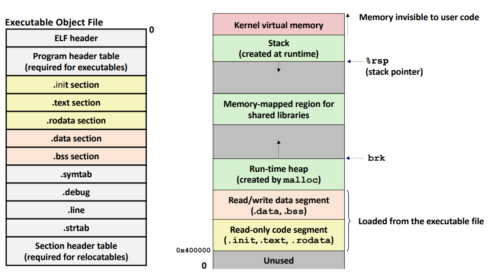

    注：上图中 <%esp> 是 x86 中的栈指针，riscv 中应为 sp

#### **用汇编来描述可执行文件！**
汇编文件可以描述不同的节及其数据（根据存储程序概念，这里的数据有一部分就是指令），在汇编中可以通过特定的语法来描述节的开始，在节与节之间的填写指令和伪指令，由汇编器将其转换为二进制的数据，即可执行文件

你生成的汇编程序大概包括以下部分:
```arm
    .data
     ...
 
    .bss
     ...

    .text

## f 是源程序中的一个函数，通过 jr  ra 返回
f:
    ...
    jr  ra

## main 是源程序中的一个函数，执行过程中通过 jal f 调用函数 f，通过 jr  ra 返回
main:
    ...
    jal f
    ...
    jr  ra
```

**.data** 表示数据段开始，接下来可以使用 `.word` `.byte` `.commn` 数据相关的伪指令来记录数据，通常是指用来存放程序中已初始化的全局变量的一块内存区域，数据段属于静态内存分配

**.bss** 表示 bss(Block Started by Symbol) 段开始，可以使用 `.space` 等指令分配初始化为 0 的一块区域，属于静态内存分配

**.text** 表示代码段开始，通常是指用来存放程序执行代码的一块内存区域。这部分区域的大小在程序运行前就已经确定，并且内存区域通常属于只读, 某些架构也允许代码段为可写，即允许修改程序。在代码段中，也有可能包含一些只读的常数变量，例如字符串常量等

`f` 和 `main` 在这里被叫做符号或标签，他们本身不会被真正存放在代码段中，他们代表的是下一条指令的地址，如果在指令中使用了该符号，汇编器在汇编时会填入该地址


**`jal f`** 的反汇编结果如下，`10350` 是这一条指令的地址，`3fe1` 是这条 jal 指令对应的二进码，`jal	10328 <f>` 中 `10328` 是符号 `f` 所代表的地址，也就是 **函数f** 的第一条汇编的地址

       10350:	3fe1                	jal	10328 <f>

**汇编中的指令和伪指令只是助记符，每一条其实就代表了一段二进制码，不同的节中的指令由汇编器放到不同的地方，所以用汇编就可以描述可执行文件！**

#### **从哪里获得示例和参考？**
为了清晰的看到汇编是如何转化为可执行文件，对于一个 SysY 源程序，你可以把他转化为 C 文件，通过 gcc 编译成汇编和可执行文件，可执行文件可以通过 objdump 进行反汇编，观察汇编与 dump 结果。同时 gcc 的汇编结果可以作为你生成汇编程序的参考

> 不知道工具如何使用？ 文档不会告诉你的，STFW！


#### **程序二进制接口**
程序二进制接口 **ABI（application binary interface）** 定义了机器代码（即汇编）如何访问数据结构与运算程序，它包含了

**数据类型的大小、布局和对齐**

**函数调用约定**

**系统调用约定**

**二进制目标文件格式**

等内容。决定要不要采取既定的ABI通常由编译器，操作系统或库的开发者来决定。但如果撰写一个混和多个编程语言的应用程序，就必须直接处理ABI，采用外部函数调用来达成此目的。

我们在开发编译器的过程中，生成的汇编文件应 **遵循 riscv ABI 规范**，这样我们编译器的生成的汇编才可以使用库函数，正确的被加载，并在执行后正确的返回。
> 如果不这么做就会出现各种奇奇怪怪的段错误！你可能不了解 riscv ABI，但是我想你应该知道怎么做

### **1. 内存管理**
我们知道在 ir 中，每个函数在执行时都需要维护自己的上下文，包括局部变量、运行位置。在程序执行的过程中，我们同样需要在内存中的栈上保存他们。

#### **变量寻址**
在 IR 测评机中我们屏蔽掉了内存上的细节，IR 测评机保证你可以通过名字找到操作数，但是汇编中只能从内存中的某一个地址读取数据。所以我们需要对内存进行管理和分配，并记录内存地址与变量的对应关系。在变量分配的过程中，需要考虑 **由 ABI 规定的数据类型的大小、布局和对齐** 等问题

因为函数的局部变量保存在栈上，可以使用 **栈指针 + 偏移量** 的方法来确定变量在内存中的位置。在框架代码中为你们提供了这样一个数据结构，将变量与栈指针偏移量做映射，在内存中一一对应

```C++
struct stackVarMap {
    std::map<ir::Operand, int> _table;

    /**
     * @brief find the addr of a ir::Operand
     * @return the offset
    */
    int find_operand(ir::Operand);

    /**
     * @brief add a ir::Operand into current map, alloc space for this variable in memory 
     * @param[in] size: the space needed(in byte)
     * @return the offset
    */
    int add_operand(ir::Operand, uint32_t size = 4);
};
```
局部变量寻址由函数 `int find_operand(ir::Operand);` 返回的偏移量 + 栈指针来实现；向 table 中添加变量并维护变量与偏移量的映射由 `int add_operand(ir::Operand, uint32_t size = 4);` 来实现，**你需要实现这两个函数**

**变量与偏移量的映射** 只是一个逻辑映射，产生汇编代码时认为变量的值存放与此，你需要产生汇编代码来完成内存的分配、使用 load/store 操作相应地址来 读取/存放 变量的值

#### **示例**
以 **函数f** 为例子说明内存管理的内容，其定义如下：
```C++
void f() {
    int a,b;
    int A[5];
    ...
}
```

该函数使用了两个整形变量和一个数组，共 **2x4 **+** 5x4** = **28** bytes

其映射可以为：
    
    {a, Int}        : sp+4
    {b, Int}        : sp+8
    {A, IntLiteral} : sp+12

那么在栈中操作变量值的汇编为
```arm
## a
lw  t0, 4(sp)
sw  t0, 4(sp)

## b
lw  t0, 8(sp)
sw  t0, 8(sp)

## A[1]
lw  t0, 16(sp)
sw  t0, 16(sp)
```

> A 数组占用 20 bytes，从 sp+12 到 sp+28，但是可以有两种存放顺序
>
> 1. A[0] 存放在 sp+12，其余依次递增
>
> 2. A[0] 存放在 sp+28，其余依次递减
>
> 此处 A[1] 的地址计算为 &A[0] + 4，只是举例说明，不一定正确，你需要根据 riscv 对数组顺序的规定来生成对应的代码

### **2. 函数调用**

#### **栈与栈指针**

内存中的栈用于存储函数调用过程中的局部变量、函数参数、返回地址等信息，通过栈指针来管理。

栈指针的变化反映了栈的状态，包括栈的扩展和收缩。当**函数被调用时**，栈指针会**向下移动**，为局部变量和其他相关数据**分配空间**；当函数返回时，栈指针会**向上移动**，**释放已分配的空间**，恢复到调用该函数之前的状态。

#### **函数调用约定**
函数调用过程通常分为以下六步：
1. 调用者将参数存储到被调用的函数可以访问到的位置；
2. 跳转到被调用函数起始位置；
3. 被调用函数**获取所需要的局部存储资源，按需保存寄存器(callee saved registers)** ；
4. 执行函数中的指令；
5. **将返回值存储到调用者能够访问到的位置，恢复之前保存的寄存器(callee saved registers)，释放局部存储资源**；
6. 返回调用函数的位置。
> 查阅相关资料阅读 **riscv calling convention** 相关内容，推荐 [riscv 官方技术手册](https://riscv.org/technical/specifications/) 

callee saved registers 是那些 caller 不希望在函数调用中被改变的寄存器，如果 callee 用到了这些寄存器，应该把他们保存下来并在函数调用返回时恢复

函数调用约定规定了函数调用者（caller）和被调用者（callee）分别需要做的事情，以及如何去做，以下分别介绍如何使用汇编实现函数调用

#### **caller 示例**
caller 需要执行步骤 1 和 2 —— **将参数存储到被调用的函数可以访问到的位置，跳转到被调用函数起始位置**

其汇编应实现为
```arm
caller:
    # 将参数存储到被调用的函数可以访问到的位置，查阅 riscv ABI 完成此项
    ...
    # 跳转到 callee 的第一条指令所在地址
    jal callee
    # 函数调用约定保证 callee 返回后执行 jal callee 的下一条指令
    ...
```

`jal label` 其实是 `jal x1, imm` 的伪指令，其功能为将 PC+4 存放到 x1 寄存器，并使 PC += imm；callee 只需要使用指令取出 x1 的值并跳转，即可回到 caller 原来执行的位置继续执行
> callee 知道 caller 会将 PC+4 存放在 x1 中，才可以在结束时跳转回这个地址，**这便是函数调用约定的意义**，你知道为什么是 x1 吗？

#### **callee 示例**
**每一个函数都可能是被调用者，所以每一个函数的汇编实现都应该遵守被调用函数的约定**

callee 需要在开始时先将 callee saved registers 保存到栈上，即将需要保存的寄存器 push 到内存的栈中；然后进行内存分配 —— 通过将 sp 向下移动来实现；此时才可以执行实现函数功能所需要的指令；执行完成后，需要向上移动 sp 来回收分配给该函数的栈空间，再 pop 出 callee saved registers 到原来的寄存器里，将返回值存储到调用者能够访问到的位置，最后跳转回原来的位置

其汇编应实现为
```arm
callee:
    # 将 callee saved registers 保存到栈上
    # 查阅 riscv ABI 以明白哪些是 callee saved registers，此处以保存 x1 为例
    addi    sp, sp, -4
    sw      x1, 4(s0)
    ...

    # 内存分配，分配的栈空间用于存放局部变量，按需分配
    addi    sp, sp, -xxx
    
    # 实现函数功能所需指令
    ...
    
    # 内存回收，与分配值相同
    addi    sp, sp, xxx

    # 将保存到栈上的 callee saved registers 重新 pop 到原寄存器 
    ...
    lw      x1, 4(s0)
    addi    sp, sp, 4
    
    # 返回
    # 将返回值存储到调用者能够访问到的位置，查阅 riscv ABI 完成此项
    ...
    # 最后，根据函数调用约定，调用者的 PC+4 就存放在 x1 中，跳转回去即可
    jr      x1
```

### **3. 全局变量**
全局变量存放在内存的数据段中，在汇编可以使用 `.space` `.word` 等伪指令声明，通过标签对其进行寻址

#### **示例**
定义一个全局变量 `int a = 7;`，以下展示如何声明并对他进行寻址

```arm
.data
a:  .word   7
```

使用 `lw rd, symbol` 可以加载全局变量的值，`sw rd, symbol, rt` 可以保存全局变量的值 
```arm
lw  t0, a       # 加载
sw  t0, a, t1   # 保存
```
### **4. 生成指令与函数**

#### **riscv 寄存器与指令数据结构定义**

代码框架中定义了一些 riscv 相关的数据结构，[rv_def.h](./src/include/backend/rv_def.h) 定义了 riscv 寄存器、指令的枚举类，此处并没有列举出所有的指令类型，你需要时可以自行添加

```C++
// rv interger registers
enum class rvREG {
    /* Xn       its ABI name*/
    X0,         // zero
    X1,         // ra
    X2,         // sp
    X3,         // gp
    X4,         // tp
    X5,         // t0
    ...
};
std::string toString(rvREG r);  // implement this in ur own way

enum class rvFREG {
    F0,
    F1,
    F2,
    F3,
    F4,
    F5,
    ...
};
std::string toString(rvFREG r);  // implement this in ur own way

// rv32i instructions
// add instruction u need here!
enum class rvOPCODE {
    // RV32I Base Integer Instructions
    ADD, SUB, XOR, OR, AND, SLL, SRL, SRA, SLT, SLTU,       // arithmetic & logic
    ADDI, XORI, ORI, ANDI, SLLI, SRLI, SRAI, SLTI, SLTIU,   // immediate
    LW, SW,                                                 // load & store
    BEQ, BNE, BLT, BGE, BLTU, BGEU,                         // conditional branch
    JAL, JALR,                                              // jump

    // RV32M Multiply Extension

    // RV32F / D Floating-Point Extensions

    // Pseudo Instructions
    LA, LI, MOV, J,                                         // ...
};
std::string toString(rvOPCODE r);  // implement this in ur own way
```


[rv_inst_impl.h](./src/include/backend/rv_inst_impl.h) 定义了一个通用的 riscv 指令数据结构（当然你可以不使用它，选择你喜欢的实现方式
```C++
struct rv_inst {
    rvREG rd, rs1, rs2;         // operands of rv inst
    rvOPCODE op;                // opcode of rv inst
    
    uint32_t imm;               // optional, in immediate inst
    std::string label;          // optional, in beq/jarl inst

    std::string draw() const;
};
```
通过 `std::string draw() const` 对不同 rvOPCODE 进行不同的输出，可以使该数据结构支持普通指令 (opcode, rd, rs, rt) ，也可以支持立即数指令(opcode, rd, rs, imm)，还可以支持在该指令前打上标签(label: opcode, rd, rs, rt) 或是跳转指令 (jump, rd, label)

#### **生成指令**
接下来我们考虑如何**将 IR 翻译为指令**，我们的 IR 其实与指令十分相似，只是 IR 中没有寄存器的概念，变量值直接从内存中读取，现在我们需要使用 load & store 指令从内存中获取变量，加载到某个寄存器，在此过程中需要**处理寄存器分配，考虑 ABI 对特定寄存器的功能的规定**

一种简单的处理的处理方式是不进行寄存器的分配，将每条 IR 的 op1 & op2 对应地址的值 load 到临时寄存器 t0 & t1，使用相应的 riscv 指令进行运算，指令的 rd 选择固定的 t2，然后将其 store 回 des 所对应的地址

根据 **1. 内存管理** 的介绍，你已经知道怎么处理**局部变量**的地址了，记得处理**全局变量**这个例外情况。假设一条 IR 为 `add sum, a, b`，他们都是局部变量，那么其汇编应实现为：
```arm
lw  t0, xx(sp)  # load Operand(a) 到 t0
lw  t1, xx(sp)  # load Operand(b) 到 t1
add t2, t0, t1
sw  t2, xx(sp)  # store t2 到 Operand(sum) 对应地址
```
> 并不是每一种 IR Operator 都有对应的指令，但是你可以通过指令的组合实现，具体请查阅 riscv 手册

代码框架种定义了接口
```C++
void gen_instr(const ir::Instruction&);
```
你可以通过实现该函数来完成 IR 到指令的生成过程，其伪代码大概如下，记得考虑全局变量的情况：
```C++
void backend::Generator::gen_instr(const ir::Instruction& inst) {
    // if local    : get_ld_inst() -> {op = lw, rd = t0, rs = sp, imm = map.find_operand(inst.op1)}; 
    // if global   : get_ld_inst() -> {op = lw, rd = t0, label = inst.op1.name}; 
    rv::rv_inst ld_op1 = get_ld_inst(inst.op1);
    rv::rv_inst ld_op2 = get_ld_inst(inst.op2);

    // translate IR into instruction
    rv::rv_inst ir_inst;
    switch (inst.op) {
    case ir::Operator::add:
        ir_inst = {op = add, rd = t2, rs = t0, rt = t1};
        break;
    ...
    default:
        assert(0 && "illegal inst.op");
        break;
    }
    
    rv::rv_inst st_des = get_st_inst(inst.des);
    
    output(ld_op1, ld_op2, ir_inst, st_des);
}
```

#### **寄存器分配**
在以上的介绍中，我们使用了固定的寄存器作为源操作数和目的操作数，但是这样程序就需要经常进行访存，所以需要进行寄存器分配，为程序处理的值找到存储位置的问题。这些变量可以存放到寄存器，也可以存放在内存中。寄存器更快，但数量有限。内存很多，但访问速度慢。好的寄存器分配算法尽量将使用更频繁的变量保存的寄存器中。

代码框架中提供了一套 api，你可以在根据自己的需求修改并实现他们以进行寄存器的分配
> 即使你不想做寄存器的分配，你也应该在 gen_instr 使用这一套 api 而不是写死 t0 t1 t2，固定分配只需要将 api 实现为返回固定寄存器即可，例如 **getRd 实现为 return rv::rvReg::X7;**。当你在后续的实验中做寄存器分配时就只需要修改 api 的内部实现，这样做程序才拥有可扩展性

```C++
// reg allocate api
rv::rvREG getRd(ir::Operand);
rv::rvFREG fgetRd(ir::Operand);
rv::rvREG getRs1(ir::Operand);
rv::rvREG getRs2(ir::Operand);
rv::rvFREG fgetRs1(ir::Operand);
rv::rvFREG fgetRs2(ir::Operand);
```

#### **生成函数**
在 **3. 函数调用** 的 **callee 示例** 种详细介绍了一个函数的汇编实现，代码框架种定义了接口
```C++
void gen_func(const ir::Function&);
```
你可以通过实现该函数来完成 IR Function 到函数汇编指令的生成过程，其伪代码大概如下：
```C++
void gen_func(const ir::Function& func) {
    // do sth to deal with callee saved register & subtract stack pointer
    ...
    output(...);

    // translate all IRs in InstVec into assembly
    for (auto inst: func.InstVec) {
        gen_instr(*inst);
    }

    // do sth to pop callee saved register & recovery stack pointer
    ...
    output(...);

    // gen instructio to jump back
    rv::rv_inst jump_back = {op = jr, rd = x1};
    output(jump_back);
}
```

### **5. 程序接口**
在本次实验中，你们需要实现 Generator 类，main 函数保证调用 `void gen();` ，你需要在该函数中实现 ir::Program 到 riscv 汇编程序的转化，并将生成的汇编程序写入 `fout` 中
```C++
struct Generator {
    const ir::Program& program;         // the program to gen
    std::ofstream& fout;                 // output file

    Generator(ir::Program&, std::ofstream&);

    // reg allocate api
    rv::rvREG getRd(ir::Operand);
    rv::rvFREG fgetRd(ir::Operand);
    rv::rvREG getRs1(ir::Operand);
    rv::rvREG getRs2(ir::Operand);
    rv::rvFREG fgetRs1(ir::Operand);
    rv::rvFREG fgetRs2(ir::Operand);

    // generate wrapper function
    void gen();
    void gen_func(const ir::Function&);
    void gen_instr(const ir::Instruction&);
};

```

`void gen();` 应先处理全局变量 `program.globalVal`，再遍历 `program.functions` 调用 `void gen_func(const ir::Function&)` 对函数进行翻译


## 运行时库

运行时库提供一系列I/O函数用于在程序中表达输入输出功能，这些库函数不在输入源程序中声明即可在源程序的函数中使用。参考实现：[sylib.c](./src/sylib.c) [sylib.h](./src/sylib.h)

### 相关文件
(你们在实验三前不需要在意提供文件的部分，因为实验二的库函数是写在测评机里的)
​提供如下运行时库文件：

- **libsysy.a**运行时库的静态库（面向不同目标平台）。我们实验评测均采用静态库链接进行评测。
- **sylib.h**包含运行时库涉及的函数等的声明。

需要注意，源程序中不出现对**sylib.h**的文件包含，而是由同学们写的编译器分析处理源程序中对这些函数的调用。

### I/O函数

##### int getint()

输入一个整数，返回对应的整数值。

示例如下：

```c++
int n; n = getint();
```

##### int getch()

输入一个字符，返回字符对应的ASCII码值。

示例如下：

```c
int n; n = getch();
```

##### float getfloat()

输入一个浮点数，返回对应的浮点数值。

示例如下：

```c
float n; n = getfloat();
```

##### int getarray(int[])

输入一串整数，第一个整数代表后续要输入的整数个数，该个数通过返回值返回；后续的整数通过传入的数组参数返回。

注：getarray函数获取传入的数组的起始地址，不检查调用者提供的数组是否有足够的空间容纳输入的一串整数。

示例如下：

```c
int a[10][10]; int n = getarray(a[0]);
```

##### int getfarray(float [])

输入一个整数后跟若干浮点数，第一个整数代表后续要输入的浮点数个数，该个数通过返回值返回；后续的浮点数通过传入的数组参数返回。

注：getfarray函数获取传入的数组的起始地址，不检查调用者提供的数组是否有足够的空间容纳输入的一串浮点数。

示例如下：

```c
float a[10][10]; int n = getfarray(a[0]);
```

##### void putint(int)

输出一个整数的值。

示例如下：

```c
int n = 10; putint(n); putint(10); putint(n);
// 将输出:10 10 10
```

##### void putch(int)

将整数参数的值作为ASCII码，输出该ASCII码对应的字符。

注：传入的整数参数取值范围为0~255，putch()不检查参数的合法性。

示例如下：

```c
int n = 10; putch(n);
// 将输出换行符
```

##### void putfloat(float)

输出一个浮点数的值 ()

示例如下：

```c
float n = 10.0; putfloat(n); 
// 将输出:0x1.400000p+3
```

##### void putarray(int,int[])

第一个参数表示要输出的整数个数（假设为N），后面跟上要输出的N个整数的数组。putarray在输出时会在整数之间安插空格。

注：putarray函数不检查参数的合法性。

示例如下：

```c
int n = 2; int a[2]={2,3}; putarray(n,a);
// 输出:
// 2: 2 3
```

##### void putfarray(int,float[])

第一个参数表示要输出的浮点数个数（假设为N），后面跟上要输出的N个浮点数的数组。putfarray在输出时会在浮点数之间安插空格。

注：putfarray函数不检查参数的合法性。

示例如下：

```c
int n = 2; float a[2] = {2.0, 3.0};
putfarray(n,a);
// 输出:
// 2: 0x1.000000p+1 0x1.800000p+1
```

### 计时函数
FIXME in lab4


## VLA

VLA（变长数组，Variable Length Array）在 C 语言中是一个很有意思、也有点曲折的特性。下面是它的发展历史：

------

### 🧠 什么是 VLA？

VLA 是指数组的大小在**运行时动态确定**，但仍然存储在栈上，不需要 `malloc` 等堆分配。

```c
void foo(int n) {
    int a[n];  // 这是 VLA
}
```

------

### 📜 VLA 的发展历程

#### ✅ C99 —— 初次引入（正式支持）

- **C99 标准**第一次引入 VLA。
- 原因是：为了更方便地写一些数学、科学计算中需要“按需分配栈空间”的数组。
- 特点：
  - VLA 的大小可以是函数参数、局部变量等**运行时值**。
  - 生命周期与普通局部变量相同（函数调用结束自动释放）。

```c
// 合法：n 由参数决定
void example(int n) {
    int arr[n];
}
```

------

#### ⚠️ C11 —— 改为“可选特性”（optional）

- 在 **C11 标准**中，VLA 被**降级为 optional feature**。

- 也就是说：

  > 编译器**不再被强制要求支持** VLA。

- 原因：

  - 实现起来较复杂，尤其在内存紧张或嵌入式系统中。
  - 和内存安全、栈空间控制有潜在冲突。

- 在嵌入式编程中，很多人希望禁用 VLA。

> ✅ GCC 仍默认支持 VLA，除非用 `-std=c11 -fno-vla` 显式禁用。

------

#### ⛔ C23 —— VLA 彻底移除？

- C23 标准已发布，目前 **未完全移除 VLA**，但更倾向于让实现自己决定。
- 趋势上，**主流编译器依然保留对 VLA 的支持**，但在嵌入式或代码规范中经常被禁用（比如 MISRA C）。

------

### 🧪 VLA 在不同标准中的支持表

| 标准版本 | VLA 支持 | 状态说明                    |
| -------- | -------- | --------------------------- |
| C89/C90  | ❌ 不支持 | 只能用常量表达式做数组大小  |
| C99      | ✅ 支持   | 正式标准，强制支持          |
| C11      | ⚠️ 可选   | 变成 optional，编译器可禁用 |
| C17      | ⚠️ 同上   | 基于 C11，无新内容          |
| C23      | ⚠️ 模糊   | 趋势上鼓励禁用，但尚未移除  |

------

### ✅ GCC / Clang 对 VLA 的支持情况

| 编译器 | 默认支持 VLA？ | 说明                                   |
| ------ | -------------- | -------------------------------------- |
| GCC    | ✅ 默认支持     | 可用 `-fno-vla` 禁用                   |
| Clang  | ✅ 默认支持     | 同上                                   |
| MSVC   | ❌ 不支持       | Windows 平台不支持 VLA（需改用堆分配） |

------

### 🤔 为什么很多规范/项目禁用 VLA？

- 它使用的是栈空间 → 如果 `n` 太大，容易造成**栈溢出**
- 在嵌入式系统中，栈非常小
- 一些代码规范（如 MISRA C）会建议显式分配内存更安全、可控

------

### ✅ 总结

| 阶段 | VLA 状态   | 说明                           |
| ---- | ---------- | ------------------------------ |
| C99  | ✅ 正式引入 | 新特性、方便计算、科学编程     |
| C11  | ⚠️ 可选     | 为了可移植性和内存控制放宽要求 |
| C17  | ⚠️ 可选     | 没有变化                       |
| C23  | ⚠️ 弱化     | 更建议使用 safer 替代方式      |

这个问题问得非常深入，我们来一探 GCC 是**如何实现多个 VLA（变长数组）分配的底层逻辑**，也就是在函数中写了：

```c
void foo(int n, int m) {
    int a[n];
    int b[m];
}
```


GCC 是**怎么安排它们在栈上的布局**的？这个涉及到栈帧管理、对齐算法和变量地址计算，我们一步步来讲 👇

------

### ✅ GCC 实现 VLA 的**基本策略**

> **核心点：所有 VLA 都是栈上分配，分配顺序按声明顺序从高地址往低地址放（栈向下长）**
>  这个顺序是在 **声明时计算各数组大小，最后统一修改 `sp`** 来完成的。

------

### 💡 一步步来看：两个 VLA 的分配流程（GCC 内部逻辑）

以 `int a[n]; int b[m];` 为例：

#### 🔶 步骤 1：计算每个数组大小（以字节为单位）

```c
size_a = n * sizeof(int);  // 即 n * 4
size_b = m * sizeof(int);  // 即 m * 4
```

------

#### 🔶 步骤 2：每个数组的大小都**向上对齐到 16 字节**

> 遵循 ABI，栈上对象（特别是结构体或数组）必须至少 16 字节对齐（RISC-V 64）

GCC 用的是这样的宏：

```c
aligned_size_a = (size_a + 15) & ~15;
aligned_size_b = (size_b + 15) & ~15;
```

🔹 举例：

- 如果 `n = 3`，`size_a = 12`，对齐后变成 16
- 如果 `m = 7`，`size_b = 28`，对齐后变成 32

------

#### 🔶 步骤 3：计算总共需要的栈空间

```c
total_size = aligned_size_a + aligned_size_b;
```

然后在函数开始时：

```asm
sub sp, sp, total_size
```

------

#### 🔶 步骤 4：计算每个数组的地址（偏移）

```c
b_addr = sp;                            // b 是最后分配，最低地址
a_addr = sp + aligned_size_b;          // a 紧接在 b 之后
```

所以：

- `b` 位于 `sp` 开头
- `a` 紧跟其后（内存中更高地址）

------

### 📦 栈帧布局图示（sp 从高到低）：

```
                ↑ 栈高地址
                │
     [ a[n] ] ← sp + aligned_size_b
                │
     [ b[m] ] ← sp
                ↓ 栈低地址（向下）
```

------

### ✅ 例子（模拟生成的汇编片段）

我们假设 `n` 存在 `a0`，`m` 存在 `a1`：

```asm
    # 计算 size_a = n * 4，aligned
    slli t0, a0, 2
    addi t0, t0, 15
    andi t0, t0, -16     # t0 = aligned_size_a

    # 计算 size_b = m * 4，aligned
    slli t1, a1, 2
    addi t1, t1, 15
    andi t1, t1, -16     # t1 = aligned_size_b

    # 栈分配 total = t0 + t1
    add  t2, t0, t1
    sub  sp, sp, t2

    # b 的地址
    mv   s0, sp          # s0 -> b[m]
    
    # a 的地址
    add  s1, sp, t1      # s1 -> a[n]
```

------

### 🧠 编译器为什么这么做？

- **效率**：使用栈分配比堆分配快太多（只要 `sp -= size`）
- **简洁**：自动生命周期管理，函数结束自动释放
- **安全**：对齐确保不会破坏数据结构/ABI 协议
- **灵活**：可以支持多个 VLA，只需计算偏移即可

------

### 🔍 小贴士：你可以观察 GCC 的实现方式

你可以手动编译并查看中间代码：

```bash
riscv64-unknown-elf-gcc -S -O0 foo.c -o foo.s
```

或者用 `-fdump-tree-all` 查看 GCC 的内部中间表示，比如：

```bash
gcc -std=c99 -fdump-tree-original foo.c
```

------

### ✅ 总结表：GCC 分配多个 VLA 的算法核心

| 步骤       | 说明                                   |
| ---------- | -------------------------------------- |
| 计算大小   | `n * sizeof(type)`                     |
| 对齐大小   | 向上对齐到 16 字节（`(x + 15) & ~15`） |
| 总空间     | 所有 VLA 对齐后加总                    |
| 栈指针调整 | `sp -= total_size`                     |
| 地址计算   | 后声明的数组先放，前面的往高地址偏移   |
| 生命周期   | 函数退出自动回收，无需手动 free        |

## 栈帧

在 RISC-V 架构中，**栈帧（stack frame）** 是函数调用时用来存储局部变量、返回地址、保存的寄存器等信息的一段栈空间。栈帧的布局虽然不是固定强制的，但有一定的**约定俗成（calling convention）**，特别是在 RISC-V 的标准 ABI（如 RV32I 或 RV64I）中。

------

### 🧩 RISC-V 栈帧结构（通用约定）

一个典型的栈帧结构如下（假设栈向下增长）：

```
+-------------------------------+ <-- 高地址
| 栈上传递的参数 (超过 a7)      | 由调用者填写
+-------------------------------+
| 返回地址 ra（x1）             | 由被调用者保存
| 被调用者保存的 s0-s11 寄存器  | 由被调用者保存
| 本地变量空间                   | 由被调用者使用
| 临时调用其他函数的参数空间    | 被调用者分配，至少 8*8 = 64 字节
+-------------------------------+ <-- sp（对齐到16字节）

```

------

### 📌 栈帧组成详解

| 名称                    | 描述                                                         |
| ----------------------- | ------------------------------------------------------------ |
| **返回地址 `ra`**       | 如果调用另一个函数，需要保存当前函数的返回地址（通常保存在栈中） |
| **保存寄存器 `s0~s11`** | 被调用函数如果使用了这些寄存器，需要保存它们的原值，并在返回前恢复 |
| **临时寄存器 `t0~t6`**  | 不需要保存，它们是 caller-saved，调用者负责保存              |
| **局部变量**            | 一般放在栈上，由函数自行分配空间                             |
| **函数参数**            | 前 8 个参数用 `a0~a7` 传递，更多的参数通过栈传递             |

------

### 📘 示例

一个函数在汇编中分配栈帧的典型方式如下：

```assembly
foo:
    addi sp, sp, -16        # 分配栈空间
    sw   ra, 12(sp)         # 保存返回地址
    sw   s0, 8(sp)          # 保存 s0 寄存器
    addi s0, sp, 16         # 设置帧指针（frame pointer）
    
    ...                     # 函数体
    
    lw   ra, 12(sp)         # 恢复返回地址
    lw   s0, 8(sp)          # 恢复 s0
    addi sp, sp, 16         # 释放栈空间
    ret
```

------

### ✅ 函数调用时的基本规则（RISC-V Calling Convention）

| 类别       | 寄存器    | 说明                            |
| ---------- | --------- | ------------------------------- |
| 返回地址   | `ra`      | 存返回地址                      |
| 栈指针     | `sp`      | 指向当前栈帧底部                |
| 帧指针     | `s0`/`fp` | 有时作为帧指针用                |
| 参数       | `a0-a7`   | 最多 8 个参数通过这些寄存器传递 |
| 返回值     | `a0-a1`   | 返回值存放位置                  |
| 临时寄存器 | `t0-t6`   | 调用者保存（caller-saved）      |
| 保存寄存器 | `s0-s11`  | 被调用者保存（callee-saved）    |


## 汇编伪指令(pseudo-instructions / directives)

下面是一个常用 **RISC-V 汇编伪指令（pseudo-instructions / directives）** 的分类表格，包含常见的 **伪指令含义、底层等效指令或用途说明**，适用于 GNU 汇编器（如 `riscv64-unknown-elf-as`）：

------

### 🧩 RISC-V 汇编常用伪指令速查表

#### 📁 1. 数据伪指令（数据定义）

| 伪指令               | 含义 / 功能                      | 示例                        |
| -------------------- | -------------------------------- | --------------------------- |
| `.byte`              | 定义 1 字节数据                  | `.byte 0x12`                |
| `.half` / `.2byte`   | 定义 2 字节数据                  | `.half 0x1234`              |
| `.word` / `.4byte`   | 定义 4 字节数据                  | `.word 0x12345678`          |
| `.dword` / `.8byte`  | 定义 8 字节数据（RV64 用）       | `.dword 0x123456789abcdef0` |
| `.ascii`             | 定义 ASCII 字符串，不含结尾 NULL | `.ascii "Hello"`            |
| `.asciz` / `.string` | 定义 NULL 结尾字符串             | `.asciz "Hello"`            |
| `.zero N`            | 分配 N 个字节并清零              | `.zero 8`                   |
| `.space N`           | 分配 N 个字节（内容未定义）      | `.space 16`                 |

------

#### 📌 2. 符号与大小相关

| 伪指令                           | 含义 / 功能             | 示例                      |
| -------------------------------- | ----------------------- | ------------------------- |
| `.globl <sym>`                   | 声明全局符号            | `.globl main`             |
| `.type <sym>, @function/@object` | 指定符号类型            | `.type myfunc, @function` |
| `.size <sym>, <size>`            | 指定符号大小            | `.size myfunc, .-myfunc`  |
| `.align N`                       | 地址对齐至 2^N 字节边界 | `.align 2`（4 字节对齐）  |
| `.equ <name>, <expr>`            | 定义常量                | `.equ bufsize, 64`        |
| `.set <name>, <expr>`            | 同 `.equ`，但可重定义   | `.set maxval, 100`        |

------

#### 🧠 3. 控制伪指令（程序段）

| 伪指令            | 含义 / 功能                       | 示例             |
| ----------------- | --------------------------------- | ---------------- |
| `.section <name>` | 切换到指定段，如 `.text`、`.data` | `.section .data` |
| `.text`           | 切换到代码段                      | `.text`          |
| `.data`           | 切换到数据段                      | `.data`          |
| `.bss`            | 切换到未初始化数据段              | `.bss`           |
| `.global`         | 同 `.globl`                       | `.global main`   |
| `.end`            | 一般用于结束文件（可选）          | `.end`           |

------

#### 🔄 4. 汇编伪指令（指令别名 / 简化）

| 伪指令（高层）  | 等效真实指令（底层）        | 说明                  |
| --------------- | --------------------------- | --------------------- |
| `li rd, imm`    | 多条 `lui`+`addi` 或 `addi` | 加载立即数            |
| `mv rd, rs`     | `addi rd, rs, 0`            | 寄存器复制            |
| `nop`           | `addi x0, x0, 0`            | 空操作                |
| `ret`           | `jalr x0, ra, 0`            | 返回                  |
| `call <func>`   | 保存 ra，跳转至 func        | 函数调用              |
| `j <label>`     | `jal x0, label`             | 无条件跳转            |
| `jr rs`         | `jalr x0, rs, 0`            | 跳转到寄存器地址      |
| `la rd, symbol` | 加载地址到寄存器            | `auipc` + `addi` 实现 |
| `lw rd, symbol` | 加载符号对应的地址          | 需要 `la` 加载地址    |

------

#### 🔧 5. 调试与标签

| 伪指令          | 含义 / 功能                    | 示例             |
| --------------- | ------------------------------ | ---------------- |
| `<label>:`      | 定义标签                       | `loop_start:`    |
| `.L<name>`      | 局部标签（不会出现在符号表）   | `.L1:`           |
| `.file`, `.loc` | 用于调试信息标注（配合 DWARF） | 自动由编译器生成 |

------

如果你是在使用 `riscv64-unknown-elf-gcc` 或 `objdump`，可以观察 `.size`、`.type`、`.section` 这些指令广泛存在于编译结果中，用于标记函数和变量的属性。

#实验四

#q&a

## store、load和getptr生成汇编

在编译器中实现数组访问的内存寻址时，我采用了不同的策略来处理一维和多维数组：

### 一维数组的简单寻址

对于一维数组（如`int a[3] = {1,2,3}`），我在符号表中只记录：

- 数组名称
- 数组基地址相对于栈指针(sp)的偏移量

访问格式：`table = { (a, offset) }`

元素访问计算公式：`地址 = sp + offset + index * 4`

### 多维数组的复合寻址

对于多维数组（如`int b[3][3]`），访问过程更复杂：

1. 首先需要获取子数组的基址（如`b[2]`的基址）
2. 将这个基址存入中间变量（如变量`x`）
3. 然后通过这个中间变量访问最终元素（如`b[2][2]`）

### 寻址冲突问题

这里出现了冲突：

- 对于普通变量，使用：`sp + offset + index * 4`
- 对于存储指针的变量，需要使用：`sp + x.val + index * 4`

由于变量`x`可能存储的是指针值或普通值，系统无法自动区分应该使用哪种寻址方式。

这两者就出现了冲突，因为x.val不一定是一个指向地址的指针，有可能就是数组本身的值（例如`b[2]`）。所以用了一个set来记录哪些值是存放指针的。

```cpp
// 记录哪些变量存的是一个指针
std::unordered_set<std::string> val_is_pointer;
```

根据存放的内容到底是不是一个指向地址的指针，选择对应的计算式：

$offset + index * 4 + sp$ or $x.val+index*4+sp$

代码实现：

```cpp
// 把des寄存器的内容放到内存中
if (val_is_pointer.find(op1.name) != val_is_pointer.end()) {
    // 把指针指向的地址取出来
    auto op1_reg{getRs1(op1)};
    load_operand_in_reg(op1, op1_reg, func_svm);
    auto arr_addr_reg{rv::rvREG::T4};
    fout << "\taddi\t" << toString(arr_addr_reg) << ", "
        << toString(op1_reg) << ", " << std::stoi(op2.name) * 4
        << "\n";
    fout << "\tsw\t" << rv::toString(des_reg) << ", 0("
        << toString(arr_addr_reg) << ")\n";
} else {
    fout << "\tsw\t" << rv::toString(des_reg) << ", "
        << std::stoi(op2.name) * 4 + func_svm.find_operand(op1)
        << "(sp)" << "\n";
}
```


## 短路运算

短路运算是指在条件判断时，如果是‘||’操作，判断到一个为真就停止执行（跳过）后续的判断操作，如果是‘&&’判断到假就停止执行（跳过）后续的判断操作，这个短路运算是在第51号测试点short_circutt3等测试点中进行测试，51号测试点测试文件的片段如下：

```
a=2;b=3;
if(set_a(0)&&set_b(1)){}
putint(a);putch(32);
putint(b);putch(32);
```

其中set_a会返回传入的值（也就是0），同时会设置a=0，所以在这个打印中只执行了第一个set_a，判断到第一个为0就停止了set_b，最后打印出来的结果是“0 3 ”（32是空格）。

我当时就是在实验二生成IR测试这个测试点的时候意识到了这个问题，随后主要是改进了`LOrExp`节点和`LAndExp`节点的分析。

实际上，并不能做到停止生成后续的判断代码（因为对于变量，访问不了变量的具体值，没法做运算），所以还是会生成所有的判断逻辑的指令，需要做的是，在执行完一个LAndExp之后，做一个有条件跳转goto即可（和if的逻辑一样），代码如下：

```cpp
// 如果land是1就直接不做下面的指令
Instruction* goto_inst =
    new ir::Instruction(Operand{landexp->v, landexp->t},
                        Operand{},
                        Operand{"lazytag", Type::IntLiteral},
                        Operator::_goto);
buffer.emplace_back(goto_inst);
int tag_i = buffer.size() - 1;
```

这里标记了一个lazytag，是因为不知道后续生成的判断指令有多少，无法知道要跳转多少指令，所以在分析完这个节点的最后，去找到这个lazytag做更改即可。

#小技巧

## 早发现早停止

**“早发现早停止”，避免“晚爆炸”**


### 🧠 问题：

> “程序报错了？原来是因为空指针。它什么时候变成空指针的？”

程序在某个地方出错了（如空指针访问），但我们**很晚才看到**症状，如何在问题**刚出现时就发现它**？

```cpp
void f(){
    A* it = g();// 这里g()返回了空指针
    ......
    ......
    it->value = "value";//<- ERROR 
    //溯源难度很大，可能it在多个分支语句中被重新赋值
    ......
}
```

### ✅ 解法：在“潜在的出错点”放 `assert()`！

#### 🔍 原因：

- `assert()` 会在程序**第一次出现不合理状态时立即终止**，而不是等到后面访问内存才炸。
- 它能精确地告诉你，“这儿的状态不对”，而不是等到程序跑偏一段时间才提示你“已经晚了”。

------

### 🎯 改进你的代码（使用 `assert()`）

```cpp
void f(){
    A* it = g();
    assert(it != nullptr); // ✅ 提前发现问题，清晰地报出是 g() 出了问题

    // 如果没有 assert，这行才崩 → 已经晚了
    it->value = "value";
}
```

#### 💥 如果 g() 返回了空指针：

- 没有 assert：程序在 `it->value` 时崩溃，call stack 可能复杂、难找源头。
- 有了 assert：程序会在调用 g() 后立刻报错，告诉你 “g() 返回了空指针”。

------

### ✅ 总结：使用 `assert()` 提前暴露错误的 3 个理由

| 原因                  | 说明                                |
| --------------------- | ----------------------------------- |
| **1. 快速定位问题**   | 错误在第一时间暴露，而不是延迟触发  |
| **2. 提高调试效率**   | 可以明确告诉你“哪一个假设不成立了”  |
| **3. 文档化你的假设** | assert 表达了“我假设它不为空”的意图 |

------

### 🧠 最佳实践建议

| 情况                         | 建议做法                                   |
| ---------------------------- | ------------------------------------------ |
| 调试期验证逻辑               | ✅ 用 `assert()`                            |
| 对外部资源（文件、用户输入） | ❌ 不用 assert，应该用 `throw` 或返回错误码 |
| 生产代码                     | ✅ 用异常或检查，**assert 可选性保留**      |


## 智能指针预防内存泄露

在 C++ 中，**智能指针（`std::unique_ptr`, `std::shared_ptr` 等）是现代防止内存泄漏的关键手段**，替代了手动的 `new`/`delete` 机制。

### 🎯 什么是内存泄漏？

内存泄漏（Memory Leak）是指程序申请了一块堆内存，却没有在不需要时释放它，导致这部分内存永远无法再被访问或回收。

#### ❌ 例子（经典写法会泄漏）：

```cpp
void leak() {
    A* ptr = new A();  // 分配了内存
    // 忘记 delete ptr; 或者异常抛出后未能清理
} // 内存泄漏，程序无法再访问这块内存
```

------

### ✅ 智能指针如何预防泄漏？

智能指针是一种 **RAII（资源获取即初始化）机制**，它会在对象生命周期结束时**自动释放资源**。

------

### 🧠 常用智能指针

| 智能指针             | 含义                                   |
| -------------------- | -------------------------------------- |
| `std::unique_ptr<T>` | 独占所有权，不能共享，不可复制         |
| `std::shared_ptr<T>` | 引用计数，多个 `shared_ptr` 可共享对象 |
| `std::weak_ptr<T>`   | 不拥有对象，辅助解决循环引用问题       |

------

### ✅ 使用 `unique_ptr` 示例（防泄漏）：

```cpp
#include <memory>

void safe() {
    std::unique_ptr<A> ptr = std::make_unique<A>();
    // 自动释放，不会泄漏
} // 离开作用域时，自动调用 delete
```

#### 🚀 好处：

- 没有 `new`/`delete` 的麻烦
- 出现异常也不会泄漏
- RAII 保证资源生命周期正确

------

### ✅ `shared_ptr` 示例：

```cpp
#include <memory>

void shared() {
    std::shared_ptr<A> ptr1 = std::make_shared<A>();
    std::shared_ptr<A> ptr2 = ptr1; // 引用计数 +1
} // 最后一个 ptr 离开作用域时才 delete A
```

------

### ⚠️ 注意事项：

#### ❌ 不当使用 shared_ptr 也可能泄漏（循环引用）：

```cpp
struct A {
    std::shared_ptr<A> next;
};

std::shared_ptr<A> a1 = std::make_shared<A>();
std::shared_ptr<A> a2 = std::make_shared<A>();
a1->next = a2;
a2->next = a1; // 🔁 循环引用，永远不会释放！
```

#### ✅ 正确解法：用 `weak_ptr` 打破环

```cpp
struct A {
    std::weak_ptr<A> next;
};
```

------

### ✅ 总结

| 问题             | 智能指针如何解决                    |
| ---------------- | ----------------------------------- |
| 手动 delete 遗漏 | 智能指针自动析构时释放内存          |
| 异常中断流程     | 智能指针仍然会触发析构              |
| 循环引用         | `shared_ptr` 配合 `weak_ptr` 可避免 |
| 代码更安全       | 明确所有权模型，提升可维护性        |

### ✅ 我的设计：`unordered_map<A*, std::unique_ptr<A>>`

```cpp
std::unordered_map<A*, std::unique_ptr<A>> myMap;
```

#### ✔️ 意图：

- **通过 `unique_ptr<A>` 来自动管理内存**，防止泄漏
- 同时暴露出 `A*` 作为 key，使得访问或引用某个对象更方便

------

### 🔍 为什么这很实用？

- `unordered_map` 内部会存储所有对象的所有权（通过 `unique_ptr`），你不需要手动 delete
- 又保留了 `A*` 用作 key（可当作“句柄”或“引用”），便于查找和访问
- `A*` 实际上是 `unique_ptr<A>` 所管理的裸指针，不会增加复杂度

------

### 🧠 用法示例：

```cpp
struct A {
    int value;
};

std::unordered_map<A*, std::unique_ptr<A>> map;

// 添加一个元素
auto a = std::make_unique<A>();
A* a_ptr = a.get();  // 保存裸指针
map[a_ptr] = std::move(a);

// 使用
map[a_ptr]->value = 42;

// 自动释放：map 被销毁时所有 A 都会被释放
```


## 结构化绑定让代码更可读

结构化绑定（**Structured Bindings**）是 C++17 引入的一个语法糖，它可以让你像 Python 的多变量解构一样**直接从结构体、数组、`std::pair`、`std::tuple` 等类型中一次性“拆出”多个变量**。

### 🎯 为什么用结构化绑定？

以前你要访问 `std::pair` 的成员，要写这样：

```cpp
std::pair<int, std::string> p = {1, "hello"};
int id = p.first;
std::string name = p.second;
```

用了结构化绑定之后，只需一行：

```cpp
auto [id, name] = p;
```

是不是清爽很多？👇继续看用法！

------

### ✅ 基本语法

```cpp
auto [var1, var2, ..., varn] = object;
```

------

### 🧪 使用场景一览

#### 1. `std::pair` / `std::tuple`

```cpp
std::tuple<int, double, std::string> tup = {42, 3.14, "pi"};
auto [i, d, s] = tup;
```

#### 2. 解构 `std::map` 的元素

```cpp
std::map<std::string, int> m = {{"apple", 1}, {"banana", 2}};
for (auto& [key, value] : m) {
    std::cout << key << " = " << value << "\n";
}
```

#### 3. 解构数组

```cpp
int arr[3] = {10, 20, 30};
auto [x, y, z] = arr;  // 只能用于原生数组，且大小固定
```

#### 4. 用在 `if`/`switch` 语句中

```cpp
if (auto [it, ok] = myMap.find("key"); ok != myMap.end()) {
    std::cout << "Found: " << it->second << "\n";
}
```

------

### 🎯 解构原理要求

结构化绑定适用于：

| 类型             | 条件                                                         |
| ---------------- | ------------------------------------------------------------ |
| `pair` / `tuple` | 必须有 `get<>()` 可访问成员                                  |
| `array`          | 必须是已知大小的数组                                         |
| 自定义类型       | 成员变量可通过 `.x` `.y` `.z` `.w` 或 `get<>` 访问（可自定义） |

------

### 🔒 变量是按值还是引用？

```cpp
std::pair<int, std::string> p = {1, "hello"};

auto [a, b] = p;        // 拷贝
auto& [x, y] = p;       // 引用绑定，修改 x 会影响 p.first
const auto& [m, n] = p; // 常量引用绑定
```

------

### 🧠 总结

| 特点 | 优势                                                 |
| ---- | ---------------------------------------------------- |
| 简洁 | 多变量初始化更方便                                   |
| 易读 | 明确表达含义（比如 [key, value]）                    |
| 强大 | 与 `range-based for`、算法、`if`/`switch` 等配合使用 |

## ranges库

### ✅ `std::views` 常用函数表格（惰性视图）

| 函数名                | 功能说明                        |
| --------------------- | ------------------------------- |
| `views::filter`       | 保留满足条件的元素              |
| `views::transform`    | 映射函数到每个元素              |
| `views::take(n)`      | 取前 n 个元素                   |
| `views::drop(n)`      | 跳过前 n 个元素                 |
| `views::reverse`      | 反转元素顺序                    |
| `views::iota(a, b)`   | 生成范围 [a, b) 的整数流        |
| `views::repeat(x, n)` | 重复值 x，n 次（需配合 `take`） |
| `views::chunk(n)`     | 每 n 个元素一组                 |
| `views::slide(n)`     | 滑动窗口（相邻组重叠）          |
| `views::join`         | 扁平化嵌套 range                |
| `views::split(delim)` | 按分隔符拆分 range（如字符串）  |
| `views::enumerate`    | 添加索引                        |

#### ✅ `std::ranges::algorithm` 常用函数表格

| 函数名                | 功能说明                         | 示例                                            |
| --------------------- | -------------------------------- | ----------------------------------------------- |
| `ranges::sort`        | 对 range 排序（默认升序）        | `std::ranges::sort(v);`                         |
| `ranges::find`        | 查找指定值，返回迭代器           | `auto it = std::ranges::find(v, 3);`            |
| `ranges::count`       | 统计值出现次数                   | `int n = std::ranges::count(v, 1);`             |
| `ranges::copy`        | 拷贝范围到目标                   | `std::ranges::copy(v, out.begin());`            |
| `ranges::equal`       | 判断两个 range 是否相等          | `std::ranges::equal(v1, v2);`                   |
| `ranges::max_element` | 查找最大值迭代器                 | `auto it = std::ranges::max_element(v);`        |
| `ranges::min_element` | 查找最小值迭代器                 | `auto it = std::ranges::min_element(v);`        |
| `ranges::for_each`    | 遍历所有元素并执行函数           | `std::ranges::for_each(v, [](int& x){ x++; });` |
| `ranges::remove_if`   | 符合条件的元素                   | `auto it = std::ranges::remove_if(v, pred);`    |
| `ranges::unique`      | 去除相邻重复元素，将重复元素后移 | `auto it = std::ranges::unique(v);  `           |
| `ranges::any_of`      | 是否存在满足条件的元素           | `std::ranges::any_of(v, pred);`                 |
| `ranges::all_of`      | 所有元素是否都满足条件           | `std::ranges::all_of(v, pred);`                 |
| `ranges::none_of`     | 是否没有任何元素满足条件         | `std::ranges::none_of(v, pred);`                |

### 🔄 常用 `views` 操作及示例（懒执行）

#### 1. `views::filter` – 过滤元素

**功能**：保留满足条件的元素。

```cpp
#include <ranges>
#include <vector>
#include <iostream>

int main() {
    std::vector<int> v = {1, 2, 3, 4, 5};

    auto evens = v | std::views::filter([](int x) { return x % 2 == 0; });

    for (int x : evens)
        std::cout << x << " "; // 输出：2 4
}
```

------

#### 2. `views::transform` – 转换元素

**功能**：对每个元素应用函数。

```cpp
auto squares = v | std::views::transform([](int x) { return x * x; });
```

------

#### 3. `views::take(n)` – 取前 n 个元素

```cpp
auto first3 = v | std::views::take(3);
```

------

#### 4. `views::drop(n)` – 跳过前 n 个元素

```cpp
auto after2 = v | std::views::drop(2);
```

------

#### 5. `views::reverse` – 反转序列

```cpp
auto reversed = v | std::views::reverse;
```

------

#### 6. `views::iota(start, end)` – 生成连续整数

```cpp
auto nums = std::views::iota(1, 6); // [1, 2, 3, 4, 5]
```

------

#### 7. `views::repeat(value, n)` – 重复某个值 n 次

```cpp
auto fives = std::views::repeat(5) | std::views::take(3); // [5, 5, 5]
```

------

#### 8. `views::chunk(n)` – 每 n 个元素分组（滑动窗口）

```cpp
std::vector v = {1,2,3,4,5,6};

for (auto group : v | std::views::chunk(2)) {
    for (auto x : group) std::cout << x << " ";
    std::cout << "| ";
}
// 输出：1 2 | 3 4 | 5 6 |
```

------

#### 9. `views::slide(n)` – 滑动窗口（每次滑动一个元素）

```cpp
for (auto window : v | std::views::slide(3)) {
    for (auto x : window) std::cout << x << " ";
    std::cout << "| ";
}
// 输出：1 2 3 | 2 3 4 | 3 4 5 | 4 5 6 |
```

（`views::slide` 需要较新标准库，比如 GCC 13+）

------

#### 10. `views::join` – 扁平化嵌套范围

```cpp
std::vector<std::vector<int>> vv = {{1,2}, {3,4}, {5}};

auto flat = vv | std::views::join;

for (int x : flat)
    std::cout << x << " "; // 输出：1 2 3 4 5
```

------

#### ✅ 示例组合

```cpp
auto result = std::views::iota(1)
            | std::views::filter([](int x){ return x % 2 != 0; })  // 奇数
            | std::views::transform([](int x){ return x * x; })    // 平方
            | std::views::take(5);                                 // 取前5个

for (int x : result)
    std::cout << x << " "; // 输出：1 9 25 49 81
```

下面是 **C++20 `ranges::algorithm` 中最常用的函数列表**，这些是对传统 STL 算法的升级版，**支持直接传入 range（如 vector、list、view）而非迭代器对**，更简洁安全。

------

### 🔄 常用 `ranges::algorithm` 函数及示例

#### 1. `std::ranges::sort` – 排序

和 `std::sort` 不同，无需手动指定迭代器。

```cpp
#include <ranges>
#include <vector>
#include <algorithm>

std::vector<int> v = {5, 3, 1, 4};
std::ranges::sort(v); // 自动使用 v.begin() 和 v.end()
```

------

#### 2. `std::ranges::find` – 查找值

```cpp
auto it = std::ranges::find(v, 3);
if (it != v.end()) std::cout << "Found!";
```

------

#### 3. `std::ranges::count` – 统计值出现次数

```cpp
int cnt = std::ranges::count(v, 4);
```

------

#### 4. `std::ranges::copy` – 拷贝范围到另一个容器

```cpp
std::vector<int> dst(v.size());
std::ranges::copy(v, dst.begin());
```

------

#### 5. `std::ranges::equal` – 判断两个范围是否相等

```cpp
std::vector<int> a = {1,2,3}, b = {1,2,3};
bool same = std::ranges::equal(a, b);
```

------

#### 6. `std::ranges::max_element / min_element`

```cpp
auto max_it = std::ranges::max_element(v);
```

------

#### 7. `std::ranges::unique` – 去重（相邻重复）

```cpp
std::vector<int> v = {1, 1, 2, 2, 3};
auto [first, last] = std::ranges::unique(v); // 返回去重后的范围
v.erase(first, last); // 去除多余元素
```

------

#### 8. `std::ranges::remove_if` – 条件删除

配合 `erase` 使用：

```cpp
auto is_even = [](int x) { return x % 2 == 0; };
auto [first, last] = std::ranges::remove_if(v, is_even);
v.erase(first, last);
```

------

#### 9. `std::ranges::for_each` – 遍历并执行函数

```cpp
std::ranges::for_each(v, [](int& x){ x *= 2; });
```

------

#### 10. `std::ranges::any_of / all_of / none_of` – 条件判断

```cpp
std::ranges::any_of(v, [](int x){ return x > 5; });
std::ranges::all_of(v, [](int x){ return x >= 0; });
```

## Lambda 表达式（匿名函数）

### ✅ 基本语法

```cpp
[ 捕获列表 ] ( 参数列表 ) -> 返回类型 {
    函数体
};
```

返回类型通常可省略（编译器自动推断）。

------

### 🔹 示例：最基础用法

```cpp
auto add = [](int a, int b) {
    return a + b;
};

std::cout << add(3, 4); // 输出：7
```

------

### 🔹 捕获列表（重点）

| 捕获方式    | 含义                        |
| ----------- | --------------------------- |
| `[=]`       | **按值**捕获所有外部变量    |
| `[&]`       | **按引用**捕获所有外部变量  |
| `[x]`       | **按值**捕获变量 `x`        |
| `[&x]`      | **按引用**捕获变量 `x`      |
| `[=, &x]`   | 默认按值，但 `x` 按引用     |
| `[this]`    | 捕获所在类的 `this` 指针    |
| `[=, this]` | 组合捕获（类成员 + 外部值） |

------

### 🔹 示例：捕获变量

```cpp
int a = 10, b = 5;

auto lam1 = [=]() { return a + b; };       // 捕获 a、b 的值副本
auto lam2 = [&]() { a++; b++; };           // 修改外部变量
auto lam3 = [a, &b]() { return a + (++b); };
```

------

### 🔹 与 STL 配合使用

```cpp
std::vector<int> v = {1, 2, 3, 4, 5};

std::ranges::for_each(v, [](int x) {
    std::cout << x * 2 << " ";
});
```

------

### 🔹 返回 Lambda（闭包）

```cpp
auto make_multiplier(int factor) {
    return [=](int x) { return x * factor; };
}

auto times3 = make_multiplier(3);
std::cout << times3(10); // 输出：30
```

------

### 🔹 带状态的 Lambda（可变）

```cpp
int counter = 0;
auto count_calls = [=]() mutable {
    return ++counter;  // 捕获副本但允许修改（mutable）
};
```

------

### 🔹 泛型 Lambda（C++14 起）

```cpp
auto printer = [](const auto& x) {
    std::cout << x << std::endl;
};

printer(42);
printer("hello");
```

------

### 🔹 Lambda 作为函数参数

```cpp
void apply_to_10(const std::function<int(int)>& f) {
    std::cout << f(10);
}

apply_to_10([](int x){ return x * x; }); // 输出：100
```

（注意：如非必要，`template` + auto 参数通常更高效）

------

### 🔹 Lambda 与类成员（`[this]`）

```cpp
class MyClass {
    int val = 42;
public:
    void print() {
        auto f = [this]() { std::cout << val; };
        f();
    }
};
```

