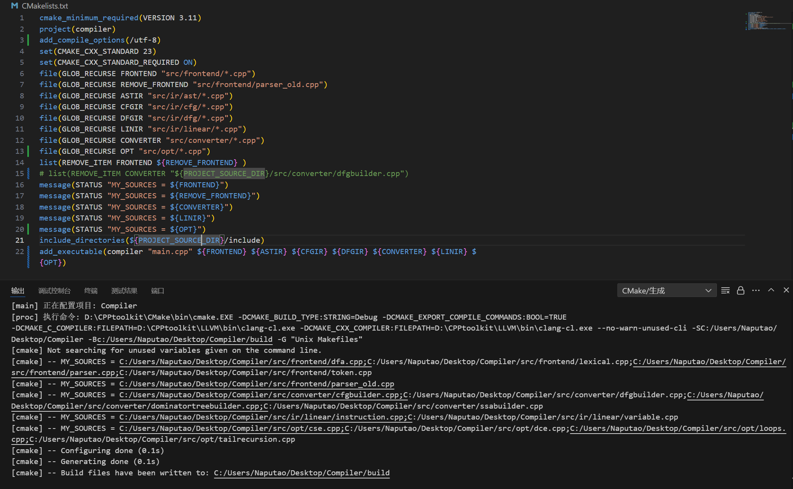
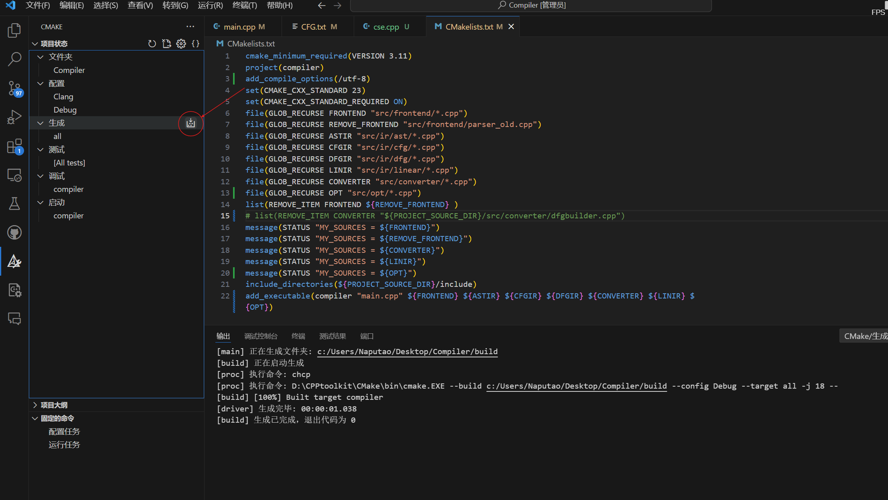
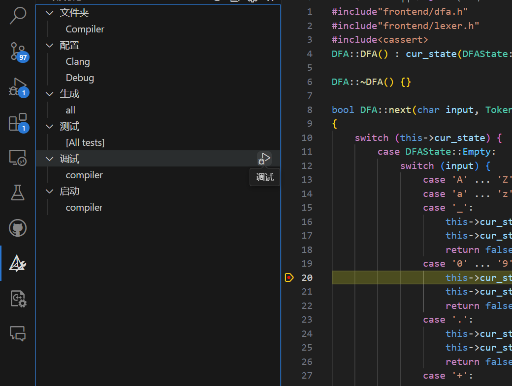
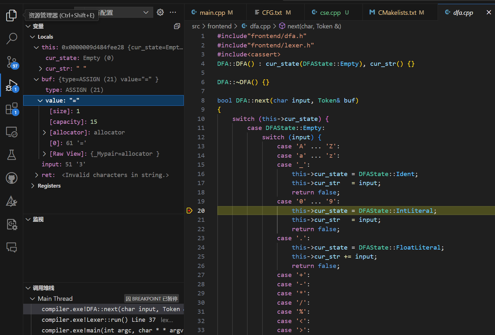
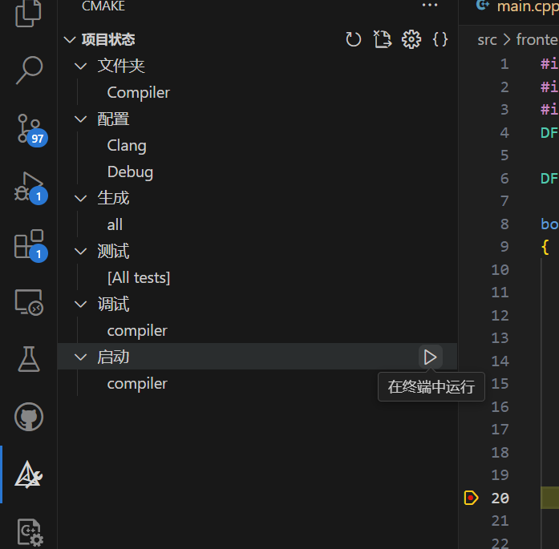

# **CMake Tools extension** 

这个插件专为 **使用 CMake 构建 C++ 项目** 而设计，它让你在 VS Code 里告别命令行、秒变图形化点点点构建大师！

相关Blog [Visual Studio Code系列--CMake Tools使用说明](https://blog.csdn.net/tianizimark/article/details/131512067)

## 📦 插件名称

> 🧩 **CMake Tools**
>  插件 ID：`ms-vscode.cmake-tools`
>  发布者：Microsoft
>  安装方式：在 VS Code 插件市场搜索 `CMake Tools`，点击安装

------

## ✨ 它能做什么？

| 功能                               | 描述                                     |
| ---------------------------------- | ---------------------------------------- |
| 🔍 自动检测 `CMakeLists.txt`        | 打开项目时自动识别并加载配置             |
| ⚙️ 选择构建工具链                   | 支持 GCC、Clang、MSVC、Ninja、Make 等    |
| 🧱 选择构建类型                     | 快速切换 Debug / Release 等              |
| 🧪 一键编译 / 清理                  | 无需命令行，点一下就编译、清理           |
| 🚀 运行与调试目标                   | 直接运行或调试你选的 `executable`        |
| 🗂️ 多目标支持                       | 适合一个项目多个 `add_executable` 的情况 |
| 📄 自动生成 `compile_commands.json` | 给 clangd 和 LSP 补全用，非常实用        |
| 📜 状态栏集成                       | 所有操作都能在底部状态栏完成，非常方便   |

------

## 💡 使用流程（上手超快）

1. 打开带有 `CMakeLists.txt` 的项目文件夹
2. 点击左下角 CMake 状态栏（选择构建目录 / 类型）
3. CMake Tools 自动配置项目（等几秒）
4. 点击 ▶️ “Build” 构建目标
5. 点 🚀 “Run” 或 🐞 “Debug” 开始运行或调试

------

## 📁 自动创建 `.vscode/` 配置（可选）

可以自动生成以下文件：

- `.vscode/settings.json`：设置构建目录、kit 等
- `.vscode/launch.json`：设置调试器（GDB / LLDB / lldb-mi 等）
- `.vscode/tasks.json`：绑定构建快捷方式

------

## 🧠 支持 Kits（构建工具套件）

插件支持检测系统中安装的构建工具，并为你生成 Kits：

- GCC / Clang（Linux / WSL）
- MSVC（Windows）
- Emscripten（WebAssembly）
- 自定义工具链文件（`toolchain.cmake`）

通过命令面板输入：

```plaintext
CMake: Scan for Kits
CMake: Select a Kit
```

可以轻松切换你要用的工具链环境。

------

## 🛠️ 示例：VS Code 中运行一个 CMake 项目

假设你有这个结构：

```
my_project/
├── CMakeLists.txt
└── main.cpp
```

**CMakeLists.txt 内容：**

```cmake
cmake_minimum_required(VERSION 3.10)
project(HelloCMake)
add_executable(hello main.cpp)
```

打开这个文件夹后，CMake Tools 会自动识别构建目标，然后你就能用 VS Code 一键构建和运行了！

## 实际效果

### 编译程序

```
Ctrl + S 保存cmake配置 
```



```
点击 生成按钮 自动构建文件
```



```
点击 调试按钮自动启动 gdb断点调试
```






```
点击 启动按钮自动运行程序
```

