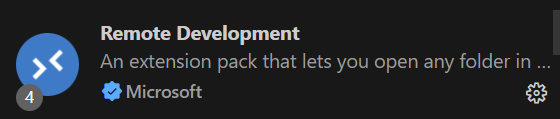

# VS Code for WSL2

## 🧩 前提条件

1. 已安装 WSL2（例如 Ubuntu）
2. 已安装最新版 VS Code（Windows 上）

👉 如果还没装 VS Code，可从这里下载并安装： https://code.visualstudio.com/

------

## 🛠️ 一步到位：安装 WSL 插件

打开 VS Code（Windows 上），然后按下：

```
Ctrl + Shift + X
```

搜索并安装插件：



## 🚀 启动 VS Code in WSL 的两种方式

### ✅ 方法 1：命令行启动

在你的 WSL2 终端（比如 Ubuntu）中输入：

```bash
code .
```

这会在 Windows 上的 VS Code 中，**以 WSL 模式打开当前 Linux 路径**（不是 Windows 的路径哦）。

如果是第一次运行，它会自动在 Linux 系统里安装 VS Code Server，并连接到 VS Code。

------

### ✅ 方法 2：从 Windows 启动

- 打开 VS Code
- 点击左下角绿色图标 → `WSL: Ubuntu`（或你的发行版名）
- 就能进入 WSL 模式啦 🎉

------

## 🧪 测试：新建文件、编译运行

在 VS Code 中：

1. 新建 `main.cpp`：

   ```cpp
   #include <iostream>
   int main() {
       std::cout << "Hello from WSL!" << std::endl;
       return 0;
   }
   ```

2. 打开终端（快捷键 `Ctrl + `），确认它在 `bash` 里。

3. 编译运行：

   ```bash
   g++ main.cpp -o hello
   ./hello
   ```

输出：

```
Hello from WSL!
```

成功！

------

## 💡 补充推荐插件（C++开发）

- **C/C++**（微软官方的 `ms-vscode.cpptools`）
- **CMake Tools**（如果你用 CMake 构建项目）
- **CodeLLDB**（调试更强大）
- **Clangd**（代码补全、智能提示）