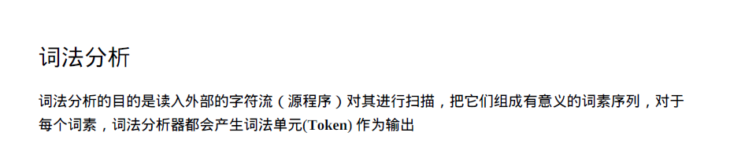
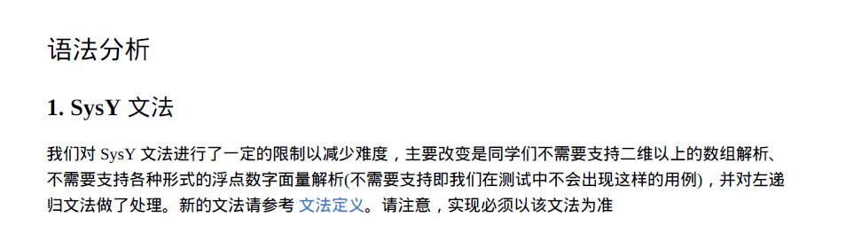
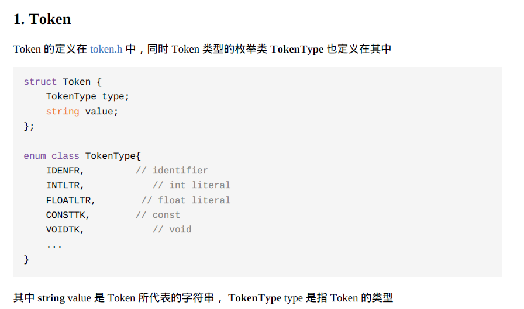
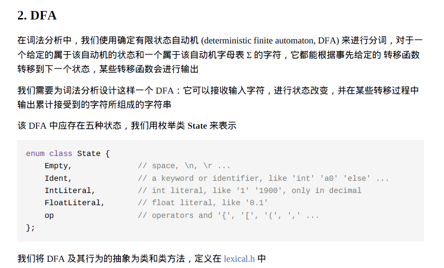
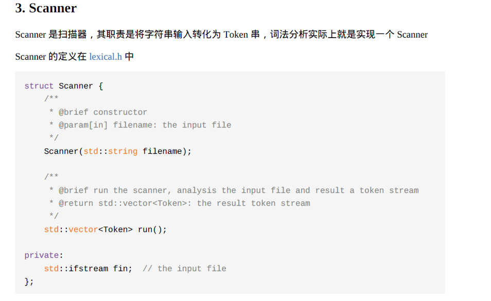
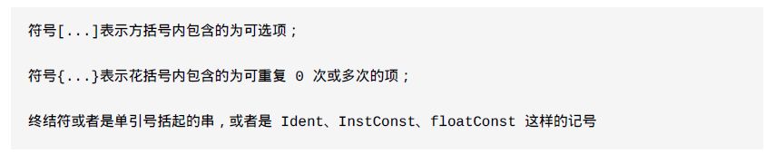

# 实验一(2025)

本文档为实验指导书的补充说明，请同学们优先仔细阅读实验指导书





实验一大致分为两个步骤，词法分析：先将文本解析成词法单元序列，语法分析：再将词法单元序列解析成抽象语法树。

## 数据结构与算法

### 词法分析相关数据结构

#### Token(词法单元)



```C++
    // enumerate for Token type
    enum class TokenType
    {
        IDENFR,     // identifier
        INTLTR,     // int literal
        FLOATLTR,   // float literal
        CONSTTK,    // const
        VOIDTK,     // void
        INTTK,      // int
        FLOATTK,    // float
        IFTK,       // if
        ELSETK,     // else
        WHILETK,    // while
        CONTINUETK, // continue
        BREAKTK,    // break
        RETURNTK,   // return
        PLUS,       // +
        MINU,       // -
        MULT,       // *
        DIV,        // /
        MOD,        // %
        LSS,        // <
        GTR,        // >
        COLON,      // :
        ASSIGN,     // =
        SEMICN,     // ;
        COMMA,      // ,
        LPARENT,    // (
        RPARENT,    // )
        LBRACK,     // [
        RBRACK,     // ]
        LBRACE,     // {
        RBRACE,     // }
        NOT,        // !
        LEQ,        // <=
        GEQ,        // >=
        EQL,        // ==
        NEQ,        // !=
        AND,        // &&
        OR,         // ||
    };
    std::string toString(TokenType);

    struct Token
    {
        TokenType type;
        std::string value;
    };
```

`type`词法单元的类型

`value`词法单元的值

#### DFA(确定性有限自动机)



```C++
struct DFA
    {
        /**
         * @brief constructor, set the init state to State::Empty
         */
        DFA();

        /**
         * @brief destructor
         */
        ~DFA();

        // the meaning of copy and assignment for a DFA is not clear, so we do not allow them
        DFA(const DFA &) = delete;            // copy constructor
        DFA &operator=(const DFA &) = delete; // assignment

        /**
         * @brief take a char as input, change state to next state, and output a Token if necessary
         * @param[in] input: the input character
         * @param[out] buf: the output Token buffer
         * @return  return true if a Token is produced, the buf is valid then
         */
        bool next(char input, Token &buf);

        /**
         * @brief reset the DFA state to begin
         */
        void reset();

    private:
        State cur_state;     // record current state of the DFA
        std::string cur_str; // record input characters
    };
```

`next()`当DFA.cur_str满足词法单元序列的匹配规则时，返回true,设置buf, 否则为false

`reset()`重置状态机

#### Scanner(扫描器)



```C++
struct Scanner
    {
        /**
         * @brief constructor
         * @param[in] filename: the input file
         */
        Scanner(std::string filename);

        /**
         * @brief destructor, close the file
         */
        ~Scanner();

        // rejcet copy and assignment
        Scanner(const Scanner &) = delete;
        Scanner &operator=(const Scanner &) = delete;

        /**
         * @brief run the scanner, analysis the input file and result a token stream
         * @return std::vector<Token>: the result token stream
         */
        std::vector<Token> run();

    private:
        std::ifstream fin; // the input file
    };
```

`fin`是C语言程序的文件输入流

`run()`执行后返回词法单元序列`std::vector<Token>`

### 词法分析相关算法

首先来介绍词法分析中最重要的组成部分DFA


DFA类中最重要函数是DFA::next(char input, Token &buf)函数

这个函数的作用是：

1. 当DFA.cur_str满足词法单元序列的匹配规则时，返回true，供scanner类处理;

2. 当next函数返回true时，根据cur_str设置Token&buf的参数，scanner类会将buf添加进std::vector\<frontend::Token\> tk_stream;中

上图是一个我当时做实验写的一个简单的状态机实例。

比如对于下面这段文本

### 示例代码

```C
float a =.2;
int b = 0x2;
int main(){
    if(b==2){
        a = 0.1;
    }
}
```

有如下处理流程

| input                                     | cur_str | cur_state    | return         |
| ----------------------------------------- | ------- | ------------ | -------------- |
| 初始                                      | none    | empty        | none           |
| f                                         | f       | ident        | false          |
| l                                         | fl      | ident        | false          |
| o                                         | flo     | ident        | false          |
| a                                         | floa    | ident        | false          |
| t                                         | float   | ident        | false          |
| 空格                                      | 空格    | empty        | true 处理float |
| a                                         | a       | ident        | false          |
| 空格                                      | 空格    | empty        | true 处理a     |
| =                                         | =       | op           | false          |
| .                                         | .       | floatliteral | true 处理=     |
| 2                                         | .2      | floatliteral | false          |
| ;                                         | ;       | op           | true 处理.2    |
| int b = 0x2;<br/>int main(){<br/>    if(b | ......  | ......       | ......         |
| =                                         | =       | op           | true 处理b     |
| 1                                         | ==      | op           |                |
| 2                                         | 2       | intliteral   | true 处理==    |
| ){<br/>        a = 0.1;<br/>    }<br/>}   | ......  | ......       | ......         |
| 空格(最后一次将cur_str情空)               | 空格    | empty        | true 处理}     |

所以得到的输出结果为

| token.value | token.type |
| ----------- | ---------- |
| float       | FLOATTK    |
| a           | IDENT      |
| =           | ASSIGN     |
| .2          | FLOATLTR   |
| ;           | SEMICN     |
| int         | INTTK      |
| b           | IDENT      |
| =           | ASSIGN     |
| 0x2         | INTLTR     |
| int         | INTTK      |
| main        | IDENT      |
| (           | LPARENT    |
| )           | RPARENT    |
| {           | LBRACE     |
| if          | RBRACK     |
| (           | LPARENT    |
| b           | IDENT      |
| ==          | EQL        |
| 2           | INTLTR     |
| )           | RPARENT    |
| {           | LBRACE     |
| a           | IDENT      |
| =           | ASSIGN     |
| 0.1         | FLOATLTR   |
| ;           | SEMICN     |
| }           | RBRACE     |
| }           | RBRACE     |

#### 🧠补充说明

1.这里没有考虑注释的情况，如果出现`//注释`和`/*多行注释*/`的情况下怎么办？

2.有限自动机也是正则表达式算法的核心实现，这里的程序是否能使用[正则表达式](正则表达式.md)来重构？

### 语法分析相关数据结构

#### AST(抽象语法树)

```c++
enum class NodeType {
    TERMINAL,  // terminal lexical unit
    COMPUINT,
    DECL,
    FUNCDEF,
    CONSTDECL,
    BTYPE,
    CONSTDEF,
    CONSTINITVAL,
    VARDECL,
    VARDEF,
    INITVAL,
    FUNCTYPE,
    FUNCFPARAM,
    FUNCFPARAMS,
    BLOCK,
    BLOCKITEM,
    STMT,
    EXP,
    COND,
    LVAL,
    NUMBER,
    PRIMARYEXP,
    UNARYEXP,
    UNARYOP,
    FUNCRPARAMS,
    MULEXP,
    ADDEXP,
    RELEXP,
    EQEXP,
    LANDEXP,
    LOREXP,
    CONSTEXP,
};
std::string toString(NodeType);

struct Varient
{
    Type t;
    Operand v_int;
    Operand v_float;
};

// tree node basic class
struct AstNode
{
    NodeType type;              // the node type
    AstNode* parent;            // the parent node
    vector<AstNode*> children;  // children of node

    /**
     * @brief constructor
     */
    AstNode(NodeType t, AstNode* p = nullptr);

    /**
     * @brief destructor
     */
    virtual ~AstNode();

    /**
     * @brief Get the json output object
     * @param root: a Json::Value buffer, should be initialized before calling
     * this function
     */
    void get_json_output(Json::Value& root) const;

    // rejcet copy and assignment
    AstNode(const AstNode&)            = delete;
    AstNode& operator=(const AstNode&) = delete;
};
```

`type`抽象语法树节点类型

`parent`父母节点

`children`子节点

`get_json_output`获取json形式的抽象语法树输出

#### Parser(语法分析器)

```C++
struct Parser
{
    uint32_t                  index;  // current token index
    const std::vector<Token>& token_stream;

    /**
     * @brief constructor
     * @param tokens: the input token_stream
     */
    Parser(const std::vector<Token>& tokens);

    /**
     * @brief destructor
     */
    ~Parser();

    /**
     * @brief creat the abstract syntax tree
     * @return the root of abstract syntax tree
     */
    CompUnit* get_abstract_syntax_tree();
    /**
     * @brief for debug, should be called in the beginning of recursive descent
     * functions
     * @param node: current parsing node
     */
    void log(AstNode* node);

    bool parseTerm(AstNode* root, TokenType expect);
    bool parseCompUnit(AstNode* root);
    bool parseDecl(AstNode* root);
    bool parseFuncDef(AstNode* root);
    bool parseConstDecl(AstNode* root);
    bool parseBType(AstNode* root);
    bool parseConstDef(AstNode* root);
    bool parseConstInitVal(AstNode* root);
    bool parseVarDecl(AstNode* root);
    bool parseVarDef(AstNode* root);
    bool parseInitVal(AstNode* root);
    bool parseFuncType(AstNode* root);
    bool parseFuncFParam(AstNode* root);
    bool parseFuncFParams(AstNode* root);
    bool parseBlock(AstNode* root);
    bool parseBlockItem(AstNode* root);
    bool parseStmt(AstNode* root);
    bool parseExp(AstNode* root);
    bool parseCond(AstNode* root);
    bool parseLVal(AstNode* root);
    bool parseNumber(AstNode* root);
    bool parsePrimaryExp(AstNode* root);
    bool parseUnaryExp(AstNode* root);
    bool parseUnaryOp(AstNode* root);
    bool parseFuncRParams(AstNode* root);
    bool parseMulExp(AstNode* root);
    bool parseAddExp(AstNode* root);
    bool parseRelExp(AstNode* root);
    bool parseEqExp(AstNode* root);
    bool parseLAndExp(AstNode* root);
    bool parseLOrExp(AstNode* root);
    bool parseConstExp(AstNode* root);
};
```

`index`下一个解析的词法单元

`token_stream`词法单元序列

`get_abstract_syntax_tree()`抽象语法树接口

`bool parseXXX(AstNode* root)`解析特定的抽象语法树节点，解析成功则返回true

### 语法分析相关算法




| 产生式 |
| ---------------------------- |
|CompUnit $\rightarrow$ (Decl \| FuncDef) [CompUnit]|
|Decl $\rightarrow$ ConstDecl \| VarDecl|
|ConstDecl $\rightarrow$ 'const' BType ConstDef { ',' ConstDef } ';'|
|BType $\rightarrow$ 'int' \| 'float'|
|ConstDef $\rightarrow$ Ident { '[' ConstExp ']' } '=' ConstInitVal|
|ConstInitVal $\rightarrow$ ConstExp \| '{' [ ConstInitVal { ',' ConstInitVal } ] '}'|
|VarDecl $\rightarrow$ BType VarDef { ',' VarDef } ';'|
|VarDef $\rightarrow$ Ident { '[' ConstExp ']' } [ '=' InitVal ]|
|InitVal $\rightarrow$ Exp \| '{' [ InitVal { ',' InitVal } ] '}'|
|FuncDef $\rightarrow$ FuncType Ident '(' [FuncFParams] ')' Block|
|FuncType $\rightarrow$ 'void' \| 'int' \| 'float'|
|FuncFParam $\rightarrow$ BType Ident ['[' ']' { '[' Exp ']' }]|
|FuncFParams $\rightarrow$ FuncFParam { ',' FuncFParam }|
|Block $\rightarrow$ '{' { BlockItem } '}'|
|BlockItem $\rightarrow$ Decl \| Stmt|
|Stmt $\rightarrow$ LVal '=' Exp ';' \| Block \| 'if' '(' Cond ')' Stmt [ 'else' Stmt ] \| 'while' '(' Cond ')' Stmt \| 'break' ';' \| 'continue' ';' \| 'return' [Exp] ';' \| [Exp] ';'|
|Exp $\rightarrow$ AddExp|
|Cond $\rightarrow$ LOrExp|
|LVal $\rightarrow$ Ident {'[' Exp ']'}|
|Number $\rightarrow$ IntConst \| floatConst|
|PrimaryExp $\rightarrow$ '(' Exp ')' \| LVal \| Number|
|UnaryExp $\rightarrow$ PrimaryExp \| Ident '(' [FuncRParams] ')' \| UnaryOp UnaryExp|
|UnaryOp $\rightarrow$ '+' \| '-' \| '!'|
|FuncRParams $\rightarrow$ Exp { ',' Exp }|
|MulExp $\rightarrow$ UnaryExp { ('\*' \| '/' \| '%') UnaryExp }|
|AddExp $\rightarrow$ MulExp { ('+' \| '-') MulExp }|
|RelExp $\rightarrow$ AddExp { ('<' \| '>' \| '<=' \| '>=') AddExp }|
|EqExp $\rightarrow$ RelExp { ('==' \| '!=') RelExp }|
|LAndExp $\rightarrow$ EqExp [ '&&' LAndExp ]|
|LOrExp $\rightarrow$ LAndExp [ '\|\|' LOrExp ]|
|ConstExp $\rightarrow$ AddExp|

❗要通过实验一的检测程序**必须**按照上述产生式进行抽象语法树构建

**最终我们要实现syntax.cpp文件下`get_abstract_syntax_tree()`抽象语法树接口。**


⭐这部分的代码主要用到了回溯和递归的思想

`parseXXX()`函数主要做了如下两件事：

1. 当解析XXX类型节点成功时，返回true
2. 设置index在正确的位置(解析成功时为下一个词法单元索引，失败时则为解析前的词法单元索引)

#### 示例1:产生式$A \rightarrow BC$

```
Function ParseA(ASTNode* root)
Begin
	保存index数据
	b = ParseB(第一个子节点)
	如果b为假，恢复index，返回false
	//b为真
	c = ParseC(第一个子节点)
	如果c为假，恢复index，返回false
    创建A节点，将节点的父节点设为root，将自己加入root的子节点
	返回true
End
```

#### 示例2:产生式$A \rightarrow B|C$

```
Function ParseA(ASTNode* root)
Begin
	保存index数据
	b = ParseB(第一个子节点)
	如果b为真，创建A节点，将节点的父节点设为root，将自己加入root的子节点，返回true
	//b为假
	c = ParseC(第一个子节点)
	如果c为真，创建A节点，将节点的父节点设为root，将自己加入root的子节点，返回true
	恢复index
	返回false
End
```

#### 示例3:产生式$A \rightarrow B\ B$ 为终结符

```
Function ParseA(ASTNode* root)
Begin
	保存index数据
	如果index对应词法单元和B不一致，恢复index，返回false
	//尝试成功
	index++
    创建Term点，将节点的父节点设为root，将自己加入root的子节点
    
	返回true
End
```

#### ⭐示例4:优先级问题

对于如下一段特殊代码

```
f();
```

假设目前我们已经分析到了UnaryExp节点，对于上文定义文法如下

UnaryExp $\rightarrow$ PrimaryExp \| Ident '(' [FuncRParams] ')' \| UnaryOp UnaryExp

这里应该采用第二条`Ident '(' [FuncRParams] ')'`产生式。但是如果按照先后顺序分析，我们会先尝试分析`PrimaryExp`，那么它的分析路径如下：

`PrimaryExp`$\rightarrow$`Lval`$\rightarrow$`'f'`

分析成功，返回true，然后`ParseUnaryExp`也返回true，此时index指向的是`(`，然后程序递归到`ParseMulExp`，`ParseMulExp`尝试分析`* / %`失败，......直到所有程序都尝试解析`(`失败，程序报错。

##### 解决方式：将第二条`Ident '(' [FuncRParams] ')'`产生式提前分析。先分析难分析的，再分析简单的，采用`贪婪模式`。

#### ⭐示例5:另一种接口

上面提到的示例接口是

```
bool parseXXXXX(AstNode* root);
```

需要将父节点传入，供子节点使用，其实有另一种更加简便的定义接口的办法。

```
AstNode* parseXXXXX();
```

这里不需要传入父节点，而是将子节点返回给父节点，让父节点成为构建树的负责人，当构建成功时返回子节点，构建失败返回nullptr。

那么对于产生式$A \rightarrow BC$，有伪代码

```
Function ParseA(ASTNode* root)
Begin
	保存index数据
	b = ParseB(第一个子节点)
	如果b为nullptr，恢复index，返回false
	//b为真
	c = ParseC(第一个子节点)
	如果c为nullptr，恢复index，返回false
    创建a = A节点，将b,c加入自己的子节点
	返回a
End
```

## Q&A

### 1.词法分析中的intliteral有十进制42、八进制052、十六进制0x2a, floatliteral有0.1、1.、1.0等形式

