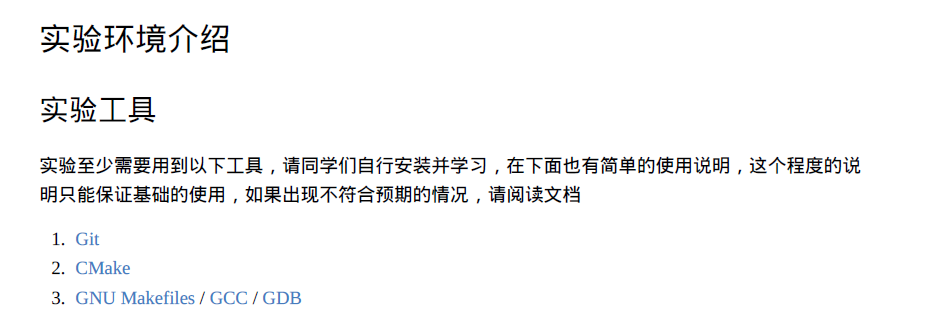

# 实验环境配置

实验指导书中给出了最少的要安装的工具包，但是这些对于一个舒服的开发环境来说，还远远不够！

下面给出我在完成实验时使用到的一些工具

## 1.WSL2

提供Windows操作系统下的Linux环境

文档：[WSL2安装](env/wsl2.md)

## 2.GCC

编译器

文档：[GCC安装](env/gcc.md)

## 3.GDB

调试器

文档：[GDB安装](env/gdb.md)

## 4.CMake

项目管理工具

文档：[CMake安装](env/cmake.md)	[cmake与make](env/cmake与make.md)

## 5.VS Code

编辑器

文档：[VSCode与WSL2](env/vscode.md)

## 6.VSCode CMake Tools Extension

图形化界面

文档：[VSCode CMake Tools Extension](env/vscode cmake tools extension.md)