# 实验环境配置


实验指导书中给出了最少的要安装的工具包，但是这些对于一个舒服的开发环境来说，还远远不够！

下面给出我在完成实验时使用到的一些工具

## 1.WSL2

提供Windows操作系统下的Linux环境

文档：[WSL2安装](env/wsl2.md)

## 2.GCC

编译器

文档：[GCC安装](env/gcc.md)

## 3.GDB

调试器

文档：[GDB安装](env/gdb.md)

## 4.CMake

项目管理工具

文档：[CMake安装](env/cmake.md)	[cmake与make](env/cmake与make.md)

## 5.VS Code

编辑器

文档：[VSCode与WSL2](env/vscode.md)

## 6.VSCode CMake Tools Extension

图形化界面

文档：[VSCode CMake Tools Extension](env/vscode cmake tools extension.md)


## 具体步骤

### 1.安装wsl

以管理员身份打开powershell，执行以下命令：

更新wsl

```powershell
wsl --update --web-download
```

安装Ubuntu发行版

```
wsl --install -d Ubuntu --web-download
```

### 2.打开vscode搜索安装wsl插件

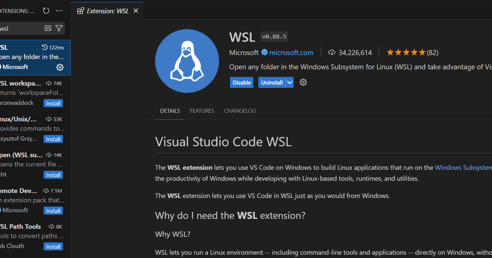

安装WSL插件

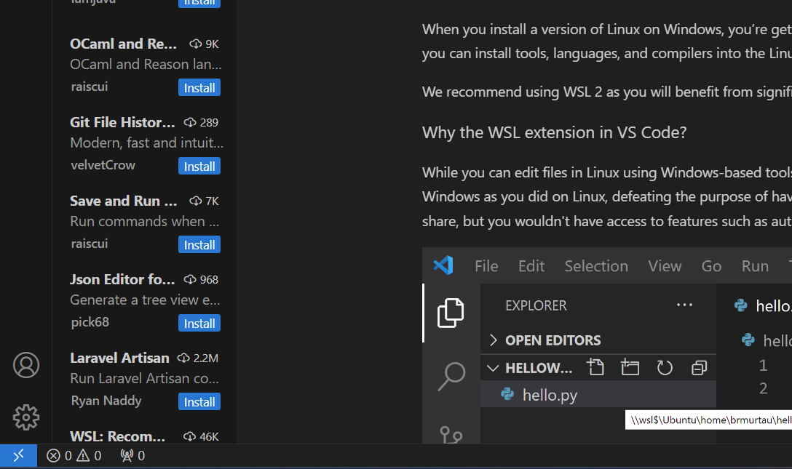

点击最左下角蓝色"><"按钮

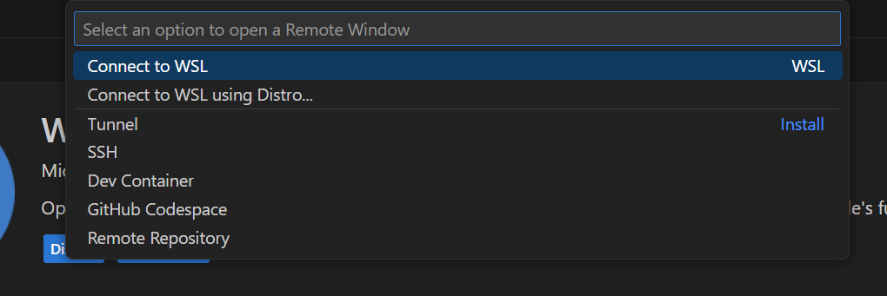

点击“连接到WSL”

### 3.安装gcc g++ gdb make cmake

ctrl + '~'波浪键打开WSL下Ubuntu发行版的命令窗口

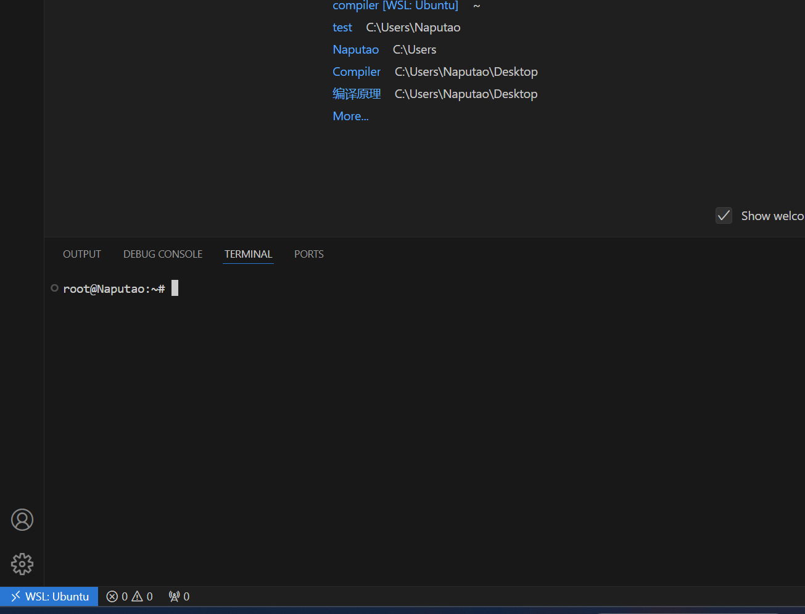

安装gcc g++ gdb make cmake

```bash
apt-get update
apt install gcc
apt install g++
apt install gdb
apt install make
apt install cmake
```

### 4.安装cmake tools插件


### 5.编写cmakelists.txt文件

首先创建文件夹

```bash
mkdir compiler
```

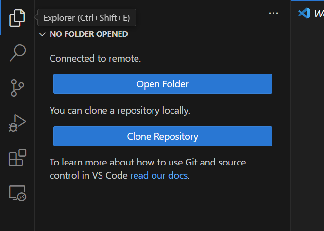

通过vscode打开文件夹，点击"打开文件夹"


选择compiler目录


点击OK


依次创建`src/test.cpp` `include/test.h` `CMakeLists.txt` `main.cpp`四个文件

```c++
//test.h
#ifndef TEST_H
#define TEST_H
#include<unordered_map>
#include<string>
void test();
void f();
#endif
```

```C++
//test.cpp
#include"test.h"
#include<iostream>
#include<vector>
void test(){
    std::cout<<"include ok"<<std::endl;
}
void f(){
    std::vector<int> vec = {1,2,3,4,5,6,7,8};
    for(auto&i:vec){
        std::cout<<i<<std::endl;
    }
    return;
}
```

```C++
//main.cpp
#include<bits/stdc++.h>
#include"test.h"
int main(){
    std::cout<<"Hello,world!"<<std::endl;
    test();
    f();
    return 0;
}
```

```cmake
# CMakeLists.txt
cmake_minimum_required(VERSION 3.11)
project(compiler)
set(CMAKE_CXX_STANDARD 23)
include_directories(${PROJECT_SOURCE_DIR}/include)
add_executable(main main.cpp src/test.cpp)
set(CMAKE_CXX_FLAGS_DEBUG "-g")
```

依次创建`src/test.cpp` `include/test.h` `CMakeLists.txt` `main.cpp`四个文件

### 6.启动项目

Ctrl + Shift + p 输入查找CMake Select for Kits


选择GCC


点击左侧小三角


点击launch，即可构建运行main.cpp

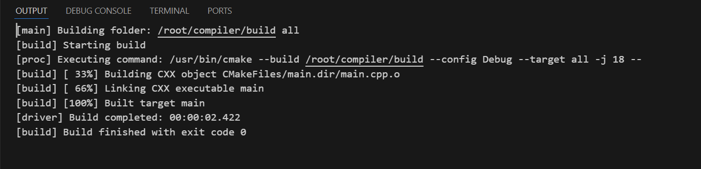

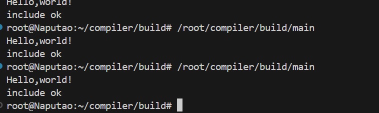

点击文本左侧添加断点

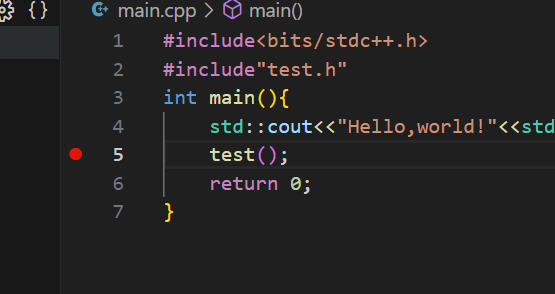

点击debug即可调试


### 7.以上环境构建就完成了，将实验框架拖入vscode即可开始编写代码

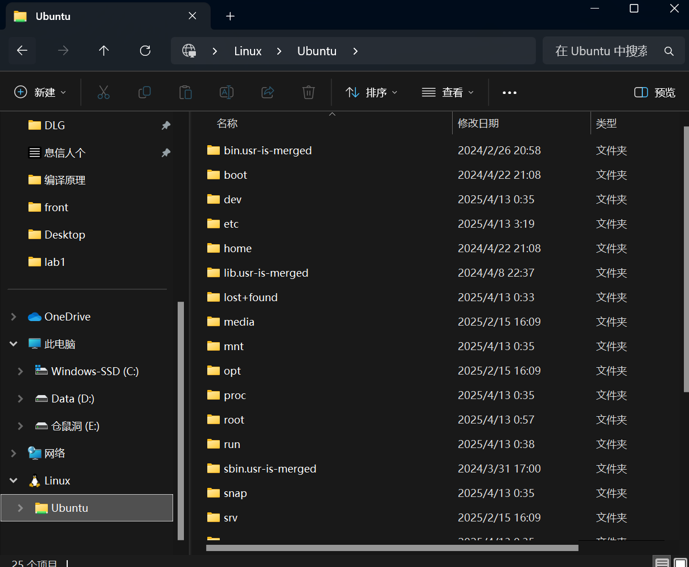

可以使用windows的资源管理器浏览WSL2的文件，以及复制拷贝文件。

将框架代码拖入到home中，在使用vscode打开即可开始快乐的写代码了

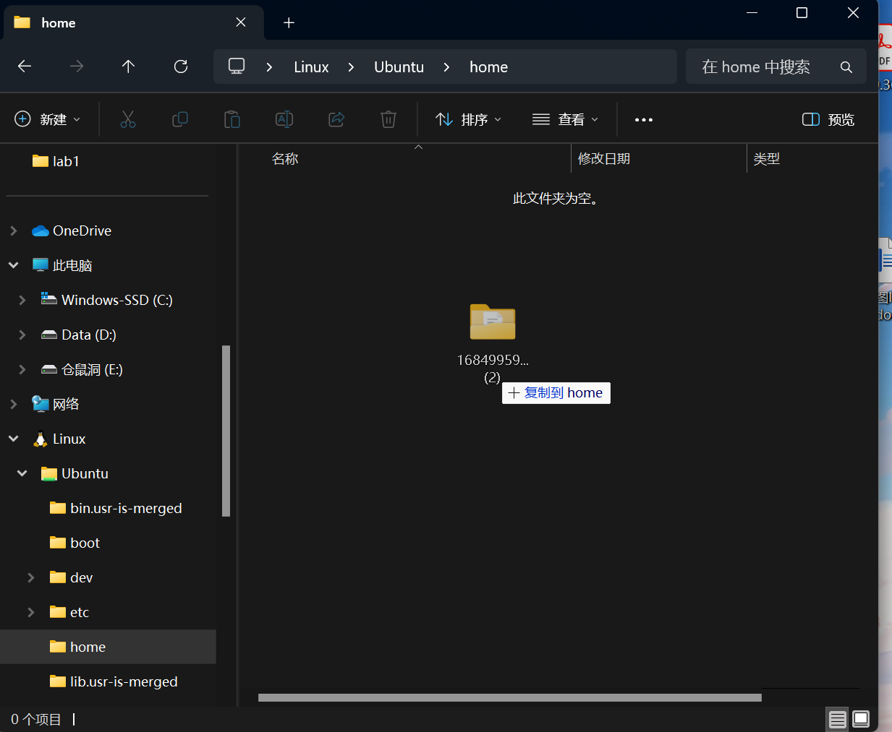


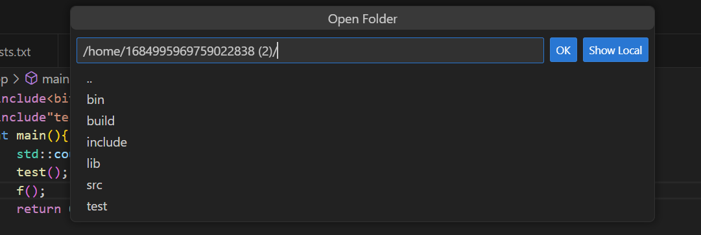


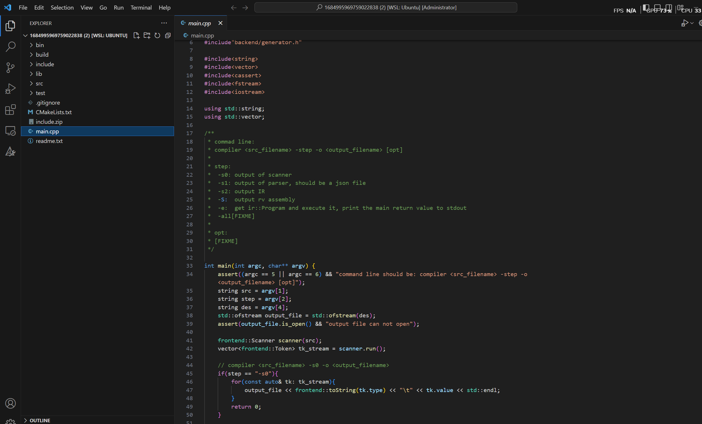

### 8.也可以直接将文件拖出，提交作业

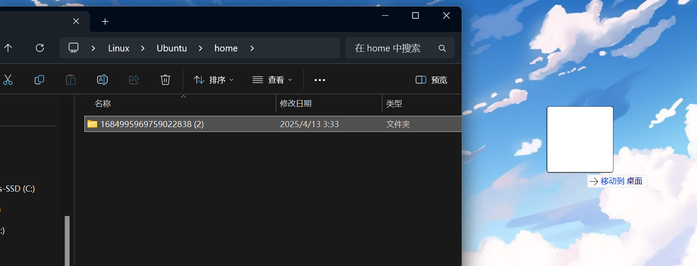